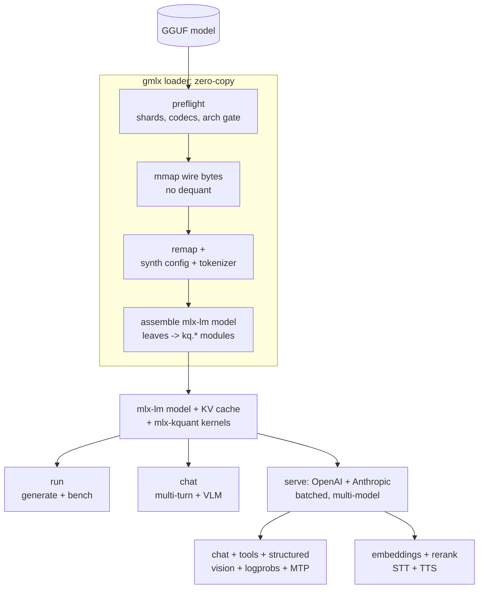

# gmlx

[](https://github.com/asher/gmlx/actions/workflows/test.yml)
[](https://github.com/asher/gmlx/blob/main/LICENSE)

**The fastest way to run GGUF models on Apple Silicon.**

gmlx is a local inference platform for Apple Silicon: chat with an open
model, serve it over OpenAI- and Anthropic-compatible APIs, talk to it by
voice, and fine-tune it. One command, entirely on your Mac.

gmlx takes the highest-quality quants available and serves them with the best
performance on Apple Silicon. Today that means the community's K-quant and
IQ-quant builds, which, size for size, keep more of the original model's
accuracy than any other open format, and markedly more than MLX's built-in
affine quantization ([accuracy per byte](#accuracy-per-byte)). Nearly every
open-weight release gets these builds within days, published as GGUF files,
and gmlx runs them exactly as published: nothing converted, nothing
re-quantized, none of that accuracy given back. The companion project
[mlx-kquant](https://github.com/asher/mlx-kquant) supplies the Metal kernels
that run these formats natively on Apple's
[MLX](https://github.com/ml-explore/mlx) framework.

On the same file, gmlx benchmarks faster than llama.cpp: prefill leads on
every model at every depth we've measured, reaching 2-4x past 100k tokens of
context, and with speculative decoding active on both engines, decode runs
1.1-2x ahead, widening with depth
([performance guide](https://github.com/asher/gmlx/blob/main/docs/performance.md)). Coverage runs from Llama, Qwen,
and Gemma through DeepSeek, GLM, and gpt-oss. A family is listed in the
generated [coverage matrix](https://github.com/asher/gmlx/blob/main/docs/arch-coverage.md) only after token-parity
certification against llama.cpp at 16k context. A 100B+ model starts
generating within seconds of launch, and a MoE bigger than RAM still runs,
streaming its experts from disk while everything every token needs stays on
the GPU ([bigger than memory](#bigger-than-memory)).

<picture>
  <source media="(prefers-color-scheme: dark)" srcset="https://raw.githubusercontent.com/asher/gmlx/main/docs/assets/perf/fleet-ratio-dark.svg">
  
</picture>

| Prefill | Decode (speculation on both engines) | MTP lift at depth |
|---|---|---|
| faster on every model at every depth; 2-4x past 100k tokens | 1.1-2x ahead, widening with depth | 1.4-1.8x held from 17k to 110k |

<picture>
  <source media="(prefers-color-scheme: dark)" srcset="https://raw.githubusercontent.com/asher/gmlx/main/docs/assets/perf/mtp-lift-dark.svg">
  
</picture>

The depth curve is the point: coding harnesses and agent sessions live at
50-200k tokens of context, and that is where the gap is widest. Full data and
methodology:
[benchmarks.md](https://github.com/asher/gmlx/blob/main/docs/benchmarks.md);
what makes it fast: the
[performance guide](https://github.com/asher/gmlx/blob/main/docs/performance.md).

The rest of the platform:

- hands-free voice chat with a built-in assistant that calls MCP tools
  mid-turn and keeps long-term memory ([voice chat](#voice-chat))
- a continuously batched server speaking OpenAI Chat Completions, OpenAI
  Responses, and Anthropic Messages on one port, with tool calling, structured
  output, logprobs, and vision ([serve an API](#serve-an-api))
- MTP speculative decoding that holds its speedup deep into long context
  ([performance](#performance))
- run MoE models bigger than RAM, experts streamed from disk with decode
  served from a popularity-managed GPU arena
  ([bigger than memory](#bigger-than-memory))
- chat in your browser: one command wires the Open WebUI app to your server
  ([getting started](https://github.com/asher/gmlx/blob/main/docs/getting-started.md#chat-in-your-browser))
- one-command hookups for coding agents and chat clients: pi, opencode,
  hermes, Open WebUI, and more
  ([connect clients](#connect-coding-agents-and-chat-apps))
- embeddings, reranking, speech-to-text, and text-to-speech, a fully local RAG
  and voice stack ([embeddings and speech](#embeddings-reranking-and-speech))
- LoRA training directly on the quantized weights, with llama.cpp adapter
  interop in both directions ([fine-tune](#fine-tune-with-lora))
- a macOS menu-bar app to watch and manage the server, with `gmlx service
  install` to keep everything running from login ([launch guide](https://github.com/asher/gmlx/blob/main/docs/launch.md))

The command is `gmlx`.

<!-- Demo GIF: record with `vhs docs/assets/demo.tape` (see the tape's header),
     then replace this comment with:
      -->

## Quickstart

Requires an Apple Silicon Mac and Python 3.11+, and installs like a Python
developer tool. On macOS 26 and newer the Metal
kernels install as a prebuilt wheel; older macOS builds them from source (Xcode
Command Line Tools, a few minutes).

```sh
mkdir ~/gmlx && cd ~/gmlx
python3 -m venv .venv && source .venv/bin/activate
pip install "gmlx[chat]"        # [chat] = upgraded chat TUI, optional

# start small: a ~0.4 GB model, downloaded into the current directory
gmlx pull hf:unsloth/Qwen3-0.6B-GGUF/Qwen3-0.6B-Q4_K_M.gguf --to .
gmlx run  Qwen3-0.6B-Q4_K_M.gguf --prompt "Explain entropy in one paragraph."
gmlx chat Qwen3-0.6B-Q4_K_M.gguf                # interactive, multi-turn
gmlx serve Qwen3-0.6B-Q4_K_M.gguf --port 8080   # OpenAI + Anthropic API server

curl localhost:8080/v1/chat/completions -d \
  '{"model": "qwen3-0.6b", "messages": [{"role": "user", "content": "hi"}]}'
gmlx stop                                       # the server ran detached
```

The core install carries the whole platform - serving, vision, embeddings,
the menu bar. Voice chat and the MCP assistant are extras (`gmlx[talk]`,
`gmlx[assistant]`), and `gmlx[all]` turns on everything; the full list is in
the
[getting-started guide](https://github.com/asher/gmlx/blob/main/docs/getting-started.md).
In new terminals, `source ~/gmlx/.venv/bin/activate` brings the `gmlx` command
back. A model typically needs roughly its file size in memory, plus the KV cache;
the exception is MoE models, which can run
[bigger than memory](#bigger-than-memory). If anything
misbehaves, `gmlx doctor` checks the runtime, config, model paths, and services
in one pass. The full walkthrough, from install to a configured server with a
connected client, is the [getting-started guide](https://github.com/asher/gmlx/blob/main/docs/getting-started.md).

## Performance

gmlx and llama.cpp run the same GGUF file, so the comparison is direct: on
an M5 Max (128 GB), gmlx prefills faster on every model in our fleet at
every depth measured, 1.2-1.6x at short context and 2-4x past 100k tokens.
At matched non-speculative baselines, decode starts at parity and wins
fleet-wide from 16k tokens as the KV cache deepens; with speculative
decoding active on both engines, gmlx decodes 1.1-2x ahead at every depth
measured. The speed comes from kernels
built for exactly this work: mlx-kquant's fused K-quant and IQ matmuls,
attention tuned for decode at depth, and a custom MTP verify path built for
this server. Where llama.cpp still leads, the
[performance guide](https://github.com/asher/gmlx/blob/main/docs/performance.md) says so. Reference points on the same
machine at short context, with llama.cpp on the same file alongside:
gemma-4-12B-it (dense, Q6_K) decodes at ~72 tok/s with MTP vs llama.cpp's ~54
with speculation (1.3x), prefilling at ~850 vs ~730 tok/s; Qwen3.5-9B (dense,
Q6_K) decodes at ~112 vs ~76 tok/s (1.5x), prefilling at ~1600 vs ~1140
tok/s; the full fleet tables are
in [benchmarks.md](https://github.com/asher/gmlx/blob/main/docs/benchmarks.md). Absolute numbers scale with the machine's memory
bandwidth; measure your own with `gmlx run model.gguf --bench "128,512,2048"`.

When you want more, the levers are: MTP speculative decoding, which roughly
doubles decode throughput at short context and still delivers 1.4-1.8x from
17k through 110k over the same server with MTP off, automatic on models with a
native draft head (Qwen3.5/3.6) and available to gemma-4 through a small
companion drafter (1.9-2.1x at short context); the prompt cache, which
removes repeated prefill for
agent workloads; KV-cache quantization for long contexts; and disk-streamed
execution for MoE models larger than memory ([below](#bigger-than-memory)).
The file you pick
matters too: a uniform K-quant decodes meaningfully faster than a heavily
mixed one at similar or better quality. When and why, with numbers: the
[performance guide](https://github.com/asher/gmlx/blob/main/docs/performance.md).

### Bigger than memory

MoE models whose files exceed RAM still run. `--stream-experts` keeps
attention, the routers, and the KV cache on the GPU and streams the experts
from disk, serving decode from a wired, popularity-managed expert arena sized
to the machine and reading only the misses from the GGUF at SSD queue depth;
`--stream-cpu` instead streams the whole model from disk through the page
cache, running everything on the CPU. Both placements stage prefill straight from
the file into GPU-visible slots, one trip per byte. The arena is also a good
citizen: under system memory pressure it shrinks, keeping its most popular
experts, and regrows once pressure clears, so a long-running model coexists
with a build or a second model. Expect single-digit decode on what the SSD can
deliver: this is a capacity feature that makes a 200B-class MoE usable on a
64 GB machine, not a speed feature. Placements, feeder mechanics, and measured
numbers: the
[performance guide](https://github.com/asher/gmlx/blob/main/docs/performance.md#bigger-than-memory-moe-offload).

### Accuracy per byte

K-quants are not just fast here; they are more accurate per byte than MLX's
native (affine) quantization, carrying roughly half the KL divergence at the
same bitrate (1.8-2.8x across the models measured). Qwen3.6-27B at a 4-bit
budget: KLD 0.0577 at 4.69 bpw for MLX affine vs 0.0208 at 4.88 bpw for
Q4_K_M, a 2.8x cut. The full table and methodology are in
[mlx-kquant's README](https://github.com/asher/mlx-kquant#why). Converting a
GGUF to MLX-native quantization gives up that margin; running it directly
keeps it.

## What you get

### Run and chat

`run` generates, benchmarks (`--bench`), or inspects the load plan without running
the model (`--report-only`). `chat` is a multi-turn terminal REPL over a persistent
KV cache: streaming markdown rendering, sessions with `--resume`, `/commands` for
live sampling changes, `/!` to stage shell output into a message, and image or audio
input with a vision-language model (drag a file in). Sampling defaults come from each
model family's model card, and `@intents` switch the operating point per call:

```sh
gmlx run model.gguf@creative --prompt "Write a haiku about entropy."
gmlx chat qwen3.6-27b-q6 --profile instruct   # --profile NAME = the flag form of @NAME
```

A `.gguf` path works with no setup; a bare id like `qwen3.6-27b-q6` names a
model from your server config - `gmlx list` shows yours (the
[getting-started guide](https://github.com/asher/gmlx/blob/main/docs/getting-started.md) sets one up).

Details: the [CLI reference](https://github.com/asher/gmlx/blob/main/docs/cli.md).

### Find and download models

`validate` checks that a file will load before you download gigabytes, by
range-reading just the header. Point it at a repo and it lists every quant variant
as a ready-to-paste ref. `pull` downloads validated files (sharded, resumable,
multi-file) into your model library, and an existing LM Studio library serves as-is.

```sh
gmlx validate hf:unsloth/Qwen3.6-27B-GGUF
gmlx pull hf:unsloth/Qwen3.6-27B-GGUF/Qwen3.6-27B-Q4_K_S.gguf
```

Details: [picking a model for your Mac](https://github.com/asher/gmlx/blob/main/docs/getting-started.md#pick-a-model-for-your-mac).

### Serve an API

`serve` runs a continuously batched, multi-model server speaking three dialects on
one port: OpenAI Chat Completions, OpenAI Responses, and Anthropic Messages, all
streaming. It handles tool calling, structured output (`response_format:
json_schema`, grammar-constrained), logprobs, and vision messages. A YAML config
gives named models, reusable sampling profiles, aliases, and directory discovery.
Residency is managed (LRU with pinning and idle unload), and repeated prefixes are
served from a cross-request prompt cache with an optional SSD tier. The server
never contacts Hugging Face to satisfy a request. It binds loopback by default,
hardened against browser-borne attacks, with static-key auth for anything wider.
Config-defined assistant ids run the built-in MCP tool loop server-side, so a thin
client gets tools (and optionally memory) with no loop of its own.

Details: the [server config reference](https://github.com/asher/gmlx/blob/main/docs/server-config.md) and the
[assistant guide](https://github.com/asher/gmlx/blob/main/docs/assistant.md).

### Connect coding agents and chat apps

One command points your tools at the local server, writing each tool's native
config without touching your dotfiles and auto-starting the server if it is down:

```sh
gmlx launch pi --model qwen3.6-27b-q6@coding
```

Supported: pi, opencode, omp, claude-code, hermes, goose, the aichat and elia chat
clients, and the Open WebUI browser app. A macOS menu-bar app shows what is
resident and offers unload, restart, and logs.

Details: the [launch guide](https://github.com/asher/gmlx/blob/main/docs/launch.md).

### Voice chat

`gmlx talk` is hands-free voice chat with any served model: a wake phrase (any
text, no training), Whisper speech-to-text, and replies spoken sentence-by-sentence
as they stream. With `talk.brain: assistant` the built-in assistant can call MCP
tools mid-turn and keeps long-term memory, stored locally and retrieved through
the server's own embeddings endpoint. The same assistant drives `gmlx chat
--assistant` in the terminal and the served assistant ids above.

Details and worked examples: the [voice-chat guide](https://github.com/asher/gmlx/blob/main/docs/talk.md) and the
[assistant guide](https://github.com/asher/gmlx/blob/main/docs/assistant.md).

### Embeddings, reranking, and speech

The same server exposes OpenAI-compatible `/v1/embeddings` (GGUF decoder-LM or
encoder embedders), Cohere-shaped `/v1/rerank`, `/v1/audio/transcriptions`
(mlx-whisper), and `/v1/audio/speech` (Kokoro, Qwen3-TTS). Together they make a
fully local RAG and voice stack for clients like Open WebUI.

Details: the [RAG guide](https://github.com/asher/gmlx/blob/main/docs/rag.md) and the
[server config reference](https://github.com/asher/gmlx/blob/main/docs/server-config.md).

### Fine-tune with LoRA

`train` finetunes directly through the quantized matmul, so you can tune a model
you could never hold in fp16, and writes the adapter as a small GGUF in
llama.cpp's adapter format (interop in both directions). `--adapter` applies it
live at run, chat, or serve, so one base can serve several adapted variants side
by side.

```sh
gmlx train model.gguf --data ./my-data --adapter-out my-lora.gguf
gmlx run   model.gguf --adapter my-lora.gguf --prompt "..."
```

Details: the [LoRA training guide](https://github.com/asher/gmlx/blob/main/docs/lora.md).

## Supported architectures

Every family below loads end to end. New architectures land regularly, so
the authoritative list is the generated
[architecture coverage matrix](https://github.com/asher/gmlx/blob/main/docs/arch-coverage.md), with per-arch parity
notes.

A GGUF is loadable when its `general.architecture` is an architecture gmlx
recognizes and can synthesize a config for, or you supply `hf_source`. Preflight runs the architecture gate and checks each tensor's
codec (its GGUF quantization type, like `Q4_K_M`) before any tensor bytes are read.

| Family | GGUF archs | Notes |
|--------|------------|-------|
| Llama | `llama`, `mistral3` | Llama-2/3, Mistral, Vicuna. Mixtral routes to `mixtral` (stacked experts) |
| Qwen | `qwen2`, `qwen2moe`, `qwen3`, `qwen35`, `qwen3moe`, `qwen35moe`, `qwen3vlmoe`, `qwen3next` | dense + MoE. Qwen3.5/3.6 and Qwen3-Next gated-DeltaNet hybrids (both GGUF layouts); `qwen3vlmoe` is the Qwen3-Omni thinker tower |
| Gemma | `gemma`, `gemma2`, `gemma3`, `gemma3n` [1], `gemma4` | norm bake undone on load; tied embeddings; gemma-3n text tower (AltUp, LAuReL, MatFormer) |
| DiffusionGemma | `diffusion-gemma` [2] | early support: non-autoregressive block-diffusion denoiser on the gemma-4 MoE backbone |
| GLM | `glm4`, `glm4moe`, `glm-dsa` | GLM-4 dense; GLM-4.5/4.6 fine-grained MoE; GLM-5.2 MLA + sparse-attention indexer |
| DeepSeek | `deepseek2`, `deepseek4` | MLA attention + fine-grained MoE (DeepSeek-V3/R1, GLM-4.x MLA conversions); V4-Flash MLA-lite + sparse indexer + MTP drafter (parity reference: the ds4 engine) |
| Phi | `phi3` | mini / small / medium; `hf_source` for 128K long-context variants |
| Nemotron | `nemotron_h_moe` | hybrid Mamba + attention MoE |
| gpt-oss | `gpt-oss` | native MXFP4 experts, attention sinks, YaRN rope, alternating sliding/full attention |
| Seed | `seed_oss` | ByteDance Seed-OSS 36B dense |
| SmolLM | `smollm3` | SmolLM3-3B; Llama backbone with NoPE every 4th layer |
| Granite | `granite`, `granitehybrid` | IBM Granite dense; Granite 4.x hybrid (Mamba2 + attention + MoE) |
| ERNIE | `ernie4_5-moe` | Baidu ERNIE-4.5-MoE (21B-A3B) |
| MiniMax | `minimax-m2`, `minimax-m3` | MiniMax-M2 (230B-A10B) and M3 (428B-A23B); every-layer fine-grained MoE. M3 adds per-head qk-norm + a shared expert; its sparse attention runs dense (exact to 2048 tokens) |
| Hunyuan | `hunyuan-moe`, `hy_v3` | Tencent Hunyuan-A13B; Hy3 (299B-A21B) with its native MTP head |
| Falcon | `falcon-h1` | TII Falcon-H1 (0.5B-34B); parallel attention + Mamba2 in every layer |

[1] `gemma3n` is implemented but gate-disabled: every published gemma-3n GGUF
carries mis-converted LAuReL weights (an upstream llama.cpp conversion bug at all
quant levels), so the loader refuses them rather than run a degraded model. It
re-enables the moment a correctly converted file exists.

[2] `diffusion-gemma` is early support and the one architecture with no
token-parity oracle at all (llama.cpp does not implement it). It is
GPU-validated by output coherence instead, currently Q8_0 only, and loads, runs,
chats, and serves through mlx-vlm's denoising engine.

One further mapped arch, `gemma-embedding`, backs the `/v1/embeddings` endpoint
(EmbeddingGemma from GGUF) rather than chat. Codec coverage spans all 19
K-quant, legacy, and IQ codecs plus the native-fp pair mxfp4/nvfp4 (run
directly from the file when the model is bigger than RAM, repacked for speed
when it fits - `GMLX_NATIVE_FP` overrides the choice); in
the rare case a file uses a type with no kernel (ternary TQ, for example),
preflight names it and lists what is supported so you can pick another
variant.

Vision-language models load as a K-quant LLM GGUF paired with its float `mmproj`
GGUF: supported families and caveats in the [VLM guide](https://github.com/asher/gmlx/blob/main/docs/vlm.md). Want a family
that is missing? What it takes, and the acceptance gate every family clears, is
in the [adding-architectures guide](https://github.com/asher/gmlx/blob/main/docs/adding-architectures.md).

## How it works

At the core of the platform is the gmlx loader and runtime, which turns a GGUF
file into a running MLX model. mlx-kquant is the op and kernel layer it builds
on (the `kq.*` namespace plus the C++ GGUF wire-byte reader); the split is
one-directional: gmlx depends on mlx-kquant, never the reverse.



The loader: preflight (shards, codecs, arch gate), mmap the wire bytes, remap GGUF
tensor names to mlx-lm parameter names, synthesize the config and tokenizer from the
GGUF metadata, assemble the model with quantized leaves swapped for `kq.*`-backed
modules, and generate with mlx-lm's sampler and KV cache. Serving-side mechanics:
[docs/serving-architecture.md](https://github.com/asher/gmlx/blob/main/docs/serving-architecture.md).

## Python API

```python
from gmlx import load_model, generate, bench

model, config, tokenizer = load_model("model.gguf")   # also: arch=, chat_template=, ...
print(generate(model, tokenizer, "Explain entropy.", max_tokens=128))
```

`load_model` returns a ready-to-run mlx-lm model, the synthesized config dict, and
the tokenizer. `generate` applies the tokenizer's chat template to string prompts by
default (`apply_chat_template=False` for base models or pre-tokenized input), and
`bench` sweeps prefill and decode throughput at chosen lengths. The full surface,
including preflight and the mlx-lm server bridge, is in
[docs/python.md](https://github.com/asher/gmlx/blob/main/docs/python.md).

## Documentation

The full index, routed by task, is [docs/README.md](https://github.com/asher/gmlx/blob/main/docs/README.md).

Start here:

- [docs/getting-started.md](https://github.com/asher/gmlx/blob/main/docs/getting-started.md): install to a served model
  with a connected client, including model picks per machine size.

Guides:

- [docs/launch.md](https://github.com/asher/gmlx/blob/main/docs/launch.md): each supported coding agent and chat app, what
  gets written where, and the menu-bar app.
- [docs/talk.md](https://github.com/asher/gmlx/blob/main/docs/talk.md): voice chat, wake word to spoken reply, with worked
  examples.
- [docs/assistant.md](https://github.com/asher/gmlx/blob/main/docs/assistant.md): the built-in tool-loop assistant: MCP
  tools, long-term memory, `chat --assistant`, and served assistant ids.
- [docs/lora.md](https://github.com/asher/gmlx/blob/main/docs/lora.md): train a LoRA on a GGUF base and apply it live.
- [docs/vlm.md](https://github.com/asher/gmlx/blob/main/docs/vlm.md): vision and audio input from paired GGUFs.
- [docs/rag.md](https://github.com/asher/gmlx/blob/main/docs/rag.md): a fully local RAG stack (embeddings + rerank +
  Open WebUI).
- [docs/performance.md](https://github.com/asher/gmlx/blob/main/docs/performance.md): what makes it fast, what the levers
  cost, and how to measure.
- [docs/troubleshooting.md](https://github.com/asher/gmlx/blob/main/docs/troubleshooting.md): the common failures and their
  fixes.
- [docs/migrating.md](https://github.com/asher/gmlx/blob/main/docs/migrating.md): coming from llama.cpp, Ollama, or
  LM Studio - what carries over and what maps to what.

Reference:

- [docs/cli.md](https://github.com/asher/gmlx/blob/main/docs/cli.md): every verb and flag.
- [docs/server-config.md](https://github.com/asher/gmlx/blob/main/docs/server-config.md): the YAML config, endpoints, and
  API capabilities.
- [docs/arch-coverage.md](https://github.com/asher/gmlx/blob/main/docs/arch-coverage.md): the generated architecture
  matrix.

Internals and contributing:

- [docs/serving-architecture.md](https://github.com/asher/gmlx/blob/main/docs/serving-architecture.md): how the loader,
  engine, and HTTP layers compose.
- [docs/adding-architectures.md](https://github.com/asher/gmlx/blob/main/docs/adding-architectures.md): what adding a
  family involves and the acceptance gate that defines supported.
- [docs/testing.md](https://github.com/asher/gmlx/blob/main/docs/testing.md): the three test tiers and the e2e harnesses.
- [CONTRIBUTING.md](https://github.com/asher/gmlx/blob/main/CONTRIBUTING.md) and [CHANGELOG.md](https://github.com/asher/gmlx/blob/main/CHANGELOG.md).

## Contributing

PRs welcome. Dev setup, test tiers, and the seam-patch ground rules are in
[CONTRIBUTING.md](https://github.com/asher/gmlx/blob/main/CONTRIBUTING.md); the test suite guide is
[docs/testing.md](https://github.com/asher/gmlx/blob/main/docs/testing.md). New architectures:
[docs/adding-architectures.md](https://github.com/asher/gmlx/blob/main/docs/adding-architectures.md).

## Acknowledgments

`gmlx` builds on several excellent projects: [llama.cpp /
ggml](https://github.com/ggml-org/llama.cpp) (the GGUF format and the K-quant
reference implementations mlx-kquant's kernels derive from), [MLX and
mlx-lm](https://github.com/ml-explore/mlx-lm) (the runtime and model zoo),
[mlx-vlm](https://github.com/Blaizzy/mlx-vlm) (the batching server engine and VLM
towers), [mlx-whisper](https://pypi.org/project/mlx-whisper/) (speech-to-text), and
[mlx-audio](https://pypi.org/project/mlx-audio/) (text-to-speech).

## License

[Business Source License 1.1](https://github.com/asher/gmlx/blob/main/LICENSE): source-available, not open source. You may
use, modify, and run gmlx for your own purposes, including commercial and
professional work. You may not redistribute or sublicense it, incorporate it into
another product, or offer it to third parties as a hosted service. Each released
version converts to the Apache License 2.0 four years after its release. No claims
are made against inference outputs, and downloaded model weights carry their own
licenses.

Third-party code vendored into gmlx is documented in
[THIRD_PARTY_NOTICES.md](https://github.com/asher/gmlx/blob/main/THIRD_PARTY_NOTICES.md), with license texts under
[`licenses/`](https://github.com/asher/gmlx/tree/main/licenses).
