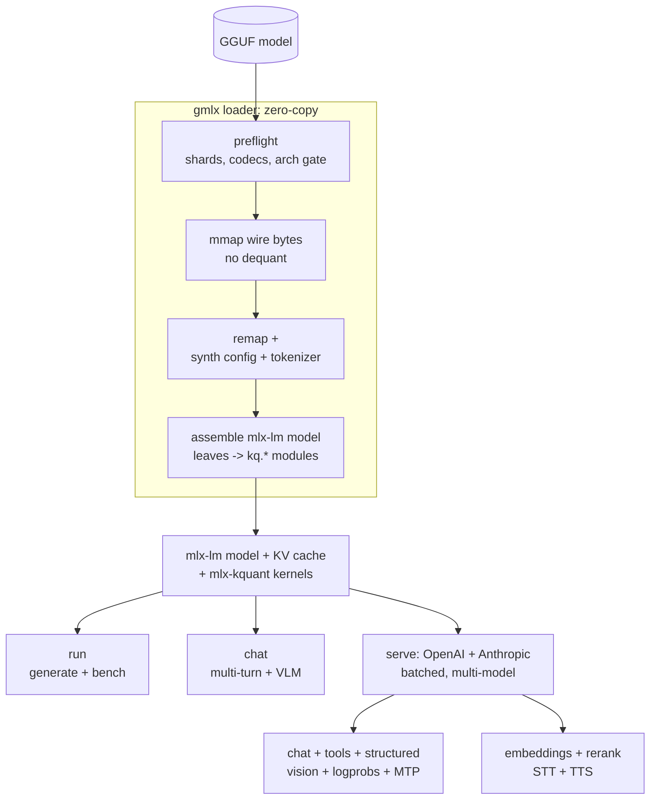

# gmlx

[](https://github.com/asher/gmlx/actions/workflows/test.yml)
[](https://github.com/asher/gmlx/blob/main/LICENSE)

**The fastest way to run GGUF models on Apple Silicon.**

gmlx is a local inference platform: chat with an open model in the terminal
or your browser, serve it over OpenAI- and Anthropic-compatible APIs,
connect your coding agent to it, talk to it by voice, build a local RAG
stack on it, and fine-tune it with LoRA. One command, entirely on your Mac.

It runs the community's K-quant and IQ-quant GGUF builds exactly as
published. Size for size, these two quant formats are the most accurate
open formats available ([accuracy per byte](#accuracy-per-byte)). The
companion project [mlx-kquant](https://github.com/asher/mlx-kquant)
supplies the Metal kernels that run them natively on Apple's
[MLX](https://github.com/ml-explore/mlx) framework. On the same file, gmlx
benchmarks faster than llama.cpp. The gap is widest at the 50-200k-token
contexts where coding agents and long sessions live
([performance](#performance)). A 100B+ model starts generating within
seconds of launch. A mixture-of-experts (MoE) model bigger than RAM still
runs, streaming its experts from disk
([bigger than memory](#bigger-than-memory)).

<picture>
  <source media="(prefers-color-scheme: dark)" srcset="https://raw.githubusercontent.com/asher/gmlx/main/docs/assets/perf/fleet-ratio-dark.svg">
  
</picture>

<picture>
  <source media="(prefers-color-scheme: dark)" srcset="https://raw.githubusercontent.com/asher/gmlx/main/docs/assets/perf/per-model/deepseek-v4-flash-antirez-iq2xxs-panels-dark.svg">
  
</picture>

In both charts, higher is faster, and depth is the number of tokens already
in the context. DeepSeek-V4-Flash is measured against antirez's ds4
(dwarfstar)
([benchmarks](https://github.com/asher/gmlx/blob/main/docs/benchmarks.md#deepseek-v4-flash-reference-engine-ds4-server)).


A 27B model, already resident in a local server, answering at 46 tokens per
second. Recorded with `docs/assets/record-demo.sh` at true speed.

A [one-minute video](#mtp-and-concurrent-streams) below shows the same server move from a
single chat at full MTP speed to four concurrent streams, and back, with
no break in the live stream.

## Quickstart

Requires an Apple Silicon Mac, and macOS 26 or newer is recommended: there
the Metal kernels install as a prebuilt wheel. On older macOS versions the
install builds them from source, which needs full Xcode with its Metal
toolchain and a few minutes; the Command Line Tools alone are not enough
([troubleshooting](https://github.com/asher/gmlx/blob/main/docs/troubleshooting.md#the-install-fails-compiling-the-metal-kernels)).
[uv](https://docs.astral.sh/uv/) and pipx install a suitable Python
themselves; a manual install needs Python 3.11 or newer.

```sh
uv tool install "gmlx[all]"     # or: pipx install "gmlx[all]"
brew install ffmpeg             # only for voice and non-wav audio

# start small: a ~0.4 GB model, downloaded into the current directory
mkdir ~/gmlx && cd ~/gmlx
gmlx pull hf:unsloth/Qwen3-0.6B-GGUF/Qwen3-0.6B-Q4_K_M.gguf --to .
gmlx run  Qwen3-0.6B-Q4_K_M.gguf --prompt "Explain entropy in one paragraph."
gmlx chat Qwen3-0.6B-Q4_K_M.gguf                # interactive, multi-turn
gmlx serve Qwen3-0.6B-Q4_K_M.gguf --port 8080   # OpenAI + Anthropic API server

curl localhost:8080/v1/chat/completions -d \
  '{"model": "qwen3-0.6b", "messages": [{"role": "user", "content": "hi"}]}'
gmlx stop                                       # the server ran detached
```

This is the one-file form: any local `.gguf` runs, chats, or serves with no
other setup. The served model id comes from the file name (`qwen3-0.6b`
here). The intended setup for everything else is `gmlx init`
([next section](#set-up-with-gmlx-init)).

`gmlx[all]` turns on every optional feature: the upgraded chat TUI, voice
chat, and the MCP assistant. The core install already carries serving,
vision, embeddings, and the menu bar, so `gmlx[chat]` is a smaller install
that gives up only voice and the assistant. `gmlx init` offers to add a
missing extra later. `uv tool` and pipx put `gmlx` on your PATH in every
terminal. `pip install "gmlx[all]"` into a venv you manage works too; the
command then exists only while that venv is active.

A model typically needs roughly its file size in memory, plus the KV cache
(the per-conversation state, which grows with context length). `--kv-bits`
and `--kv-quant-scheme kvarn` shrink that cache two to four times; the
[performance guide](https://github.com/asher/gmlx/blob/main/docs/performance.md#kv-cache-quantization)
says which models gain from it. The exception
is MoE models, which can run [bigger than memory](#bigger-than-memory). If
anything misbehaves, `gmlx doctor` checks the runtime, config, model paths,
and services in one pass.

## Set up with gmlx init

`gmlx init` is the setup path for the rest of the platform. It finds your
GGUF files, names them, and writes the one config that every other command
reads. Run bare, it opens a guided wizard:

1. It scans the model folders you name. An existing LM Studio library or
   Hugging Face cache works as-is.
2. It shows the models it found. You can rename ids, drop entries, set a
   default, and add aliases.
3. It offers the on-disk prompt cache (recommended for coding agents) and
   the optional speech, embedding, and reranking services.
4. It previews the config, then writes it to `~/.config/gmlx/gmlx.yaml`.

```sh
gmlx init       # the guided wizard
gmlx serve      # start the server: finds the config, detaches, returns
gmlx list       # the model ids the config defines
gmlx launch pi  # point a coding agent at the server (auto-starts it)
```

Every command now takes a model id in place of a path: `gmlx chat
qwen3-0.6b-q4`, or the quickstart curl with the configured id. Every wizard
choice also has a flag, so `gmlx init --models-dir ~/models` scaffolds with
no questions. `gmlx service install` keeps the server running from login.

The [getting-started guide](https://github.com/asher/gmlx/blob/main/docs/getting-started.md)
is the full walkthrough, from install to a configured server with a
connected client, including model picks per machine size and the extras
table. New to GGUF files, quants, or the KV cache? It introduces them as you
go, and its
[glossary](https://github.com/asher/gmlx/blob/main/docs/getting-started.md#glossary)
defines the vocabulary used throughout these docs.

## What you get

### Run and chat

`run` generates, benchmarks (`--bench`), or inspects the load plan without running
the model (`--report-only`). `chat` is a multi-turn terminal REPL over a persistent
KV cache: streaming markdown rendering, sessions with `--resume`, `/commands` for
live sampling changes, `/!` to stage shell output into a message, and image or audio
input with a vision-language model (drag a file in). Sampling defaults come from each
model family's model card. `@intents` are named presets that switch those
settings per call:

```sh
gmlx run model.gguf@creative --prompt "Write a haiku about entropy."
gmlx chat qwen3.6-27b-q6 --profile instruct   # --profile NAME = the flag form of @NAME
```

A `.gguf` path works with no setup. A bare id like `qwen3.6-27b-q6` names a
model from your server config: `gmlx list` shows yours, and
[`gmlx init`](#set-up-with-gmlx-init) sets one up.

Details: the [CLI reference](https://github.com/asher/gmlx/blob/main/docs/cli.md).

### Find and download models

`validate` checks that a file will load before you download gigabytes, by
range-reading just the header. Point it at a repo and it lists every quant variant
as a ready-to-paste ref. `pull` downloads validated files (sharded, resumable,
multi-file) into your model library, and an existing LM Studio library serves as-is.

```sh
gmlx validate hf:unsloth/Qwen3.6-27B-GGUF
gmlx pull hf:unsloth/Qwen3.6-27B-GGUF/Qwen3.6-27B-Q4_K_S.gguf
```

Details: [picking a model for your Mac](https://github.com/asher/gmlx/blob/main/docs/getting-started.md#pick-a-model-for-your-mac).

### Serve an API

`serve` runs a continuously batched, multi-model server. It speaks three
API dialects on one port, all streaming: OpenAI Chat Completions, OpenAI
Responses, and Anthropic Messages. Concurrent requests decode together in
one batch, a new prompt's prefill is paced so in-flight replies keep
streaming, and a memory-headroom gate admits new work only when it fits
([serving concurrent requests](https://github.com/asher/gmlx/blob/main/docs/performance.md#serving-concurrent-requests)).

Beyond plain chat completions:

- Tool calling, structured output (`response_format: json_schema`,
  grammar-constrained), logprobs, and vision messages.
- A YAML config, written by [`gmlx init`](#set-up-with-gmlx-init): named
  models, reusable sampling profiles, aliases, and directory discovery.
- Managed residency (LRU with pinning and idle unload) and a cross-request
  prompt cache for repeated prefixes, with an optional SSD tier.
- Loopback by default and hardened against browser-borne attacks, with
  static-key auth for anything wider. The server never contacts Hugging
  Face to satisfy a request.
- Config-defined assistant ids run the built-in MCP tool loop server-side,
  so a thin client gets tools (and optionally memory) with no loop of its
  own.

Details: the [server config reference](https://github.com/asher/gmlx/blob/main/docs/server-config.md) and the
[assistant guide](https://github.com/asher/gmlx/blob/main/docs/assistant.md).

### Connect coding agents and chat apps

One command points your tools at the local server, writing each tool's native
config without touching your dotfiles and auto-starting the server if it is down:

```sh
gmlx launch pi --model qwen3.6-27b-q6@coding
```

`--model` takes any id from `gmlx list`, with an optional `@intent`.
Supported: pi, opencode, omp, claude-code, hermes, goose, the aichat and elia
chat clients, and the Open WebUI browser app. A macOS menu-bar app shows what
is resident and offers unload, restart, and logs, and `gmlx service install`
keeps the server running from login.

Details: the [launch guide](https://github.com/asher/gmlx/blob/main/docs/launch.md).

### Voice chat

`gmlx talk` is hands-free voice chat with any served model: a wake phrase (any
text, no training), Whisper speech-to-text, and replies spoken sentence-by-sentence
as they stream. With `talk.brain: assistant` the built-in assistant can call MCP
tools mid-turn and keeps long-term memory, stored locally and retrieved through
the server's own embeddings endpoint. The same assistant drives `gmlx chat
--assistant` in the terminal and the served assistant ids above.

Details and worked examples: the [voice-chat guide](https://github.com/asher/gmlx/blob/main/docs/talk.md) and the
[assistant guide](https://github.com/asher/gmlx/blob/main/docs/assistant.md).

### Embeddings, reranking, and speech

The same server exposes OpenAI-compatible `/v1/embeddings` (GGUF decoder-LM or
encoder embedders), Cohere-shaped `/v1/rerank`, `/v1/audio/transcriptions`
(mlx-whisper), and `/v1/audio/speech` (Kokoro, Qwen3-TTS). Together they make a
fully local RAG and voice stack for clients like Open WebUI.

Details: the [RAG guide](https://github.com/asher/gmlx/blob/main/docs/rag.md) and the
[server config reference](https://github.com/asher/gmlx/blob/main/docs/server-config.md).

### Fine-tune with LoRA

`train` finetunes directly through the quantized matmul, so you can tune a model
you could never hold in fp16, and writes the adapter as a small GGUF in
llama.cpp's adapter format (interop in both directions). `--adapter` applies it
live at run, chat, or serve, so one base can serve several adapted variants side
by side.

```sh
gmlx train model.gguf --data ./my-data --adapter-out my-lora.gguf
gmlx run   model.gguf --adapter my-lora.gguf --prompt "..."
```

Details: the [LoRA training guide](https://github.com/asher/gmlx/blob/main/docs/lora.md).

## Performance

gmlx and llama.cpp run the same GGUF file, so the comparison is direct: on an
M5 Max (128 GB), gmlx prefills faster on every model in our fleet at every
depth measured, 1.2-1.6x at short context and 2-4x past 100k tokens. At
matched non-speculative baselines, decode starts at parity and wins
fleet-wide from 16k tokens as the KV cache deepens. With speculative decoding
active on both engines, gmlx decodes 1.1-2x ahead throughout. MTP's lift over
the same server with it off holds at 1.4-1.8x from 17k through 110k, where
llama.cpp's speculation gain decays with depth.

Reference points at short context: gemma-4-12B-it (dense, Q6_K) decodes at
~72 tok/s with MTP vs llama.cpp's ~54 with speculation (1.3x), prefilling at
~850 vs ~730 tok/s;
Qwen3.5-9B (dense, Q6_K) decodes at ~112 vs ~76 tok/s (1.5x), prefilling at
~1600 vs ~1140 tok/s. Absolute numbers scale with the machine's memory
bandwidth. Measure your own with `gmlx run model.gguf --bench "128,512,2048"`.

The speed comes from kernels built for exactly this work: mlx-kquant's fused
K-quant and IQ matmuls, attention tuned for decode at depth, and a custom MTP
verify path built for this server. The full fleet tables, per-model charts,
and methodology are in
[benchmarks.md](https://github.com/asher/gmlx/blob/main/docs/benchmarks.md).

When you want more, there are four levers. MTP speculative decoding roughly
doubles decode throughput at short context; it is automatic on models with a
native draft head (Qwen3.5/3.6/3.8), and a companion drafter brings it to
gemma-4 (1.9-2.1x) and, as DFlash 2, to Qwen3.8 and Muse Glimmer. The prompt
cache removes repeated prefill for agent workloads. KV-cache quantization frees memory at long contexts. And
disk-streamed execution runs MoE models larger than memory
([below](#bigger-than-memory)). The file you pick matters too: a uniform
K-quant decodes meaningfully faster than a heavily mixed one at similar or
better quality. Details: the
[performance guide](https://github.com/asher/gmlx/blob/main/docs/performance.md).

### MTP and concurrent streams

The video below shows MTP and concurrent serving together on a live
server. One chat decodes solo at ~150 tok/s with MTP. Three more prompts
then arrive. Speculation pauses. The server paces their prefill, so the
live stream keeps its speed. The four streams then run at 50-57 tok/s
each. As the sessions finish, speculation re-arms mid-stream. The
remaining chat returns to ~150 tok/s, through to the end of a 5200-token
response.

The video is real time with no edits. The tok/s counters come from the
server, reflecting the Qwen tokenizer.

https://github.com/user-attachments/assets/de5dab84-3155-4cee-aa57-7d0b9c726ec5

### Bigger than memory

MoE models whose files exceed RAM still run. `--stream-experts` keeps
attention, the routers, and the KV cache on the GPU and streams the experts
from disk, serving decode from a wired, popularity-managed expert arena sized
to the machine and reading only the misses from the GGUF at SSD queue depth;
`--stream-cpu` instead streams the whole model from disk through the page
cache, running everything on the CPU. Both placements stage prefill straight from
the file into GPU-visible slots, one trip per byte. The arena is also a good
citizen: under system memory pressure it shrinks, keeping its most popular
experts, and regrows once pressure clears, so a long-running model coexists
with a build or a second model. Expect single-digit decode on what the SSD can
deliver: this is a capacity feature that makes a 200B-class MoE usable on a
64 GB machine, not a speed feature. Placements, feeder mechanics, and measured
numbers: the
[streaming guide](https://github.com/asher/gmlx/blob/main/docs/streaming.md).

### Accuracy per byte

K-quants are not just fast here; they are more accurate per byte than MLX's
native (affine) quantization, carrying 1.8-2.8x less KL divergence at the
same bitrate across the models measured. Qwen3.6-27B at a 4-bit
budget: KLD 0.0577 at 4.69 bpw for MLX affine vs 0.0208 at 4.88 bpw for
Q4_K_M, a 2.8x cut. The full table and methodology are in
[mlx-kquant's README](https://github.com/asher/mlx-kquant#why). Converting a
GGUF to MLX-native quantization gives up that margin; running it directly
keeps it.

## Supported architectures

Coverage runs across the major open-weight families: Llama and Mistral;
Qwen 2 through 3.8, dense and MoE, including the gated-DeltaNet hybrids and
Qwen3-Next; Gemma 1 through 4 plus DiffusionGemma; DeepSeek V3/R1 and
V4-Flash; GLM 4 through 5.2; gpt-oss; Kimi-K3; MiniMax M2 and M3; Hunyuan
A13B, Hy3 and HY4-preview; Muse Glimmer; Granite, including the 4.x hybrids;
Nemotron-H; Falcon-H1; ERNIE-4.5; Phi-3; Seed-OSS; and SmolLM3. New
architectures land regularly, and a family is listed in the generated
[architecture coverage matrix](https://github.com/asher/gmlx/blob/main/docs/arch-coverage.md)
only after token-parity certification against llama.cpp at 16k context; the
matrix carries per-arch notes, including the rare exceptions (DiffusionGemma
has no llama.cpp oracle and is validated by output coherence; HY4-preview's
oracle is CPU-only, so its parity window is 4k and its sparse-attention path
is certified against its own dense forward; gemma-3n is code-complete but
gate-disabled until a correctly converted GGUF exists).

A GGUF is loadable when its `general.architecture` is an architecture gmlx
recognizes and can synthesize a config for, or you supply `hf_source`.
Preflight runs the architecture gate and checks each tensor's codec (its
GGUF quantization type, like `Q4_K_M`) before any tensor bytes are read.
Codec coverage spans all 19 K-quant, legacy, and IQ codecs plus the
native-fp pair mxfp4/nvfp4 (layout choice covered in the
[streaming guide](https://github.com/asher/gmlx/blob/main/docs/streaming.md)).
In the rare case a file uses a type with no kernel (ternary TQ, for
example), preflight names it and lists what is supported so you can pick
another variant.

Vision-language models load as a K-quant LLM GGUF paired with its float `mmproj`
GGUF: supported families and caveats in the [VLM guide](https://github.com/asher/gmlx/blob/main/docs/vlm.md). Want a family
that is missing? What it takes is in the
[adding-architectures guide](https://github.com/asher/gmlx/blob/main/docs/adding-architectures.md).

## How it works

At the core of the platform is the gmlx loader and runtime, which turns a GGUF
file into a running MLX model. mlx-kquant is the op and kernel layer it builds
on (the `kq.*` namespace plus the C++ GGUF wire-byte reader); the split is
one-directional: gmlx depends on mlx-kquant, never the reverse.


```mermaid
flowchart TB
  gguf[("GGUF model")]

  subgraph load["gmlx loader: zero-copy"]
    direction LR
    pre["preflight<br/>shards, codecs, arch gate"]
    bytes["mmap wire bytes<br/>no dequant"]
    synth["remap +<br/>synth config + tokenizer"]
    asm["assemble mlx-lm model<br/>leaves -> kq.* modules"]
    pre --> bytes --> synth --> asm
  end

  rt["mlx-lm model + KV cache<br/>+ mlx-kquant kernels"]

  gguf --> pre
  asm --> rt

  rt --> run["run<br/>generate + bench"]
  rt --> chat["chat<br/>multi-turn + VLM"]
  rt --> serve["serve: OpenAI + Anthropic<br/>batched, multi-model"]

  serve --> caps["chat + tools + structured<br/>vision + logprobs + MTP"]
  serve --> aux["embeddings + rerank<br/>STT + TTS"]
```

Serving-side mechanics (engine, batching, and the HTTP layers):
[docs/serving-architecture.md](https://github.com/asher/gmlx/blob/main/docs/serving-architecture.md).

## Python API

```python
from gmlx import load_model, generate, bench

model, config, tokenizer = load_model("model.gguf")   # also: arch=, chat_template=, ...
print(generate(model, tokenizer, "Explain entropy.", max_tokens=128))
```

`load_model` returns a ready-to-run mlx-lm model, the synthesized config dict, and
the tokenizer. `generate` applies the tokenizer's chat template to string prompts by
default (`apply_chat_template=False` for base models or pre-tokenized input), and
`bench` sweeps prefill and decode throughput at chosen lengths. The full surface,
including preflight and the mlx-lm server bridge, is in
[docs/python.md](https://github.com/asher/gmlx/blob/main/docs/python.md).

## Documentation

The full index, routed by task, is [docs/README.md](https://github.com/asher/gmlx/blob/main/docs/README.md).

Start here:

- [docs/getting-started.md](https://github.com/asher/gmlx/blob/main/docs/getting-started.md): install to a served model
  with a connected client, including model picks per machine size.

Guides:

- [docs/launch.md](https://github.com/asher/gmlx/blob/main/docs/launch.md): each supported coding agent and chat app, what
  gets written where, and the menu-bar app.
- [docs/talk.md](https://github.com/asher/gmlx/blob/main/docs/talk.md): voice chat, wake word to spoken reply, with worked
  examples.
- [docs/assistant.md](https://github.com/asher/gmlx/blob/main/docs/assistant.md): the built-in tool-loop assistant: MCP
  tools, long-term memory, `chat --assistant`, and served assistant ids.
- [docs/lora.md](https://github.com/asher/gmlx/blob/main/docs/lora.md): train a LoRA on a GGUF base and apply it live.
- [docs/vlm.md](https://github.com/asher/gmlx/blob/main/docs/vlm.md): vision and audio input from paired GGUFs.
- [docs/rag.md](https://github.com/asher/gmlx/blob/main/docs/rag.md): a fully local RAG stack (embeddings + rerank +
  Open WebUI).
- [docs/performance.md](https://github.com/asher/gmlx/blob/main/docs/performance.md): what makes it fast, what the levers
  cost, and how to measure.
- [docs/streaming.md](https://github.com/asher/gmlx/blob/main/docs/streaming.md): MoE models bigger than RAM, placements
  and feeder mechanics.
- [docs/benchmarks.md](https://github.com/asher/gmlx/blob/main/docs/benchmarks.md): the generated fleet scorecard behind
  the performance claims.
- [docs/troubleshooting.md](https://github.com/asher/gmlx/blob/main/docs/troubleshooting.md): the common failures and their
  fixes.
- [docs/migrating.md](https://github.com/asher/gmlx/blob/main/docs/migrating.md): coming from llama.cpp, Ollama, or
  LM Studio: what carries over and what maps to what.

Reference:

- [docs/cli.md](https://github.com/asher/gmlx/blob/main/docs/cli.md): every verb and flag.
- [docs/server-config.md](https://github.com/asher/gmlx/blob/main/docs/server-config.md): the YAML config, endpoints, and
  API capabilities.
- [docs/arch-coverage.md](https://github.com/asher/gmlx/blob/main/docs/arch-coverage.md): the generated architecture
  matrix.

Internals and contributing:

- [docs/serving-architecture.md](https://github.com/asher/gmlx/blob/main/docs/serving-architecture.md): how the loader,
  engine, and HTTP layers compose.
- [docs/adding-architectures.md](https://github.com/asher/gmlx/blob/main/docs/adding-architectures.md): what adding a
  family involves and the acceptance gate that defines supported.
- [docs/testing.md](https://github.com/asher/gmlx/blob/main/docs/testing.md): the three test tiers and the e2e harnesses.
- [CONTRIBUTING.md](https://github.com/asher/gmlx/blob/main/CONTRIBUTING.md) and [CHANGELOG.md](https://github.com/asher/gmlx/blob/main/CHANGELOG.md).

## Contributing

PRs welcome. Dev setup, test tiers, and the seam-patch ground rules are in
[CONTRIBUTING.md](https://github.com/asher/gmlx/blob/main/CONTRIBUTING.md); the test suite guide is
[docs/testing.md](https://github.com/asher/gmlx/blob/main/docs/testing.md). New architectures:
[docs/adding-architectures.md](https://github.com/asher/gmlx/blob/main/docs/adding-architectures.md).

## Acknowledgments

`gmlx` builds on several excellent projects: [llama.cpp /
ggml](https://github.com/ggml-org/llama.cpp) (the GGUF format and the K-quant
reference implementations mlx-kquant's kernels derive from), [MLX and
mlx-lm](https://github.com/ml-explore/mlx-lm) (the runtime and model zoo),
[mlx-vlm](https://github.com/Blaizzy/mlx-vlm) (the batching server engine and VLM
towers), [mlx-whisper](https://pypi.org/project/mlx-whisper/) (speech-to-text), and
[mlx-audio](https://pypi.org/project/mlx-audio/) (text-to-speech).

## License

[Business Source License 1.1](https://github.com/asher/gmlx/blob/main/LICENSE): source-available, not open source. You may
use, modify, and run gmlx for your own purposes, including commercial and
professional work. You may not redistribute or sublicense it, incorporate it into
another product, or offer it to third parties as a hosted service. Each released
version converts to the Apache License 2.0 four years after its release. No claims
are made against inference outputs, and downloaded model weights carry their own
licenses.

Exception: the DSpark draft-model module (`gmlx/models/deepseek_v4/dspark.py`),
the sidecar converter (`scripts/convert_dspark_sidecar.py`), the mlx-lm-style
model modules (`gmlx/models/kimi_k3.py`, `gmlx/models/minimax_m3.py`,
`gmlx/models/hy_v3/model.py`),
and the Kimi-K3 tests are MIT licensed (see
[LICENSE-MIT](https://github.com/asher/gmlx/blob/main/LICENSE-MIT)), so the
model classes can be reused freely in mlx-lm-based projects and the DSpark
tooling alongside the MIT-licensed ds4 and gguf tooling it reimplements from.
MIT-licensed files carry an SPDX header saying so.

Third-party code vendored into gmlx is documented in
[THIRD_PARTY_NOTICES.md](https://github.com/asher/gmlx/blob/main/THIRD_PARTY_NOTICES.md), with license texts under
[`licenses/`](https://github.com/asher/gmlx/tree/main/licenses).
