# gmlx fleet serve-bench

Single-stream (concurrency 1) server throughput of gmlx against
llama.cpp on the same GGUF across the fleet, at KV depths from 512 to
200k+ tokens. Prefill is faster on every model at every measured
depth; above 4k depth decode is too, and the gap widens as context
deepens. Speculative decode (MTP) is measured where a
native/preserved MTP head exists.

Machine-readable data: [benchmarks.json](benchmarks.json). Any cell
is reproducible with the bundled harness in [bench/](../bench/).

## Fleet at a glance

**Throughput speedup vs KV depth** (gmlx / reference engine, every model):

<picture>
  <source media="(prefers-color-scheme: dark)" srcset="assets/perf/fleet-ratio-dark.svg">
  
</picture>

**Speculative (MTP) decode lift vs KV depth** (own-baseline, per model):

<picture>
  <source media="(prefers-color-scheme: dark)" srcset="assets/perf/mtp-lift-dark.svg">
  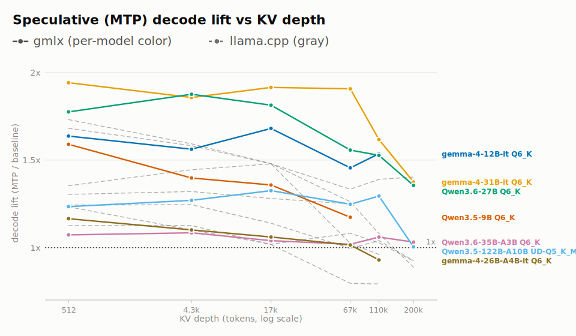
</picture>

## Methodology

All numbers are single-stream (concurrency 1) server throughput,
gmlx vs the reference engine, measured with the same GGUF weights,
same sampler, and the same chat prompts on both engines.

| | |
|---|---|
| **Hardware** | Apple M5 Max, 128 GB unified memory (MacBook Pro) |
| **gmlx** | `0.1.0` |
| **mlx-kquant** | `0.3.5` (K-quant + perf kernels) |
| **llama.cpp** | `b9967` |
| **DeepSeek-V4-Flash reference** | ds4-server (dwarfstar) @ `80ebbc3`, ignore-eos patched |
| **Dates** | 2026-07-05 .. 2026-07-15 |
| **Prompt corpus** | HuggingFaceH4/ultrachat_200k:train_sft (chat template applied) |
| **Sampling** | temperature 0.6, top-p 0.95, top-k 20, seed 1234 (coupled RNG across engines) |
| **Speculative draft** | MTP @ 3 draft tokens (native/preserved MTP head, or gemma-4's companion drafter) |
| **Aggregation** | 4 requests/cell x 2 thermal-alternated rounds, median reported |
| **Thermal protocol** | cool to <=50 C between arms, 20s baseline cooldown, 1 warmup request |
| **Decode metric** | median decode tok/s over full-length samples (>=150 output tokens) |
| **Prefill metric** | median prefill tok/s over all successful samples |

## Model provenance

Chart labels are sanitized (abliterated community builds render as the
base model); this table is the honest weight mapping for reproduction.

| Model | GGUF file | Source | MTP |
|---|---|---|---|
| Qwen3.5-122B-A10B UD-Q5_K_M | `Qwen3.5-122B-A10B-UD-Q5_K_M-00001-of-00003.gguf` | [HF](https://huggingface.co/unsloth/Qwen3.5-122B-A10B-MTP-GGUF) | native |
| Qwen3.6-35B-A3B Q6_K | `Qwen3.6-35B-A3B-uncensored-heretic-Native-MTP-Preserved-Q6_K.gguf` | [HF](https://huggingface.co/llmfan46/Qwen3.6-35B-A3B-uncensored-heretic-Native-MTP-Preserved-GGUF) | native |
| Qwen3.6-27B Q6_K | `Qwen_Qwen3.6-27B-Q6_K.gguf` | [HF](https://huggingface.co/bartowski/Qwen_Qwen3.6-27B-GGUF) | native |
| Qwen3.5-9B Q6_K | `Qwen3.5-9B-Q6_K.gguf` | [HF](https://huggingface.co/unsloth/Qwen3.5-9B-MTP-GGUF) | native |
| gemma-4-31B-it Q6_K | `gemma-4-31B-it-Q6_K.gguf` | - | drafter |
| gemma-4-26B-A4B-it Q6_K | `google_gemma-4-26B-A4B-it-Q6_K.gguf` | [HF](https://huggingface.co/bartowski/google_gemma-4-26B-A4B-it-GGUF) | drafter |
| gemma-4-12B-it Q6_K | `gemma-4-12b-it-Q6_K.gguf` | - | drafter |
| gemma-4-E4B-it Q6_K | `gemma-4-E4B-it-Q6_K.gguf` | - | - |
| gemma-4-E2B-it UD-Q6_K_XL | `gemma-4-E2B-it-UD-Q6_K_XL.gguf` | - | - |
| gpt-oss-120b MXFP4 | `gpt-oss-120b-heretic-v2-MXFP4.gguf` | [HF](https://huggingface.co/llmfan46/gpt-oss-120b-heretic-v2-GGUF) | - |
| gpt-oss-20b MXFP4 | `gpt-oss-20b-mxfp4.gguf` | - | - |
| Dolphin3.0-Llama3.1-8B Q6_K | `Dolphin3.0-Llama3.1-8B-abliterated.Q6_K.gguf` | [HF](https://huggingface.co/RavichandranJ/Dolphin3-Cyber-8B-GGUF) | - |
| DeepSeek-V4-Flash UD-IQ3_XXS | `DeepSeek-V4-Flash-UD-IQ3_XXS-00001-of-00004.gguf` | [HF](https://huggingface.co/unsloth/DeepSeek-V4-Flash-GGUF) | - |
| DeepSeek-V4-Flash IQ2_XXS | `DeepSeek-V4-Flash-IQ2XXS-w2Q2K-AProjQ8-SExpQ8-OutQ8-chat-v2-imatrix.gguf` | [HF](https://huggingface.co/antirez/deepseek-v4-gguf) | - |

## Per-model detail

### Qwen3.5-122B-A10B UD-Q5_K_M

<picture>
  <source media="(prefers-color-scheme: dark)" srcset="assets/perf/per-model/qwen3.5-122b-a10b-ud-q5km-panels-dark.svg">
  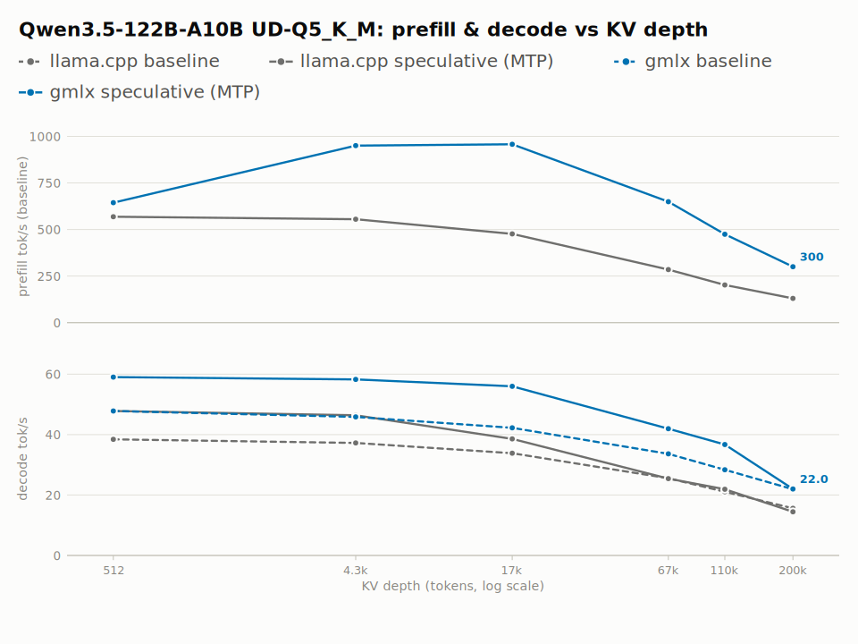
</picture>

| KV depth | gmlx decode (baseline) | gmlx decode (MTP) | MTP lift | llama.cpp decode (MTP) | gmlx/llama.cpp decode | gmlx prefill | llama.cpp prefill |
|---|--:|--:|--:|--:|--:|--:|--:|
| 512 | 47.8 (47.4-48) | 59 (55.6-67.3) | 1.23x | 47.8 (42.3-51) | 1.23x | 643.9 (482.2-706.7) | 568.8 (546.6-612.4) |
| 4.3k | 45.9 (45.7-46.2) | 58.3 (55.6-62.8) | 1.27x | 46.4 (44.7-48) | 1.26x | 950.3 (935.3-956.4) | 555 (496.5-607.6) |
| 17k | 42.2 (42.1-42.4) | 56 (46.6-61.2) | 1.33x | 38.6 (37.4-40.7) | 1.45x | 957.6 (945.2-968.5) | 476.3 (449.9-491.7) |
| 67k | 33.6 (32.8-33.9) | 42 (38.5-44.7) | 1.25x | 25.4 (24.4-31.2) | 1.65x | 649.5 (628-654.5) | 284.8 (276-289.7) |
| 110k | 28.4 (27.9-28.8) | 36.7 (34.4-38.2) | 1.29x | 21.9 (21.1-24.7) | 1.68x | 474.2 (463.2-478.4) | 202.2 (201.2-207.3) |
| 200k | 21.9 (21.8-22) | 22 (20.6-23.8) | 1.00x | 14.4 (13.9-15.9) | 1.53x | 300.3 (297.5-301.3) | 129.9 (129.3-130) |

### Qwen3.6-35B-A3B Q6_K

<picture>
  <source media="(prefers-color-scheme: dark)" srcset="assets/perf/per-model/qwen3.6-35b-a3b-heretic-q6k-panels-dark.svg">
  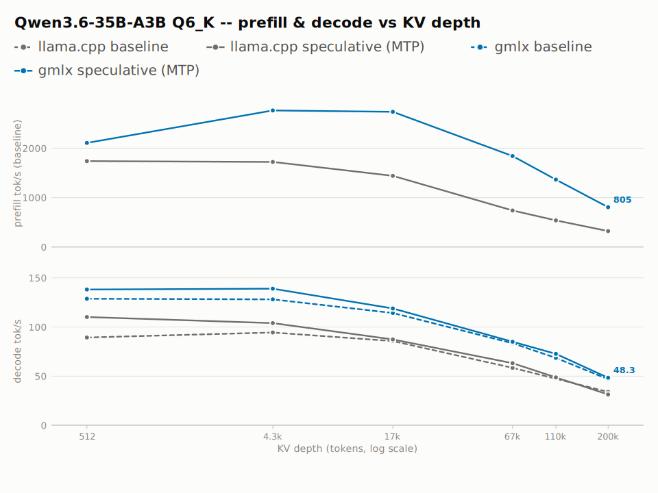
</picture>

| KV depth | gmlx decode (baseline) | gmlx decode (MTP) | MTP lift | llama.cpp decode (MTP) | gmlx/llama.cpp decode | gmlx prefill | llama.cpp prefill |
|---|--:|--:|--:|--:|--:|--:|--:|
| 512 | 128.8 (126.7-130) | 138.1 (131.4-143.1) | 1.07x | 110.1 (99.9-115.3) | 1.25x | 2106.6 (1554.9-2319.9) | 1737.9 (1166.7-1756.3) |
| 4.3k | 128.1 (127.5-128.7) | 139 (123.1-151.3) | 1.09x | 104 (96.9-111.1) | 1.34x | 2764.5 (2636.6-2849.5) | 1722.3 (1478.8-1823.7) |
| 17k | 114.3 (113.9-114.5) | 118.8 (117.1-130.5) | 1.04x | 87.4 (83.4-103.3) | 1.36x | 2736.4 (2685.6-2761.8) | 1440.5 (1403.8-1459.5) |
| 67k | 83.4 (82.8-84.7) | 85 (80.7-89.8) | 1.02x | 63.2 (52.4-70.1) | 1.34x | 1841.4 (1834.8-1849.8) | 739 (727.1-798.2) |
| 110k | 68.5 (68.4-69.1) | 72.6 (66-80.3) | 1.06x | 48.6 (40.9-50.8) | 1.49x | 1364.7 (1338.3-1374.4) | 537.6 (517-561.6) |
| 200k | 46.8 (46.5-48.2) | 48.3 (46.2-50.7) | 1.03x | 31.3 (27.2-36.3) | 1.54x | 805.1 (785-835) | 321.1 (315.8-324.3) |

### Qwen3.6-27B Q6_K

<picture>
  <source media="(prefers-color-scheme: dark)" srcset="assets/perf/per-model/qwen3.6-27b-q6k-panels-dark.svg">
  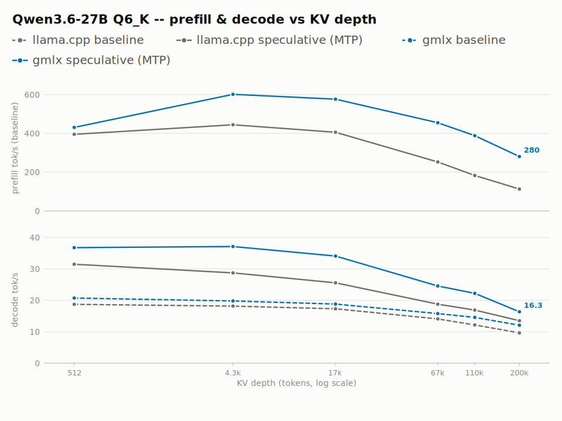
</picture>

| KV depth | gmlx decode (baseline) | gmlx decode (MTP) | MTP lift | llama.cpp decode (MTP) | gmlx/llama.cpp decode | gmlx prefill | llama.cpp prefill |
|---|--:|--:|--:|--:|--:|--:|--:|
| 512 | 20.7 (20.7-20.8) | 36.8 (35.1-39.9) | 1.78x | 31.5 (31.1-32.6) | 1.17x | 430.2 (407.4-489.8) | 394.6 (335.7-446.8) |
| 4.3k | 19.8 (19.7-20.1) | 37.1 (33.9-47) | 1.87x | 28.7 (27.5-56.4) | 1.29x | 600.9 (596-606.2) | 443.9 (412.5-464.4) |
| 17k | 18.8 (18.7-18.8) | 34.1 (29.5-39.3) | 1.81x | 25.6 (24.1-29.8) | 1.33x | 575.9 (570.1-587.6) | 405.4 (399.7-425.8) |
| 67k | 15.8 (15.5-16.2) | 24.6 (21.8-31.3) | 1.56x | 18.8 (17.6-21.6) | 1.31x | 454.5 (436.6-466.1) | 252.1 (247.9-255.7) |
| 110k | 14.5 (14.5-14.6) | 22.2 (18.5-23.8) | 1.53x | 16.9 (13.1-18.5) | 1.31x | 387.7 (384.6-389.3) | 182.6 (160.3-185) |
| 200k | 12.1 (11.7-12.4) | 16.3 (15.3-17.1) | 1.35x | 13.5 (11.2-14.8) | 1.21x | 280.3 (273.1-285.8) | 112.8 (112.5-114.5) |

### Qwen3.5-9B Q6_K

<picture>
  <source media="(prefers-color-scheme: dark)" srcset="assets/perf/per-model/qwen3.5-9b-q6k-panels-dark.svg">
  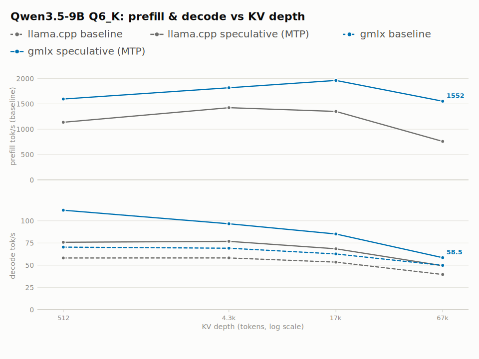
</picture>

| KV depth | gmlx decode (baseline) | gmlx decode (MTP) | MTP lift | llama.cpp decode (MTP) | gmlx/llama.cpp decode | gmlx prefill | llama.cpp prefill |
|---|--:|--:|--:|--:|--:|--:|--:|
| 512 | 70.3 (69.1-72.4) | 111.9 (102.9-126.7) | 1.59x | 75.8 (72.8-80.9) | 1.48x | 1595 (1407.5-2267.2) | 1136.4 (1075.4-1142.4) |
| 4.3k | 69.1 (69-69.6) | 96.6 (85.7-103) | 1.40x | 76.8 (69.5-86.7) | 1.26x | 1817.4 (1786.1-1916.4) | 1424 (1342-1582) |
| 17k | 62.7 (62-63.5) | 85.1 (76.7-91.9) | 1.36x | 68.4 (61.3-73.6) | 1.24x | 1962.4 (1920-1997.6) | 1350.5 (1306-1375.9) |
| 67k | 49.8 (49.3-50.7) | 58.5 (52.5-64.1) | 1.17x | 49.4 (43.9-59.4) | 1.18x | 1551.7 (1540.2-1600.1) | 758.7 (740.7-798.9) |

### gemma-4-31B-it Q6_K

<picture>
  <source media="(prefers-color-scheme: dark)" srcset="assets/perf/per-model/gemma-4-31b-q6k-panels-dark.svg">
  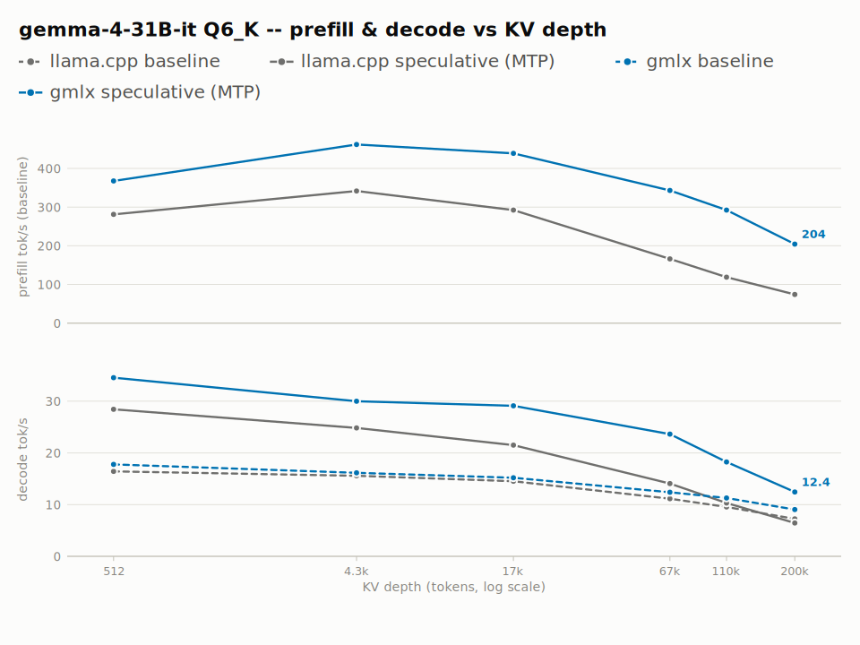
</picture>

| KV depth | gmlx decode (baseline) | gmlx decode (MTP) | MTP lift | llama.cpp decode (MTP) | gmlx/llama.cpp decode | gmlx prefill | llama.cpp prefill |
|---|--:|--:|--:|--:|--:|--:|--:|
| 512 | 17.8 (17.6-18) | 34.5 (32.5-37.5) | 1.94x | 28.4 (25.1-28.8) | 1.21x | 367.5 (360.3-384.2) | 281.1 (261-283.8) |
| 4.3k | 16.1 (15.2-17) | 30 (26.5-31.7) | 1.86x | 24.8 (21.5-27.1) | 1.21x | 461.8 (439-490.4) | 341.7 (317.1-354.5) |
| 17k | 15.2 (13.9-16.1) | 29.1 (27.4-34.4) | 1.91x | 21.5 (18.6-25.6) | 1.35x | 439 (407.9-463.6) | 292.4 (284.9-295.8) |
| 67k | 12.4 (11.1-13.2) | 23.6 (19.9-25.5) | 1.90x | 14.1 (13.2-18.2) | 1.67x | 343.1 (319.2-363.7) | 166 (163.9-166.7) |
| 110k | 11.3 (11.2-11.4) | 18.2 (17-19.6) | 1.61x | 10.3 (9.6-13.5) | 1.77x | 292.3 (290.5-293.3) | 118.7 (116.9-122.8) |
| 200k | 9 (9-9.1) | 12.4 (11.8-13.5) | 1.38x | 6.4 (6-8.2) | 1.94x | 204.2 (192.2-207.7) | 74.1 (72.1-75.4) |

### gemma-4-26B-A4B-it Q6_K

<picture>
  <source media="(prefers-color-scheme: dark)" srcset="assets/perf/per-model/gemma-4-26b-a4b-q6k-panels-dark.svg">
  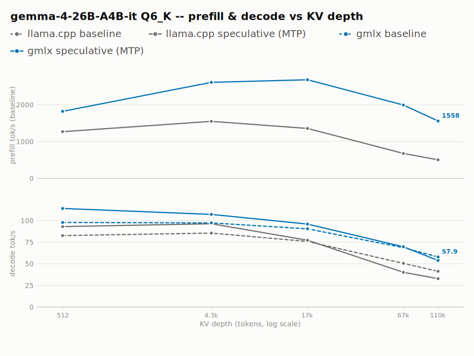
</picture>

| KV depth | gmlx decode (baseline) | gmlx decode (MTP) | MTP lift | llama.cpp decode (MTP) | gmlx/llama.cpp decode | gmlx prefill | llama.cpp prefill |
|---|--:|--:|--:|--:|--:|--:|--:|
| 512 | 97.8 (96.9-98.8) | 113.9 (104.2-127.1) | 1.16x | 93 (90.4-93.5) | 1.22x | 1821.3 (1531.2-2125) | 1268.3 (1104.3-1480.1) |
| 4.3k | 97.2 (97.1-97.3) | 107.1 (98.1-117.7) | 1.10x | 96.3 (79.2-109.9) | 1.11x | 2610.2 (2514.4-2668.2) | 1549.2 (1400-1650.7) |
| 17k | 90.4 (90.1-90.9) | 95.9 (89.5-124.4) | 1.06x | 77.2 (65.6-97) | 1.24x | 2679.4 (2647.9-2731) | 1355.5 (1281.5-1413.2) |
| 67k | 68.6 (67.9-69.3) | 69.7 (65.7-75.5) | 1.02x | 40.2 (36.1-47.8) | 1.73x | 1992.6 (1964-2010.6) | 676.3 (622.2-722.3) |
| 110k | 57.9 (57.5-58.5) | 53.8 (49.9-70.2) | 0.93x | 32.8 (30-33.6) | 1.64x | 1558 (1541.4-1564.8) | 502 (491.3-533.6) |

### gemma-4-12B-it Q6_K

<picture>
  <source media="(prefers-color-scheme: dark)" srcset="assets/perf/per-model/gemma-4-12b-q6k-panels-dark.svg">
  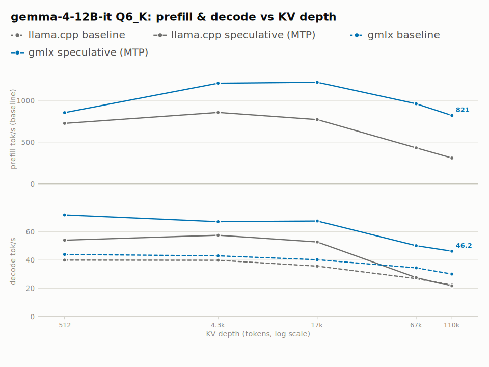
</picture>

| KV depth | gmlx decode (baseline) | gmlx decode (MTP) | MTP lift | llama.cpp decode (MTP) | gmlx/llama.cpp decode | gmlx prefill | llama.cpp prefill |
|---|--:|--:|--:|--:|--:|--:|--:|
| 512 | 43.9 (43.3-44) | 71.9 (66.3-87.3) | 1.64x | 54 (51.4-55.3) | 1.33x | 854.4 (808.8-965.4) | 726.2 (589.4-773.2) |
| 4.3k | 42.9 (42.8-43.3) | 67.1 (62.9-76.9) | 1.56x | 57.5 (52.4-65.4) | 1.17x | 1208 (1185.8-1228.8) | 856.8 (772.5-899.7) |
| 17k | 40.2 (40-40.5) | 67.6 (63.8-77) | 1.68x | 52.7 (46.9-56.5) | 1.28x | 1219.7 (1209.2-1239.5) | 771.2 (761.8-811) |
| 67k | 34.4 (33.9-34.9) | 50.1 (47.1-66.6) | 1.46x | 27.5 (23.7-33.2) | 1.82x | 961.2 (944.2-976.6) | 431.9 (411.5-438) |
| 110k | 30.1 (30-30.7) | 46.2 (38.6-53.1) | 1.53x | 21.5 (17.9-22.8) | 2.15x | 821 (806.1-827.9) | 310.1 (306.7-326.3) |

### gemma-4-E4B-it Q6_K

<picture>
  <source media="(prefers-color-scheme: dark)" srcset="assets/perf/per-model/gemma-4-e4b-q6k-panels-dark.svg">
  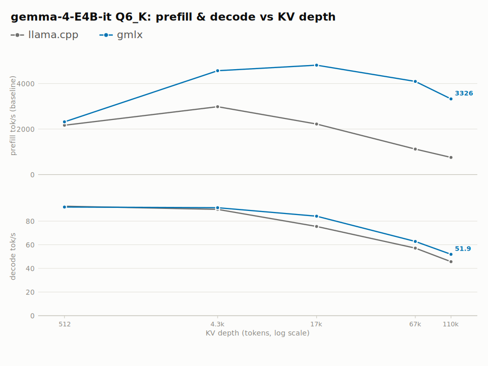
</picture>

| KV depth | gmlx decode | llama.cpp decode | gmlx/llama.cpp decode | gmlx prefill | llama.cpp prefill | gmlx/llama.cpp prefill |
|---|--:|--:|--:|--:|--:|--:|
| 512 | 91.9 (91.2-92.1) | 92.6 (92.3-93.5) | 0.99x | 2317.7 (2223.7-2456.6) | 2168.9 (1974.8-2547.6) | 1.07x |
| 4.3k | 91.3 (90.2-91.8) | 89.9 (85.9-90.8) | 1.02x | 4564.5 (4367.5-4613.2) | 2984.5 (2769.6-3247.5) | 1.53x |
| 17k | 84.1 (82.9-85) | 75.5 (74.3-81.1) | 1.11x | 4810.2 (4662.7-4954) | 2221.4 (2200.4-2314.9) | 2.17x |
| 67k | 62.8 (61.1-63.5) | 57.1 (54.2-60.9) | 1.10x | 4095.1 (4031.9-4239.9) | 1119.9 (1084.2-1159.4) | 3.66x |
| 110k | 51.9 (51.2-52.2) | 45.7 (45.2-46) | 1.14x | 3326.1 (3266.9-3420.2) | 754.2 (717.8-783.8) | 4.41x |

### gemma-4-E2B-it UD-Q6_K_XL

<picture>
  <source media="(prefers-color-scheme: dark)" srcset="assets/perf/per-model/gemma-4-e2b-q6kxl-panels-dark.svg">
  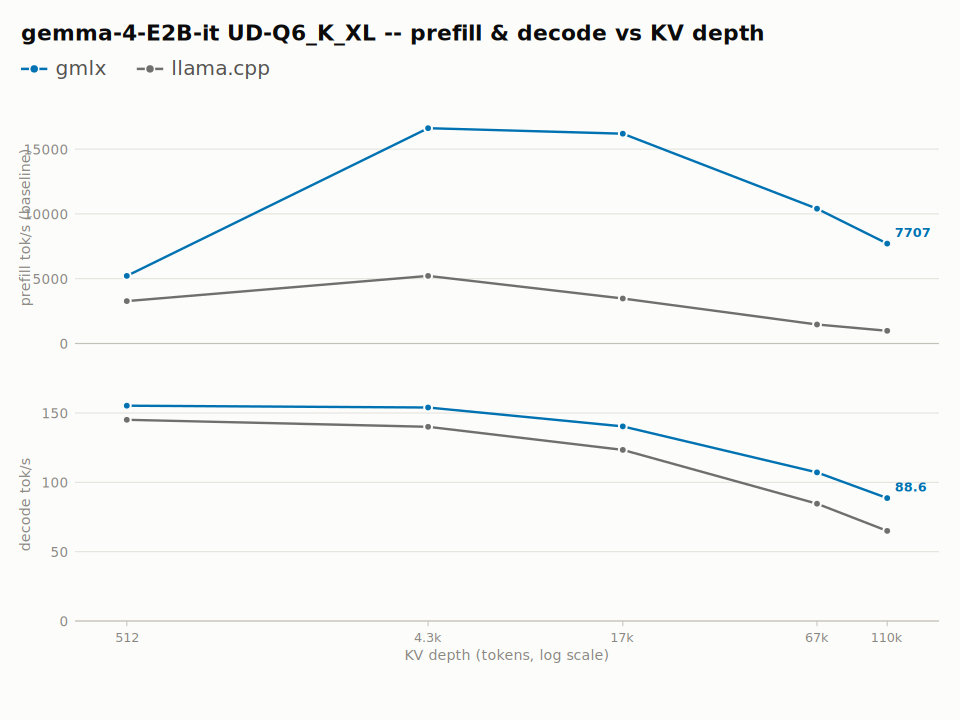
</picture>

| KV depth | gmlx decode | llama.cpp decode | gmlx/llama.cpp decode | gmlx prefill | llama.cpp prefill | gmlx/llama.cpp prefill |
|---|--:|--:|--:|--:|--:|--:|
| 512 | 155.3 (155-156) | 145.1 (143.7-146) | 1.07x | 5217 (5037.3-5527) | 3273.8 (3080.6-3759.2) | 1.59x |
| 4.3k | 153.9 (153.7-163) | 140.1 (138.9-141.5) | 1.10x | 16620.1 (16156.5-17589) | 5212.7 (5061.9-5636.2) | 3.19x |
| 17k | 140.4 (139.6-141.8) | 123.4 (120.5-124.1) | 1.14x | 16188.3 (15211.5-19019.1) | 3469.4 (3412.9-3619.4) | 4.67x |
| 67k | 107.2 (106.6-107.7) | 84.6 (83.4-85) | 1.27x | 10403.4 (9910.2-11056.5) | 1460.4 (1417.8-1464.6) | 7.12x |
| 110k | 88.6 (84.6-90.2) | 65 (64.3-65.5) | 1.36x | 7706.8 (7288.2-8190.8) | 975.4 (966.9-983.2) | 7.90x |

### gpt-oss-120b MXFP4

<picture>
  <source media="(prefers-color-scheme: dark)" srcset="assets/perf/per-model/gpt-oss-120b-heretic-mxfp4-panels-dark.svg">
  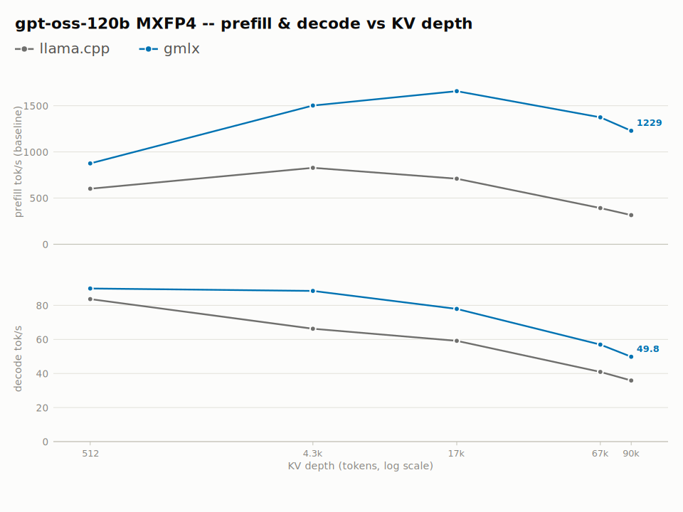
</picture>

| KV depth | gmlx decode | llama.cpp decode | gmlx/llama.cpp decode | gmlx prefill | llama.cpp prefill | gmlx/llama.cpp prefill |
|---|--:|--:|--:|--:|--:|--:|
| 512 | 89.9 (87.6-91.2) | 83.7 (83.7-84.1) | 1.07x | 875.5 (764.8-1078.1) | 601.1 (581.9-622.7) | 1.46x |
| 4.3k | 88.5 (86.8-91.6) | 66.3 (65.6-69.6) | 1.33x | 1502.4 (1423.3-1558.5) | 827.5 (780.3-870.2) | 1.82x |
| 17k | 77.9 (76.7-78.5) | 59.2 (58.5-59.7) | 1.32x | 1658.1 (1579.1-1676.7) | 709.5 (683-737.3) | 2.34x |
| 67k | 57 (54-65.9) | 40.9 (39.6-41.4) | 1.39x | 1374.5 (1340.1-1386.8) | 391.8 (386.9-395.4) | 3.51x |
| 90k | 49.8 (48.7-51.3) | 35.9 | 1.39x | 1229 (1219.9-1241.3) | 315.2 (308.4-321.2) | 3.90x |

### gpt-oss-20b MXFP4

<picture>
  <source media="(prefers-color-scheme: dark)" srcset="assets/perf/per-model/gpt-oss-20b-mxfp4-panels-dark.svg">
  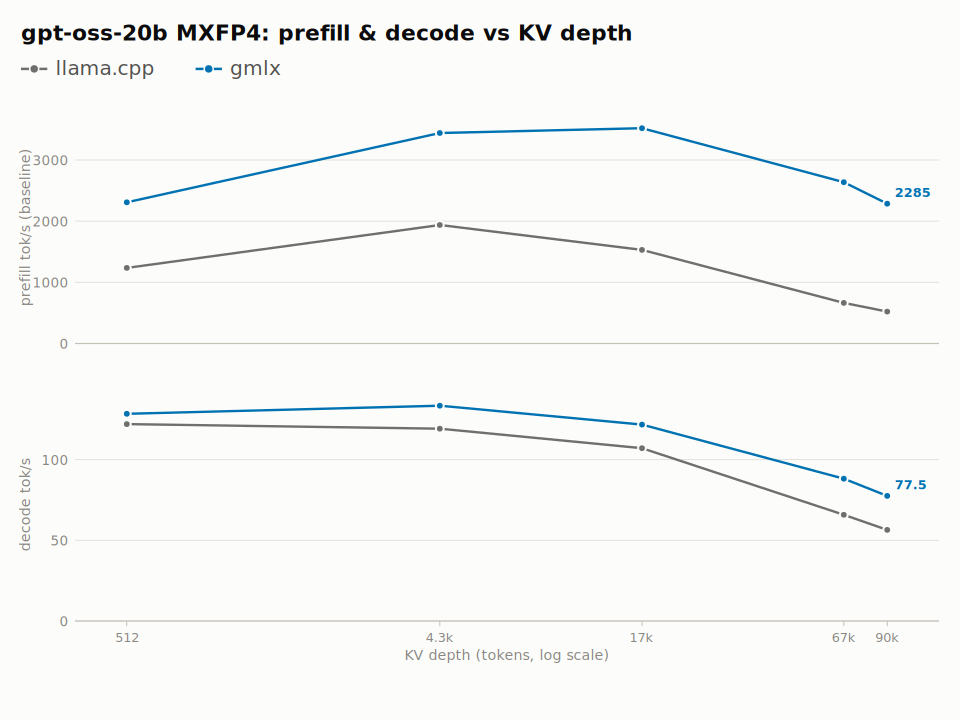
</picture>

| KV depth | gmlx decode | llama.cpp decode | gmlx/llama.cpp decode | gmlx prefill | llama.cpp prefill | gmlx/llama.cpp prefill |
|---|--:|--:|--:|--:|--:|--:|
| 512 | 128.4 (126.5-130.5) | 122 (116-122) | 1.05x | 2307.5 (2149.1-2689.5) | 1235.5 (1055.5-1666.8) | 1.87x |
| 4.3k | 133.4 (131.3-135.1) | 119.1 (112.9-121.6) | 1.12x | 3441.8 (3269.6-3525.8) | 1937.4 (1717.7-1973.9) | 1.78x |
| 17k | 121.7 (119.7-122.6) | 107 (104-107.8) | 1.14x | 3520.6 (3354.2-3607.7) | 1529.7 (1507.3-1553) | 2.30x |
| 67k | 88.2 (84.2-92.7) | 65.8 (64.6-68.6) | 1.34x | 2636.2 (2453-2655.5) | 662.8 (653.4-703.2) | 3.98x |
| 90k | 77.5 (74.8-82.8) | 56.4 (55.7-57.9) | 1.37x | 2285.5 (2258.9-2333.2) | 520.9 (517.3-547) | 4.39x |

### Dolphin3.0-Llama3.1-8B Q6_K

<picture>
  <source media="(prefers-color-scheme: dark)" srcset="assets/perf/per-model/dolphin3-llama3.1-8b-q6k-panels-dark.svg">
  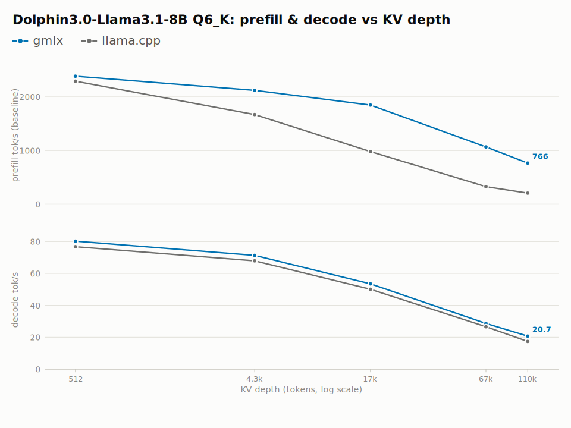
</picture>

| KV depth | gmlx decode | llama.cpp decode | gmlx/llama.cpp decode | gmlx prefill | llama.cpp prefill | gmlx/llama.cpp prefill |
|---|--:|--:|--:|--:|--:|--:|
| 512 | 80.2 (78.9-82.1) | 76.7 (75.3-78.7) | 1.05x | 2384.4 (2279.7-2462.6) | 2290.8 (2206.5-2481) | 1.04x |
| 4.3k | 71.3 (70.5-71.8) | 67.9 (65.3-70.2) | 1.05x | 2120.1 (1940.1-2236.3) | 1669.2 (1566.4-1810.8) | 1.27x |
| 17k | 53.4 (52.7-54.6) | 50.1 (48.9-50.4) | 1.07x | 1846.2 (1752.2-1902.3) | 980.1 (943.4-1006.4) | 1.88x |
| 67k | 28.7 (26.7-29.1) | 26.6 (23.3-27.4) | 1.08x | 1065.5 (1009.8-1087.3) | 326.4 (308.1-345.4) | 3.26x |
| 110k | 20.7 (19.4-21.9) | 17.4 (16.6-17.6) | 1.19x | 765.6 (742.2-776.3) | 205.9 (200.7-208.8) | 3.72x |

### DeepSeek-V4-Flash UD-IQ3_XXS

<picture>
  <source media="(prefers-color-scheme: dark)" srcset="assets/perf/per-model/deepseek-v4-flash-unsloth-udiq3xxs-panels-dark.svg">
  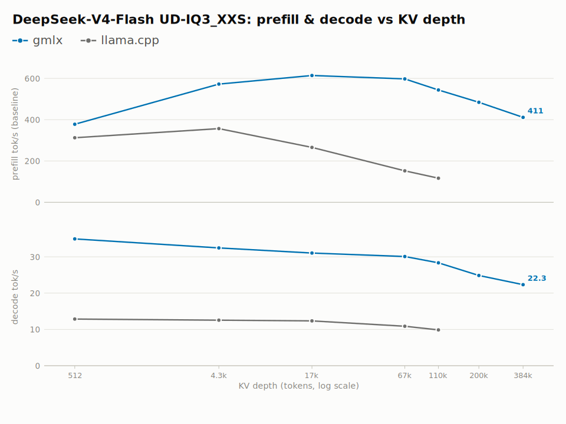
</picture>

| KV depth | gmlx decode | llama.cpp decode | gmlx/llama.cpp decode | gmlx prefill | llama.cpp prefill | gmlx/llama.cpp prefill |
|---|--:|--:|--:|--:|--:|--:|
| 512 | 34.9 (34.1-35) | 12.9 (12.7-13.1) | 2.71x | 377.9 (334.7-438.4) | 312.5 (280.6-336.8) | 1.21x |
| 4.3k | 32.5 (32.3-32.7) | 12.5 (12.4-12.7) | 2.60x | 572.3 (567.3-582.8) | 356.7 (342.2-370.7) | 1.60x |
| 17k | 31 (30.6-31.8) | 12.4 (12-12.5) | 2.50x | 614.1 (610-619.6) | 265.7 (248.9-279.8) | 2.31x |
| 67k | 30.1 (29.1-30.5) | 10.9 (10.6-10.9) | 2.76x | 597.4 (591-610.5) | 152.1 (142.2-157.1) | 3.93x |
| 110k | 28.3 (28-28.9) | 9.9 (9.7-9.9) | 2.86x | 543.8 (492.2-569.6) | 116.5 (112-118.7) | 4.67x |
| 200k | 24.9 (24.8-25.1) | - | - | 484.3 (450-493.2) | - | - |
| 384k | 22.3 (20.7-22.9) | - | - | 411.1 (397.2-431.8) | - | - |

## DeepSeek-V4-Flash (reference engine: ds4-server)

This model's comparison engine is **ds4-server** (dwarfstar's
DeepSeek-V4 server, ignore-eos patched), not llama.cpp -- llama.cpp
has no DeepSeek-V4-Flash path. Ratios below are gmlx / ds4-server.

### DeepSeek-V4-Flash IQ2_XXS

<picture>
  <source media="(prefers-color-scheme: dark)" srcset="assets/perf/per-model/deepseek-v4-flash-antirez-iq2xxs-panels-dark.svg">
  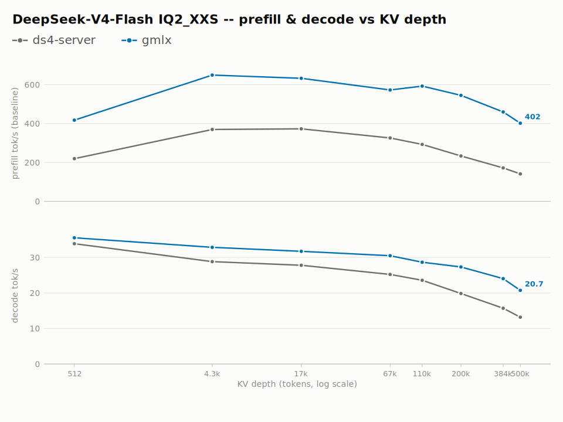
</picture>

| KV depth | gmlx decode | ds4-server decode | gmlx/ds4-server decode | gmlx prefill | ds4-server prefill | gmlx/ds4-server prefill |
|---|--:|--:|--:|--:|--:|--:|
| 512 | 35.5 (35.3-35.7) | 33.8 (33.6-34.6) | 1.05x | 417.5 (408.9-422.2) | 219.5 (210.2-274.8) | 1.90x |
| 4.3k | 32.8 (32.7-33) | 28.8 (28.7-29.7) | 1.14x | 649.3 (645.6-660.4) | 369.6 (362-372.6) | 1.76x |
| 17k | 31.7 | 27.8 (27.5-28.9) | 1.14x | 633 (632.5-633.5) | 373 (344.7-380.5) | 1.70x |
| 67k | 30.5 (30.1-30.8) | 25.2 (24.1-26.4) | 1.21x | 572.8 (570.2-575.4) | 326 (303.9-328.3) | 1.76x |
| 110k | 28.6 (28.5-29.3) | 23.6 (23.2-23.9) | 1.21x | 592.9 (588.1-598.3) | 292.8 (282.6-294.3) | 2.02x |
| 200k | 27.3 (27.2-27.5) | 19.8 (18.9-20.7) | 1.38x | 545 (530-549.5) | 233.2 (224.2-238.6) | 2.34x |
| 384k | 24 (23.9-24.1) | 15.7 (15.6-15.8) | 1.53x | 459.7 (456.3-460.6) | 171.9 (168.7-172.1) | 2.67x |
| 500k | 20.7 (20.5-21.6) | 13.2 (13.1-13.7) | 1.57x | 402 (390-404.5) | 141.1 (131.4-141.1) | 2.85x |
