# Benchmarks

gmlx serves the same GGUF files faster than llama.cpp, one request at a
time, at context depths from 512 to more than 200K tokens. Its prefill is
faster on every model at every measured depth. Above a depth of about 4K
tokens its decoding is faster too, and the gap grows as the context
deepens. Speculative decoding adds more where the model has a
[native head](glossary.md#native-head) or a companion drafter.

To measure your own model the same way, run the
[benchmark harness](../bench/) from a gmlx checkout, with `llama-server` on
your PATH:

```sh
cd bench
./serve-bench.py ~/models/model.gguf --tokenizer gguf --dry-run   # Prints the plan and runs nothing.
./serve-bench.py ~/models/model.gguf --tokenizer gguf --depths 512,4096,16384
./serve-bench.py --config example.json                            # Speculative arms. Edit its model paths first.
```

The report, the raw samples and the charts land in `bench/results/`. The
data behind this page's charts is in [a JSON file](benchmarks.json).

- [Summary](#summary)
- [Methodology](#methodology)
- [Model provenance](#model-provenance)
- [Per-model detail](#per-model-detail)
- [DeepSeek-V4 against ds4-server](#deepseek-v4-against-ds4-server)
- [Serving measurements](#serving-measurements)
- [KV cache fidelity](#kv-cache-fidelity)

## Summary

gmlx's throughput divided by the reference engine's, for every model,
against the context depth:

<picture>
  <source media="(prefers-color-scheme: dark)" srcset="assets/perf/fleet-ratio-dark.svg">
  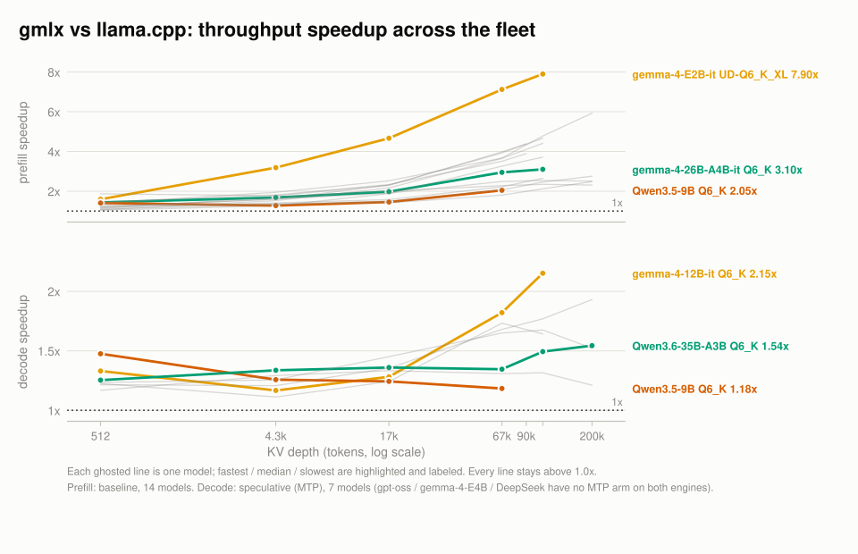
</picture>

Speculative decoding against plain decoding on the same server, for each
model, against the context depth:

<picture>
  <source media="(prefers-color-scheme: dark)" srcset="assets/perf/mtp-lift-dark.svg">
  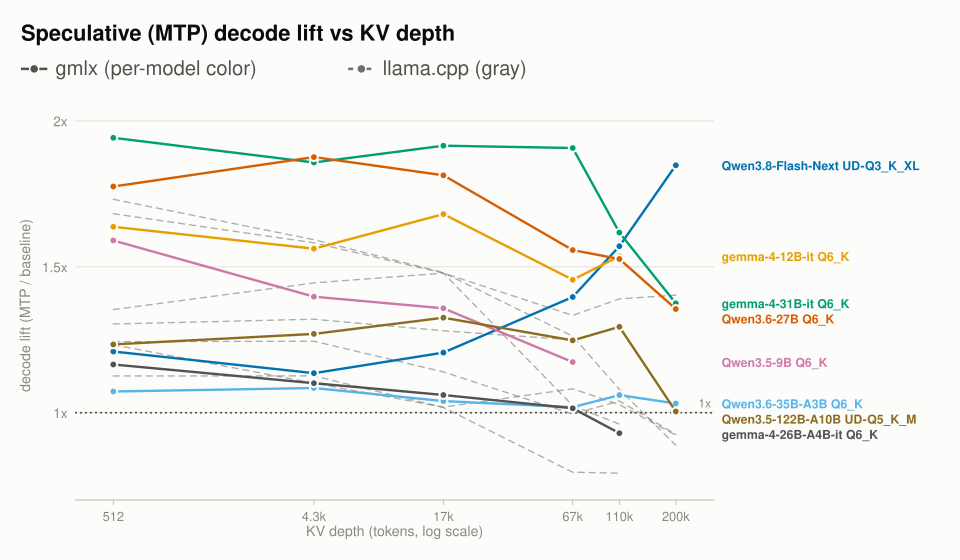
</picture>

## Methodology

Every number in the per-model tables is server throughput for one request
at a time, in tokens per second. Both engines ran the same GGUF weights,
sampler settings and chat prompts.

| Item | Setting |
|---|---|
| Hardware | Apple M5 Max with 128 GB of unified memory, in a MacBook Pro |
| llama.cpp | `b9967` |
| DeepSeek-V4 reference | antirez's ds4-server with the ignore-eos patch: `b030961` for V4-Flash IQ2_XXS, `8db1d1d` for V4.1-Flash Q2 |
| Prompt corpus | `HuggingFaceH4/ultrachat_200k:train_sft`, with the chat template applied |
| Sampling | Temperature 0.6, top-p 0.95, top-k 20, seed 1234, the same random sequence on both engines |
| Speculative draft | Three draft tokens a round (two on Qwen3.8-Flash-Next), from the native MTP head or gemma-4's drafter |
| Aggregation | Four requests a cell, in two rounds that alternate the engines. A cell gives the median. |
| Thermal protocol | A cooldown to 50 C or below between engines, 20 seconds of cooldown and one warmup request |
| Decode metric | Decode tokens per second over samples of at least 150 output tokens |
| Prefill metric | Prefill tokens per second over all successful samples |

MTP@N means speculative decoding with N draft tokens a round on both
engines. The baseline column is the same server with it off.

## Model provenance

Chart labels give the base model, even for a community build, so this
table names the GGUF file behind each label.

| Model | GGUF file | Source | MTP |
|---|---|---|---|
| Qwen3.5-122B-A10B UD-Q5_K_M | `Qwen3.5-122B-A10B-UD-Q5_K_M-00001-of-00003.gguf` | [HF](https://huggingface.co/unsloth/Qwen3.5-122B-A10B-MTP-GGUF) | Native |
| Qwen3.6-35B-A3B Q6_K | `Qwen3.6-35B-A3B-uncensored-heretic-Native-MTP-Preserved-Q6_K.gguf` | [HF](https://huggingface.co/llmfan46/Qwen3.6-35B-A3B-uncensored-heretic-Native-MTP-Preserved-GGUF) | Native |
| Qwen3.6-27B Q6_K | `Qwen_Qwen3.6-27B-Q6_K.gguf` | [HF](https://huggingface.co/bartowski/Qwen_Qwen3.6-27B-GGUF) | Native |
| Qwen3.5-9B Q6_K | `Qwen3.5-9B-Q6_K.gguf` | [HF](https://huggingface.co/unsloth/Qwen3.5-9B-MTP-GGUF) | Native |
| gemma-4-31B-it Q6_K | `gemma-4-31B-it-Q6_K.gguf` | - | Drafter |
| gemma-4-26B-A4B-it Q6_K | `google_gemma-4-26B-A4B-it-Q6_K.gguf` | [HF](https://huggingface.co/bartowski/google_gemma-4-26B-A4B-it-GGUF) | Drafter |
| gemma-4-12B-it Q6_K | `gemma-4-12b-it-Q6_K.gguf` | - | Drafter |
| gemma-4-E4B-it Q6_K | `gemma-4-E4B-it-Q6_K.gguf` | - | - |
| gemma-4-E2B-it UD-Q6_K_XL | `gemma-4-E2B-it-UD-Q6_K_XL.gguf` | - | - |
| gpt-oss-120b MXFP4 | `gpt-oss-120b-heretic-v2-MXFP4.gguf` | [HF](https://huggingface.co/llmfan46/gpt-oss-120b-heretic-v2-GGUF) | - |
| gpt-oss-20b MXFP4 | `gpt-oss-20b-mxfp4.gguf` | - | - |
| Dolphin3.0-Llama3.1-8B Q6_K | `Dolphin3.0-Llama3.1-8B-abliterated.Q6_K.gguf` | [HF](https://huggingface.co/RavichandranJ/Dolphin3-Cyber-8B-GGUF) | - |
| DeepSeek-V4-Flash UD-IQ3_XXS | `DeepSeek-V4-Flash-UD-IQ3_XXS-00001-of-00004.gguf` | [HF](https://huggingface.co/unsloth/DeepSeek-V4-Flash-GGUF) | - |
| DeepSeek-V4-Flash IQ2_XXS | `DeepSeek-V4-Flash-IQ2XXS-w2Q2K-AProjQ8-SExpQ8-OutQ8-chat-v2-imatrix-0731.gguf` | [HF](https://huggingface.co/antirez/deepseek-v4-gguf) | - |
| DeepSeek-V4.1-Flash Q2 | `DeepSeek-V4.1-Flash-Q2.gguf` | [HF](https://huggingface.co/antirez/deepseek-v4.1-flash-gguf) | - |
| Qwen3.8-Flash-Next UD-Q3_K_XL | `Qwen3.8-Flash-Next-UD-Q3_K_XL-00001-of-00003.gguf` | [HF](https://huggingface.co/unsloth/Qwen3.8-Flash-Next-GGUF) | Native |

## Per-model detail

### Qwen3.5-122B-A10B UD-Q5_K_M

<picture>
  <source media="(prefers-color-scheme: dark)" srcset="assets/perf/per-model/qwen3.5-122b-a10b-ud-q5km-panels-dark.svg">
  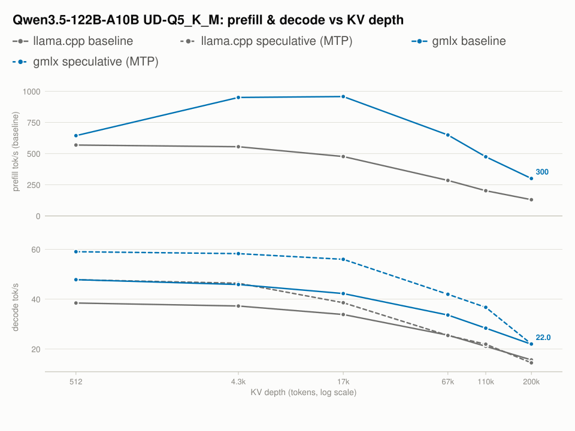
</picture>

| KV depth | gmlx decode (baseline) | gmlx decode (MTP@3) | MTP lift | llama.cpp decode (MTP@3) | gmlx/llama.cpp decode | gmlx prefill | llama.cpp prefill |
|---|--:|--:|--:|--:|--:|--:|--:|
| 512 | 47.8 | 59 | 1.23x | 47.8 | 1.23x | 643.9 | 568.8 |
| 4.3k | 45.9 | 58.3 | 1.27x | 46.4 | 1.26x | 950.3 | 555 |
| 17k | 42.2 | 56 | 1.33x | 38.6 | 1.45x | 957.6 | 476.3 |
| 67k | 33.6 | 42 | 1.25x | 25.4 | 1.65x | 649.5 | 284.8 |
| 110k | 28.4 | 36.7 | 1.29x | 21.9 | 1.68x | 474.2 | 202.2 |
| 200k | 21.9 | 22 | 1.00x | 14.4 | 1.53x | 300.3 | 129.9 |

### Qwen3.6-35B-A3B Q6_K

<picture>
  <source media="(prefers-color-scheme: dark)" srcset="assets/perf/per-model/qwen3.6-35b-a3b-heretic-q6k-panels-dark.svg">
  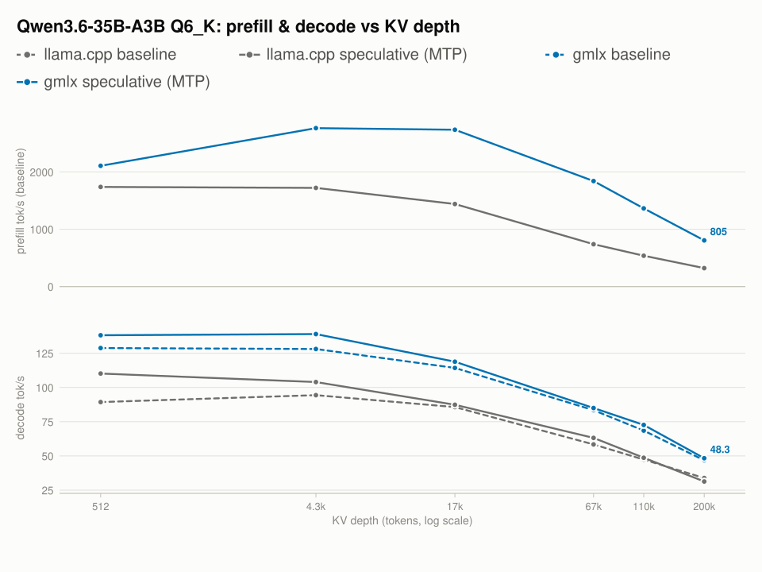
</picture>

| KV depth | gmlx decode (baseline) | gmlx decode (MTP@3) | MTP lift | llama.cpp decode (MTP@3) | gmlx/llama.cpp decode | gmlx prefill | llama.cpp prefill |
|---|--:|--:|--:|--:|--:|--:|--:|
| 512 | 128.8 | 138.1 | 1.07x | 110.1 | 1.25x | 2106.6 | 1737.9 |
| 4.3k | 128.1 | 139 | 1.09x | 104 | 1.34x | 2764.5 | 1722.3 |
| 17k | 114.3 | 118.8 | 1.04x | 87.4 | 1.36x | 2736.4 | 1440.5 |
| 67k | 83.4 | 85 | 1.02x | 63.2 | 1.34x | 1841.4 | 739 |
| 110k | 68.5 | 72.6 | 1.06x | 48.6 | 1.49x | 1364.7 | 537.6 |
| 200k | 46.8 | 48.3 | 1.03x | 31.3 | 1.54x | 805.1 | 321.1 |

### Qwen3.6-27B Q6_K

<picture>
  <source media="(prefers-color-scheme: dark)" srcset="assets/perf/per-model/qwen3.6-27b-q6k-panels-dark.svg">
  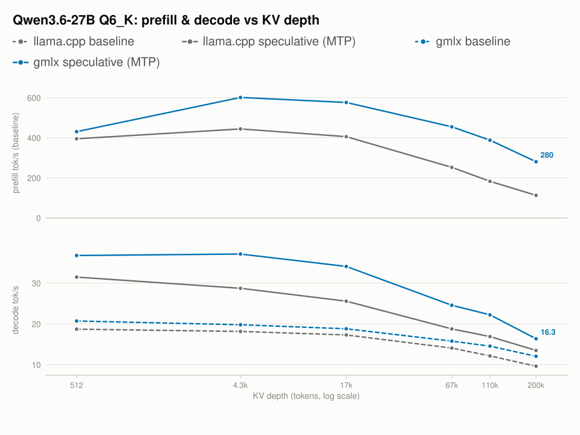
</picture>

| KV depth | gmlx decode (baseline) | gmlx decode (MTP@3) | MTP lift | llama.cpp decode (MTP@3) | gmlx/llama.cpp decode | gmlx prefill | llama.cpp prefill |
|---|--:|--:|--:|--:|--:|--:|--:|
| 512 | 20.7 | 36.8 | 1.78x | 31.5 | 1.17x | 430.2 | 394.6 |
| 4.3k | 19.8 | 37.1 | 1.87x | 28.7 | 1.29x | 600.9 | 443.9 |
| 17k | 18.8 | 34.1 | 1.81x | 25.6 | 1.33x | 575.9 | 405.4 |
| 67k | 15.8 | 24.6 | 1.56x | 18.8 | 1.31x | 454.5 | 252.1 |
| 110k | 14.5 | 22.2 | 1.53x | 16.9 | 1.31x | 387.7 | 182.6 |
| 200k | 12.1 | 16.3 | 1.35x | 13.5 | 1.21x | 280.3 | 112.8 |

### Qwen3.5-9B Q6_K

<picture>
  <source media="(prefers-color-scheme: dark)" srcset="assets/perf/per-model/qwen3.5-9b-q6k-panels-dark.svg">
  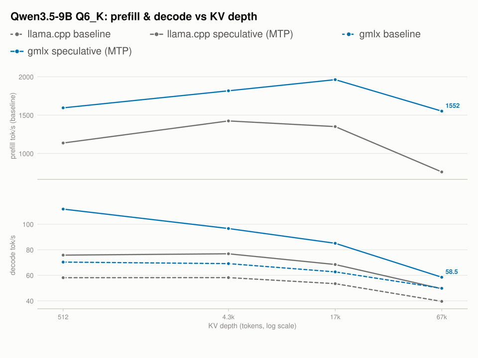
</picture>

| KV depth | gmlx decode (baseline) | gmlx decode (MTP@3) | MTP lift | llama.cpp decode (MTP@3) | gmlx/llama.cpp decode | gmlx prefill | llama.cpp prefill |
|---|--:|--:|--:|--:|--:|--:|--:|
| 512 | 70.3 | 111.9 | 1.59x | 75.8 | 1.48x | 1595 | 1136.4 |
| 4.3k | 69.1 | 96.6 | 1.40x | 76.8 | 1.26x | 1817.4 | 1424 |
| 17k | 62.7 | 85.1 | 1.36x | 68.4 | 1.24x | 1962.4 | 1350.5 |
| 67k | 49.8 | 58.5 | 1.17x | 49.4 | 1.18x | 1551.7 | 758.7 |

### gemma-4-31B-it Q6_K

<picture>
  <source media="(prefers-color-scheme: dark)" srcset="assets/perf/per-model/gemma-4-31b-q6k-panels-dark.svg">
  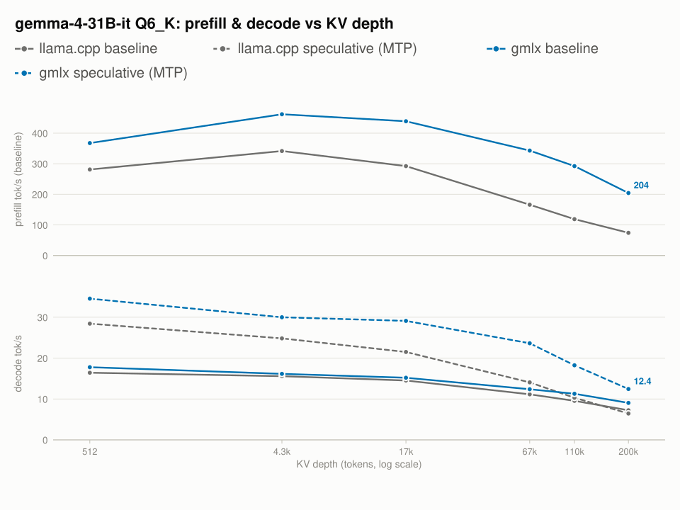
</picture>

| KV depth | gmlx decode (baseline) | gmlx decode (MTP@3) | MTP lift | llama.cpp decode (MTP@3) | gmlx/llama.cpp decode | gmlx prefill | llama.cpp prefill |
|---|--:|--:|--:|--:|--:|--:|--:|
| 512 | 17.8 | 34.5 | 1.94x | 28.4 | 1.21x | 367.5 | 281.1 |
| 4.3k | 16.1 | 30 | 1.86x | 24.8 | 1.21x | 461.8 | 341.7 |
| 17k | 15.2 | 29.1 | 1.91x | 21.5 | 1.35x | 439 | 292.4 |
| 67k | 12.4 | 23.6 | 1.90x | 14.1 | 1.67x | 343.1 | 166 |
| 110k | 11.3 | 18.2 | 1.61x | 10.3 | 1.77x | 292.3 | 118.7 |
| 200k | 9 | 12.4 | 1.38x | 6.4 | 1.94x | 204.2 | 74.1 |

### gemma-4-26B-A4B-it Q6_K

<picture>
  <source media="(prefers-color-scheme: dark)" srcset="assets/perf/per-model/gemma-4-26b-a4b-q6k-panels-dark.svg">
  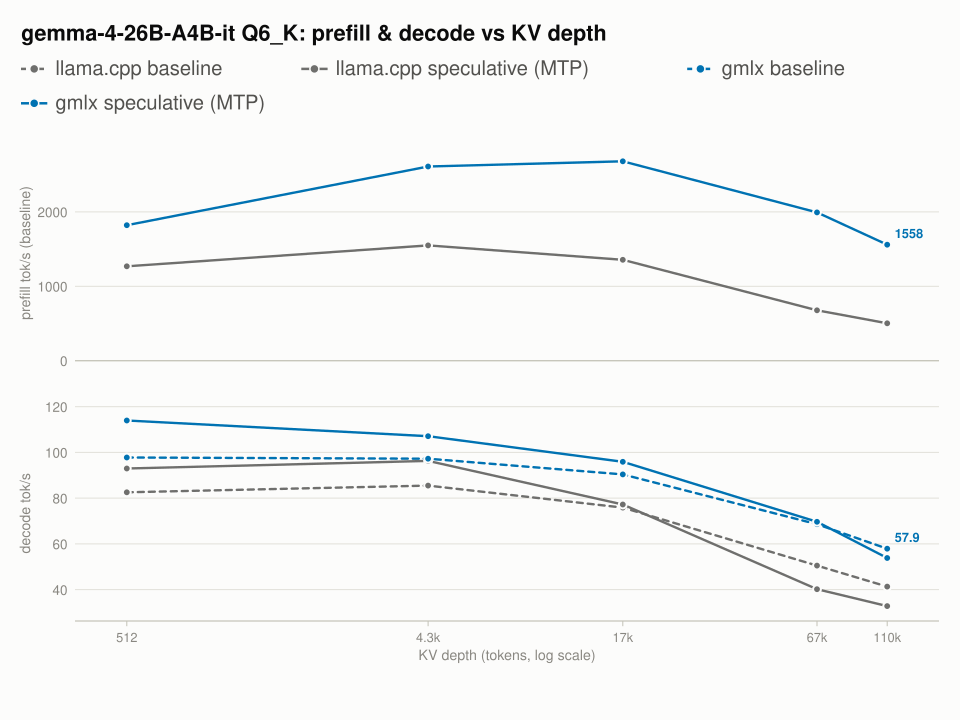
</picture>

| KV depth | gmlx decode (baseline) | gmlx decode (MTP@3) | MTP lift | llama.cpp decode (MTP@3) | gmlx/llama.cpp decode | gmlx prefill | llama.cpp prefill |
|---|--:|--:|--:|--:|--:|--:|--:|
| 512 | 97.8 | 113.9 | 1.16x | 93 | 1.22x | 1821.3 | 1268.3 |
| 4.3k | 97.2 | 107.1 | 1.10x | 96.3 | 1.11x | 2610.2 | 1549.2 |
| 17k | 90.4 | 95.9 | 1.06x | 77.2 | 1.24x | 2679.4 | 1355.5 |
| 67k | 68.6 | 69.7 | 1.02x | 40.2 | 1.73x | 1992.6 | 676.3 |
| 110k | 57.9 | 53.8 | 0.93x | 32.8 | 1.64x | 1558 | 502 |

### gemma-4-12B-it Q6_K

<picture>
  <source media="(prefers-color-scheme: dark)" srcset="assets/perf/per-model/gemma-4-12b-q6k-panels-dark.svg">
  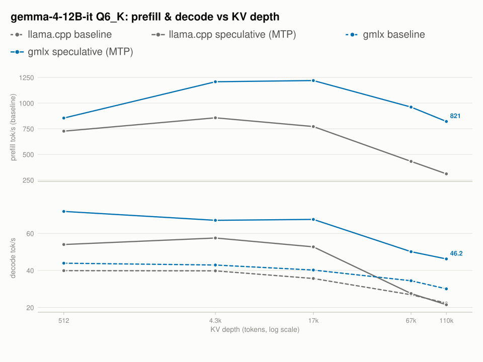
</picture>

| KV depth | gmlx decode (baseline) | gmlx decode (MTP@3) | MTP lift | llama.cpp decode (MTP@3) | gmlx/llama.cpp decode | gmlx prefill | llama.cpp prefill |
|---|--:|--:|--:|--:|--:|--:|--:|
| 512 | 43.9 | 71.9 | 1.64x | 54 | 1.33x | 854.4 | 726.2 |
| 4.3k | 42.9 | 67.1 | 1.56x | 57.5 | 1.17x | 1208 | 856.8 |
| 17k | 40.2 | 67.6 | 1.68x | 52.7 | 1.28x | 1219.7 | 771.2 |
| 67k | 34.4 | 50.1 | 1.46x | 27.5 | 1.82x | 961.2 | 431.9 |
| 110k | 30.1 | 46.2 | 1.53x | 21.5 | 2.15x | 821 | 310.1 |

### gemma-4-E4B-it Q6_K

<picture>
  <source media="(prefers-color-scheme: dark)" srcset="assets/perf/per-model/gemma-4-e4b-q6k-panels-dark.svg">
  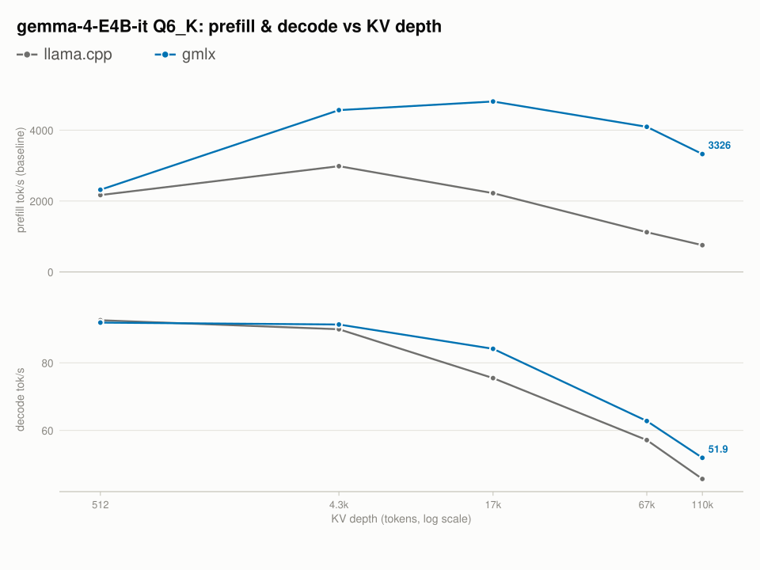
</picture>

| KV depth | gmlx decode | llama.cpp decode | gmlx/llama.cpp decode | gmlx prefill | llama.cpp prefill | gmlx/llama.cpp prefill |
|---|--:|--:|--:|--:|--:|--:|
| 512 | 91.9 | 92.6 | 0.99x | 2317.7 | 2168.9 | 1.07x |
| 4.3k | 91.3 | 89.9 | 1.02x | 4564.5 | 2984.5 | 1.53x |
| 17k | 84.1 | 75.5 | 1.11x | 4810.2 | 2221.4 | 2.17x |
| 67k | 62.8 | 57.1 | 1.10x | 4095.1 | 1119.9 | 3.66x |
| 110k | 51.9 | 45.7 | 1.14x | 3326.1 | 754.2 | 4.41x |

### gemma-4-E2B-it UD-Q6_K_XL

<picture>
  <source media="(prefers-color-scheme: dark)" srcset="assets/perf/per-model/gemma-4-e2b-q6kxl-panels-dark.svg">
  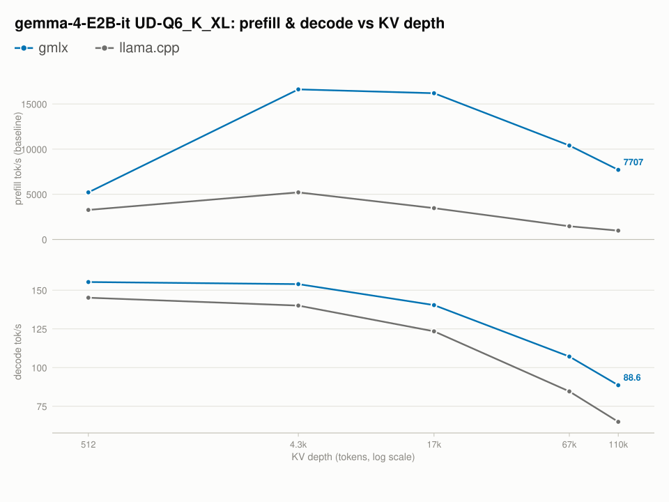
</picture>

| KV depth | gmlx decode | llama.cpp decode | gmlx/llama.cpp decode | gmlx prefill | llama.cpp prefill | gmlx/llama.cpp prefill |
|---|--:|--:|--:|--:|--:|--:|
| 512 | 155.3 | 145.1 | 1.07x | 5217 | 3273.8 | 1.59x |
| 4.3k | 153.9 | 140.1 | 1.10x | 16620.1 | 5212.7 | 3.19x |
| 17k | 140.4 | 123.4 | 1.14x | 16188.3 | 3469.4 | 4.67x |
| 67k | 107.2 | 84.6 | 1.27x | 10403.4 | 1460.4 | 7.12x |
| 110k | 88.6 | 65 | 1.36x | 7706.8 | 975.4 | 7.90x |

### gpt-oss-120b MXFP4

<picture>
  <source media="(prefers-color-scheme: dark)" srcset="assets/perf/per-model/gpt-oss-120b-heretic-mxfp4-panels-dark.svg">
  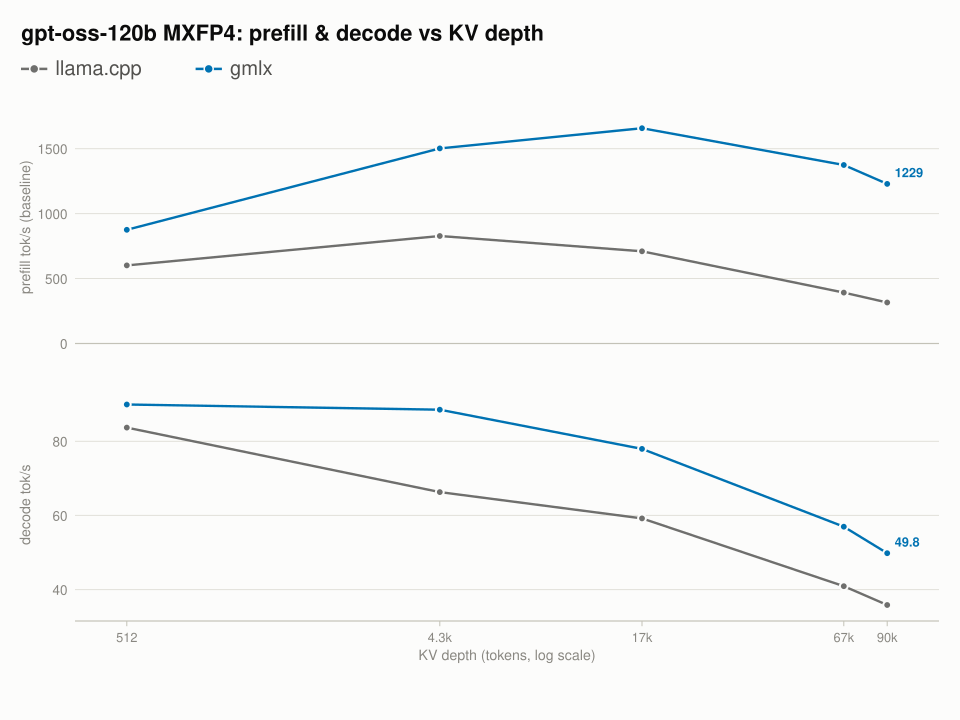
</picture>

| KV depth | gmlx decode | llama.cpp decode | gmlx/llama.cpp decode | gmlx prefill | llama.cpp prefill | gmlx/llama.cpp prefill |
|---|--:|--:|--:|--:|--:|--:|
| 512 | 89.9 | 83.7 | 1.07x | 875.5 | 601.1 | 1.46x |
| 4.3k | 88.5 | 66.3 | 1.33x | 1502.4 | 827.5 | 1.82x |
| 17k | 77.9 | 59.2 | 1.32x | 1658.1 | 709.5 | 2.34x |
| 67k | 57 | 40.9 | 1.39x | 1374.5 | 391.8 | 3.51x |
| 90k | 49.8 | 35.9 | 1.39x | 1229 | 315.2 | 3.90x |

### gpt-oss-20b MXFP4

<picture>
  <source media="(prefers-color-scheme: dark)" srcset="assets/perf/per-model/gpt-oss-20b-mxfp4-panels-dark.svg">
  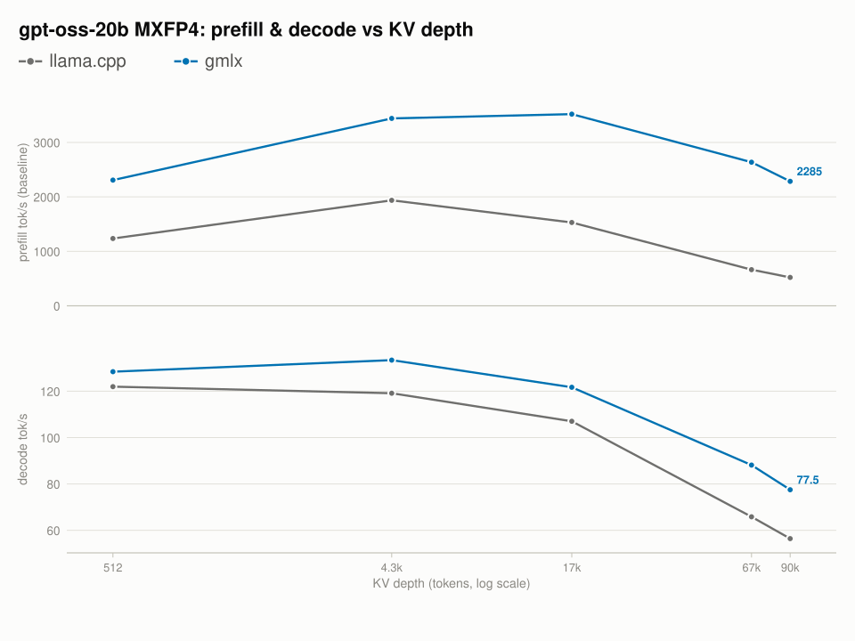
</picture>

| KV depth | gmlx decode | llama.cpp decode | gmlx/llama.cpp decode | gmlx prefill | llama.cpp prefill | gmlx/llama.cpp prefill |
|---|--:|--:|--:|--:|--:|--:|
| 512 | 128.4 | 122 | 1.05x | 2307.5 | 1235.5 | 1.87x |
| 4.3k | 133.4 | 119.1 | 1.12x | 3441.8 | 1937.4 | 1.78x |
| 17k | 121.7 | 107 | 1.14x | 3520.6 | 1529.7 | 2.30x |
| 67k | 88.2 | 65.8 | 1.34x | 2636.2 | 662.8 | 3.98x |
| 90k | 77.5 | 56.4 | 1.37x | 2285.5 | 520.9 | 4.39x |

### Dolphin3.0-Llama3.1-8B Q6_K

<picture>
  <source media="(prefers-color-scheme: dark)" srcset="assets/perf/per-model/dolphin3-llama3.1-8b-q6k-panels-dark.svg">
  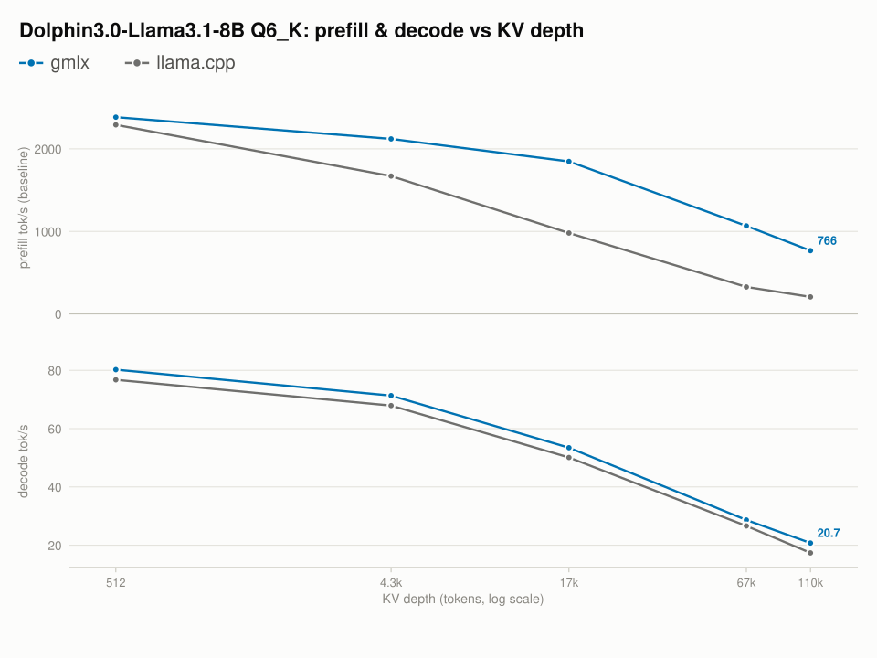
</picture>

| KV depth | gmlx decode | llama.cpp decode | gmlx/llama.cpp decode | gmlx prefill | llama.cpp prefill | gmlx/llama.cpp prefill |
|---|--:|--:|--:|--:|--:|--:|
| 512 | 80.2 | 76.7 | 1.05x | 2384.4 | 2290.8 | 1.04x |
| 4.3k | 71.3 | 67.9 | 1.05x | 2120.1 | 1669.2 | 1.27x |
| 17k | 53.4 | 50.1 | 1.07x | 1846.2 | 980.1 | 1.88x |
| 67k | 28.7 | 26.6 | 1.08x | 1065.5 | 326.4 | 3.26x |
| 110k | 20.7 | 17.4 | 1.19x | 765.6 | 205.9 | 3.72x |

### DeepSeek-V4-Flash UD-IQ3_XXS

<picture>
  <source media="(prefers-color-scheme: dark)" srcset="assets/perf/per-model/deepseek-v4-flash-unsloth-udiq3xxs-panels-dark.svg">
  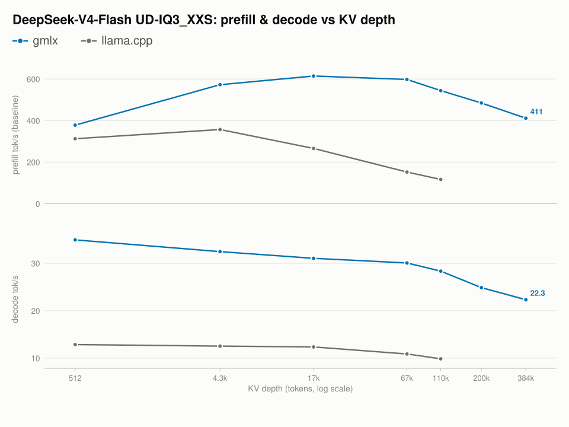
</picture>

| KV depth | gmlx decode | llama.cpp decode | gmlx/llama.cpp decode | gmlx prefill | llama.cpp prefill | gmlx/llama.cpp prefill |
|---|--:|--:|--:|--:|--:|--:|
| 512 | 34.9 | 12.9 | 2.71x | 377.9 | 312.5 | 1.21x |
| 4.3k | 32.5 | 12.5 | 2.60x | 572.3 | 356.7 | 1.60x |
| 17k | 31 | 12.4 | 2.50x | 614.1 | 265.7 | 2.31x |
| 67k | 30.1 | 10.9 | 2.76x | 597.4 | 152.1 | 3.93x |
| 110k | 28.3 | 9.9 | 2.86x | 543.8 | 116.5 | 4.67x |
| 200k | 24.9 | - | - | 484.3 | - | - |
| 384k | 22.3 | - | - | 411.1 | - | - |

### Qwen3.8-Flash-Next UD-Q3_K_XL

<picture>
  <source media="(prefers-color-scheme: dark)" srcset="assets/perf/per-model/qwen38-flash-next-udq3kxl-panels-dark.svg">
  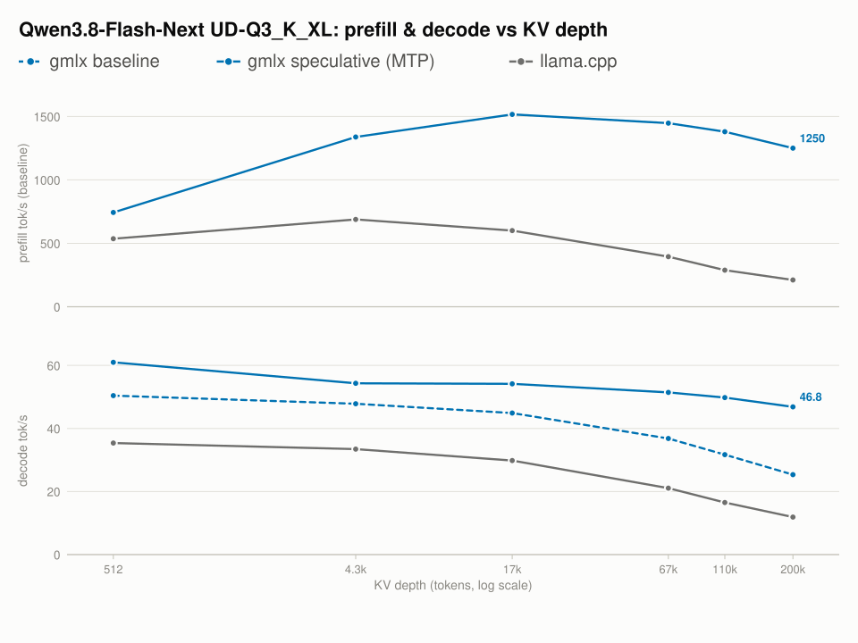
</picture>

| KV depth | gmlx decode (baseline) | gmlx decode (MTP@2) | MTP lift | llama.cpp decode (MTP@2) | gmlx/llama.cpp decode | gmlx prefill | llama.cpp prefill |
|---|--:|--:|--:|--:|--:|--:|--:|
| 512 | 50.4 | 61 | 1.21x | - | - | 743 | 536.1 |
| 4.3k | 47.8 | 54.3 | 1.14x | - | - | 1338.6 | 688.6 |
| 17k | 44.9 | 54.1 | 1.20x | - | - | 1516.1 | 600.3 |
| 67k | 36.8 | 51.4 | 1.40x | - | - | 1447.8 | 394.7 |
| 110k | 31.7 | 49.8 | 1.57x | - | - | 1379.9 | 288.7 |
| 200k | 25.3 | 46.8 | 1.85x | - | - | 1250 | 210.8 |

## DeepSeek-V4 against ds4-server

The two antirez files are compared with ds4-server, a DeepSeek-V4 server,
instead of llama.cpp. Each ratio is gmlx divided by ds4-server.

### DeepSeek-V4-Flash IQ2_XXS

<picture>
  <source media="(prefers-color-scheme: dark)" srcset="assets/perf/per-model/deepseek-v4-flash-antirez-iq2xxs-panels-dark.svg">
  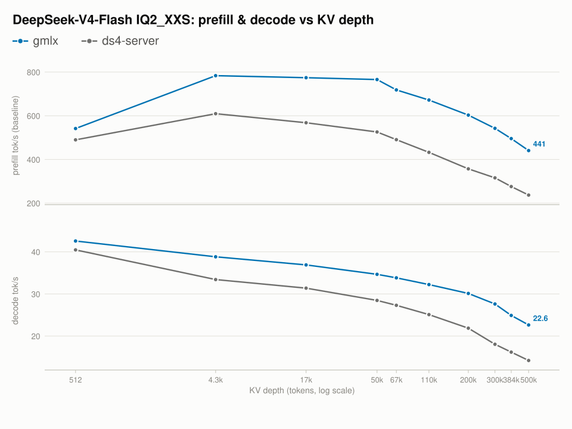
</picture>

| KV depth | gmlx decode | ds4-server decode | gmlx/ds4-server decode | gmlx prefill | ds4-server prefill | gmlx/ds4-server prefill |
|---|--:|--:|--:|--:|--:|--:|
| 512 | 42.6 | 40.5 | 1.05x | 541.6 | 489.7 | 1.11x |
| 4.3k | 38.8 | 33.4 | 1.16x | 783.5 | 609.5 | 1.29x |
| 17k | 36.9 | 31.4 | 1.18x | 774.3 | 567.9 | 1.36x |
| 50k | 34.7 | 28.5 | 1.22x | 765.7 | 525.7 | 1.46x |
| 67k | 33.8 | 27.3 | 1.24x | 718.2 | 490.6 | 1.46x |
| 110k | 32.2 | 25.1 | 1.28x | 672 | 432.4 | 1.55x |
| 200k | 30.1 | 21.9 | 1.37x | 602.9 | 357.1 | 1.69x |
| 300k | 27.6 | 18 | 1.53x | 542.4 | 315.8 | 1.72x |
| 384k | 24.9 | 16.2 | 1.54x | 495.4 | 275.9 | 1.80x |
| 500k | 22.6 | 14.2 | 1.59x | 440.7 | 236.9 | 1.86x |

### DeepSeek-V4.1-Flash Q2

<picture>
  <source media="(prefers-color-scheme: dark)" srcset="assets/perf/per-model/deepseek-v4.1-flash-antirez-q2-panels-dark.svg">
  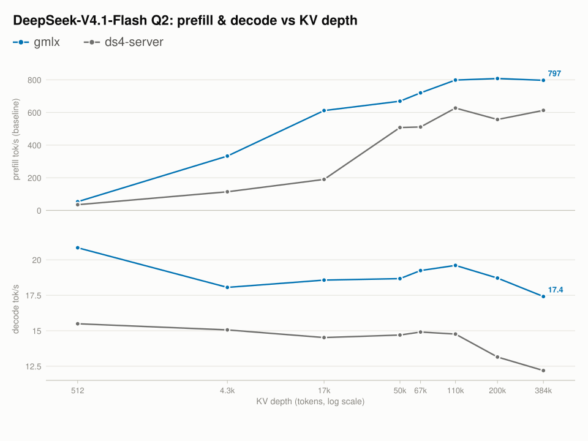
</picture>

| KV depth | gmlx decode | ds4-server decode | gmlx/ds4-server decode | gmlx prefill | ds4-server prefill | gmlx/ds4-server prefill |
|---|--:|--:|--:|--:|--:|--:|
| 512 | 20.8 | 15.5 | 1.34x | 53.3 | 34.8 | 1.53x |
| 4.3k | 18.1 | 15.1 | 1.20x | 332.6 | 113.9 | 2.92x |
| 17k | 18.6 | 14.5 | 1.28x | 611.4 | 189.9 | 3.22x |
| 50k | 18.7 | 14.7 | 1.27x | 668.8 | 507.5 | 1.32x |
| 67k | 19.2 | 14.9 | 1.29x | 719.7 | 511 | 1.41x |
| 110k | 19.6 | 14.8 | 1.32x | 798.5 | 626.8 | 1.27x |
| 200k | 18.7 | 13.1 | 1.43x | 807.9 | 556.5 | 1.45x |
| 384k | 17.4 | 12.2 | 1.43x | 796.9 | 612.5 | 1.30x |

## Serving measurements

These measurements back the guidance on the performance pages. They come
from the M5 Max under [Methodology](#methodology) unless a row names
another machine.

| Measurement | Result |
|---|---|
| Uniform against mixed quant | A uniform Q6_K decoded 64% faster than the mixed UD build on the dense Qwen3.6-27B, and 15% faster on the MoE Qwen3.6-35B-A3B, with equal or better output. |
| Batched decoding | Three streams on Qwen3.6-35B-A3B Q6_K gave 1.3x to 1.7x the total throughput of one, falling as the context grew. |
| Admission pacing | A client arriving at 14K tokens left the running stream 4% of its decode speed under strict alternation, and 80% with pacing. |
| Shared-prompt cascade | Four streams on a 12K-token system prompt decoded about 1.4x faster in total. |
| Sparse attention | On Llama-3.1-8B Q6_K at 32K, decoding ran 1.4x faster for one stream and 1.8x in total for three, with Q6-level divergence. |
| Stochastic acceptance | Acceptance rose by a few points on a Q6 dense model and by about 14 points on a low-bit MoE quant. |
| DFlash 2 drafter | On Qwen3.8-27B at Q6, the drafter about tripled decoding speed over plain decoding, and was about 1.5x the native head. |
| Thermal behavior | A 14-inch M5 Max ran about twenty minutes of streamed MoE decoding before settling about 20% lower. The 16-inch model holds its boost clocks longer. |

## KV cache fidelity

The kvarn cache beats the affine cache of the same width at every width
below 8, by 3 to 5x on the decode median at 2 to 4 bits, and the two
converge at 8. At 6 bits, kvarn sits between affine 6 and affine 8 on the
9B model and matches affine 8 on the 27B model, in three quarters of the
memory of affine 8. At 32K, its decode median can trail affine 8 by a few
percent while its p99 and top-1 stay ahead. The split width k6 v5 keeps
kvarn 6's decode median, with a p99 and top-1 at least as good as kvarn 5's.

The measure is the teacher-forced logit KL divergence against an fp16
cache on wikitext, from `scripts/kld_harness.py`, in nats, where lower is
better:

- Prefill and decode median: the typical position, scored on the chunked
  prefill logits and on token-by-token decoding from the full prefill depth.
- Decode p99: the worst hundredth, where a quantizer's outliers show.
- Decode top-1: the share of positions whose most likely token matches the
  fp16 cache, which is closest to what greedy or low-temperature output sees.

When two caches differ by a few percent on one measure, prefer the lower
p99 and the higher top-1. The corpus is wikitext, so the tables rank caches
against each other and do not predict a task score.

<!-- kld-tables -->
### Qwen3.5-9B Q4_K_M at 16K

The model has a head dimension of 256, and 7 of its 32 layers quantize.

| Cache | Prefill median | Decode median | Decode p99 | Decode top-1 |
|---|---|---|---|---|
| affine 2 | 0.02778 | 0.02745 | 0.5596 | 89.0% |
| kvarn 2 | 0.01503 | 0.00612 | 0.2301 | 94.7% |
| affine 3 | 0.00648 | 0.00606 | 0.1057 | 94.3% |
| kvarn 3 | 0.00291 | 0.00139 | 0.0313 | 97.4% |
| affine 4 | 0.00190 | 0.00183 | 0.0276 | 96.9% |
| kvarn 4 | 0.00117 | 0.00060 | 0.0071 | 98.3% |
| kvarn 5 | 0.00055 | 0.00029 | 0.0042 | 98.2% |
| kvarn k6 v5 | 0.00046 | 0.00028 | 0.0039 | 98.6% |
| affine 6 | 0.00046 | 0.00038 | 0.0045 | 98.7% |
| kvarn 6 | 0.00036 | 0.00027 | 0.0036 | 98.7% |
| affine 8 | 0.00029 | 0.00020 | 0.0027 | 98.7% |
| kvarn 8 | 0.00027 | 0.00020 | 0.0030 | 99.2% |

### Qwen3.8-27B Q6_K_XL at 16K

The model has a head dimension of 256, and 15 of its 65 layers quantize.

| Cache | Prefill median | Decode median | Decode p99 | Decode top-1 |
|---|---|---|---|---|
| affine 2 | 0.01975 | 0.02314 | 0.4697 | 90.3% |
| kvarn 2 | 0.01009 | 0.00491 | 0.1280 | 95.1% |
| affine 3 | 0.00383 | 0.00419 | 0.1034 | 96.1% |
| kvarn 3 | 0.00212 | 0.00113 | 0.0318 | 97.3% |
| affine 4 | 0.00138 | 0.00136 | 0.0268 | 97.5% |
| kvarn 4 | 0.00084 | 0.00045 | 0.0078 | 97.4% |
| kvarn 5 | 0.00041 | 0.00025 | 0.0039 | 98.4% |
| kvarn k6 v5 | 0.00034 | 0.00019 | 0.0039 | 98.5% |
| affine 6 | 0.00033 | 0.00030 | 0.0055 | 98.7% |
| kvarn 6 | 0.00027 | 0.00019 | 0.0030 | 98.8% |
| affine 8 | 0.00023 | 0.00019 | 0.0032 | 98.7% |
| kvarn 8 | 0.00021 | 0.00015 | 0.0037 | 98.9% |

### Qwen3.8-27B Q6_K_XL at 32K

This run uses the same model and layers at twice the context.

| Cache | Prefill median | Decode median | Decode p99 | Decode top-1 |
|---|---|---|---|---|
| affine 4 | 0.00162 | 0.00205 | 0.0176 | 97.6% |
| kvarn 4 | 0.00104 | 0.00070 | 0.0068 | 98.1% |
| affine 6 | 0.00039 | 0.00049 | 0.0037 | 98.5% |
| kvarn 6 | 0.00033 | 0.00032 | 0.0027 | 99.4% |
| affine 8 | 0.00027 | 0.00030 | 0.0038 | 98.8% |
| kvarn 8 | 0.00026 | 0.00028 | 0.0026 | 99.0% |

### Nemotron-3.5-Lightning-30B-A3B at 16K

This Mamba2 hybrid has a head dimension of 128.

| Cache | Prefill median | Decode median | Decode p99 | Decode top-1 |
|---|---|---|---|---|
| kvarn 4 | 0.00270 | 0.00163 | 0.0508 | 98.1% |
| kvarn 6 | 0.00125 | 0.00103 | 0.0266 | 98.8% |
| affine 8 | 0.00123 | 0.00094 | 0.0335 | 98.2% |
| kvarn 8 | 0.00111 | 0.00095 | 0.0298 | 98.6% |
<!-- /kld-tables -->

### Speed

On Qwen3-0.6B Q8 with 27 of 28 layers quantized, a dense model whose
decoding is limited by the KV read, kvarn 6 decoded at 0.81x fp16 and 0.69x
affine 8 at 16K, and at 0.98x and 0.75x at 32K. Prefill stayed within 10%
of both. On [GDN](glossary.md#gdn) hybrids and gemma-4, all three caches ran
within the spread between runs.
