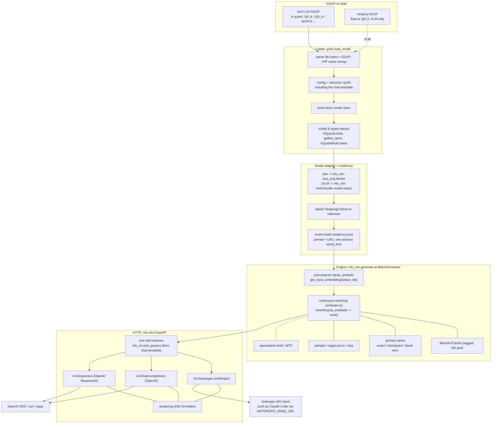
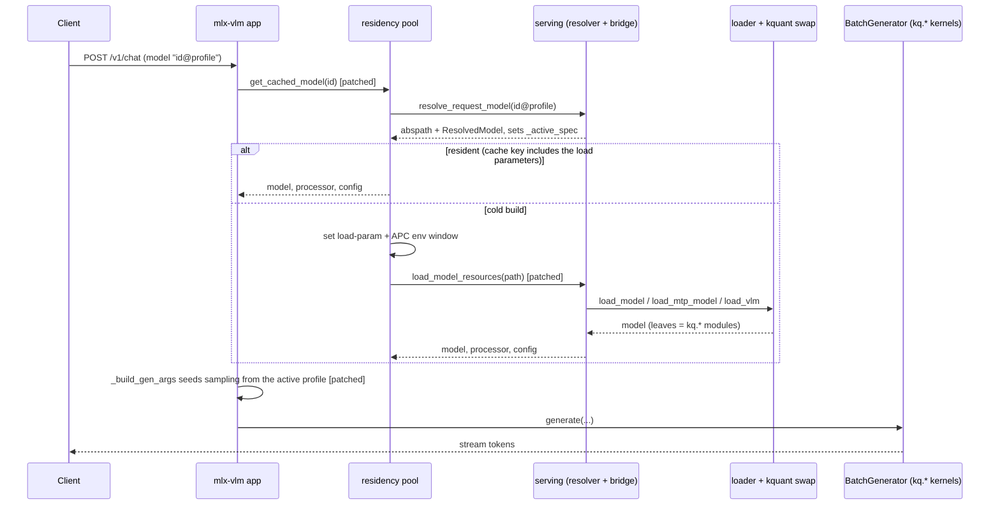

# Serving architecture

How the gmlx server serves a loaded GGUF as a continuously batched HTTP
server, for contributors. This page covers the implementation. The config
surface is documented in [server-config.md](../server-config.md) and the
endpoints in [api.md](../api.md).

gmlx is a thin patch layer over stock mlx-vlm. It installs late-bound patches
over a small set of mlx-vlm seams and leaves the stock app, batching engine
and protocol handlers untouched. Loads route to the gmlx loader, which reads
GGUF bytes through mlx-kquant's C++ reader and swaps model leaves for K-quant
kernels. The stock engine then executes those kernels in its own forward
pass. There is no engine fork.

## From file to response

## Components

The loader, `gmlx.load_model`, parses the GGUF bytes and remaps tensor names
to the Hugging Face layout. It synthesizes the config and tokenizer, including
the chat template, builds the stock model class and swaps the quantized leaves
for K-quant modules. A VLM adds a second file containing the vision or audio
tower. The output is a model, config and tokenizer triple with no safetensors
round-trip.

An adapter wraps a text model in mlx-vlm's text-only model class, which
exposes the embedding and language-model interface the engine expects. It also
attaches stopping criteria to the tokenizer. VLM models are wrapped in their
mlx-vlm class instead. Wrapped models are held in a residency pool of pinned
and LRU entries that owns the single process-wide wired limit.

The engine is mlx-vlm's batch generator. It runs continuous batching over a
ragged KV cache, given embeddings that the request path precomputes. Prefix
reuse is the prompt cache manager, which picks a tier per architecture
([prompt-cache.md](prompt-cache.md)). Speculative decoding runs gmlx's own
verify round, which keeps the prompt cache available under a drafter
([speculative-batching.md](speculative-batching.md)).

Above the engine is mlx-vlm's FastAPI app, which serves OpenAI chat
completions, OpenAI Responses and Anthropic Messages, each with streaming.
Tool calls are extracted from the raw token stream by mlx-lm's tool parsers,
selected from the model's chat template and re-emitted in each protocol's
format. Each request's sampling parameters resolve through the config
precedence chain before generation, from the family's model-card defaults up
to the request's own fields ([Precedence](../server-config.md#precedence)).
Served assistant ids are handled in front of this layer. A request to one runs
the tool loop on a worker thread. Each round re-enters the server as an
ordinary loopback client ([served
assistants](../assistant.md#served-assistants)).

Clients are anything that implements either API. Pointing `ANTHROPIC_BASE_URL`
at the server lets Anthropic-API tools such as Claude Code use a local
model.

## The request path through the seams

The patched seams are the residency lookup, the load call and the generation
argument builder. Everything between them is stock. The seam inventory and the
procedure for moving it to a new upstream release are in
[upstream-upgrades.md](upstream-upgrades.md).
