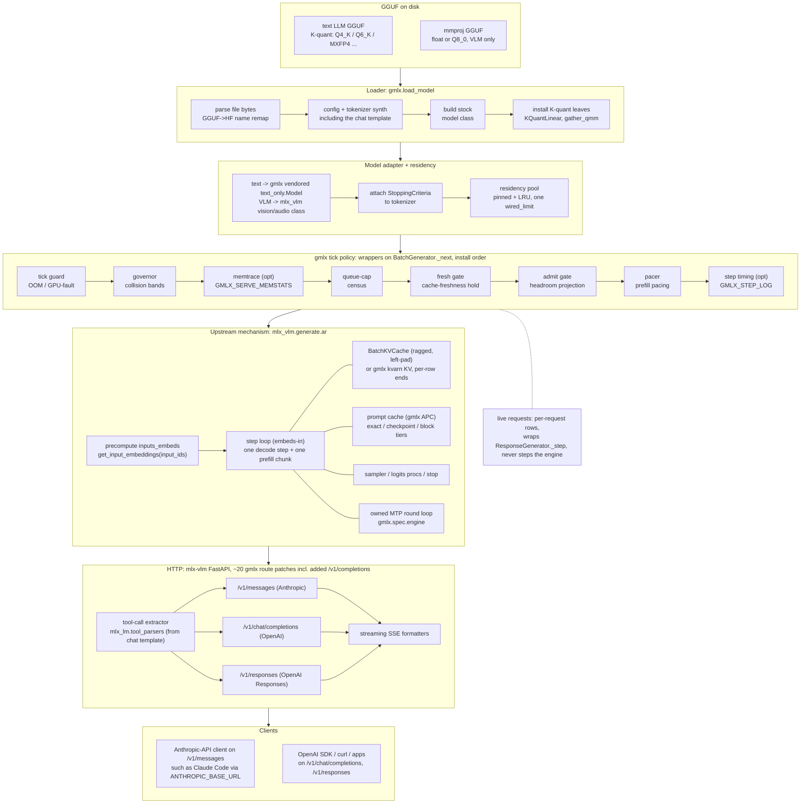
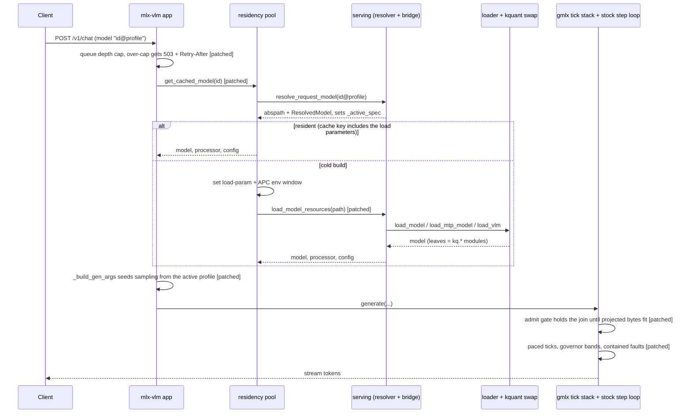

# Serving architecture

How the gmlx server serves a loaded GGUF as a continuously batched HTTP
server, for contributors. This page covers the implementation, while the
config surface is documented in [server-config.md](../server-config.md) and
the endpoints in [api.md](../api.md).

The mechanism is stock mlx-vlm and the policy is gmlx. Upstream owns the
FastAPI app object, the protocol handlers and SSE formatters, the engine's
step loop, and the fp16 `BatchKVCache` layout. gmlx owns the scheduling
policy around that loop: admission (`admit_gate`), prioritization
(`batch_sched` with `auto_ratio`), and resource arbitration (`governor`,
`capacity`, `queue_cap`). All of it installs through the patch layer, whose
seam inventory, well over a hundred entries, is in
[upstream-upgrades.md](upstream-upgrades.md). Loads route to the gmlx
loader, which reads GGUF bytes through mlx-kquant's C++ reader and swaps
model leaves for K-quant kernels, and the stock step loop executes those
kernels in its own forward pass. There is no engine fork.

## From file to response

Eight wrappers assign `BatchGenerator._next`, shown in install order in the
tick-policy box. Six install by default; memtrace and step timing are
env-gated. The live-requests publisher sits beside the stack, not in it: it
wraps `ResponseGenerator._step` to publish per-request rows and never steps
the engine.

## What the diagram leaves out

The loader's output is a model, config and tokenizer triple with no
safetensors round-trip. The text-only wrapper in the adapter stage is
gmlx's own copy of the class mlx-vlm removed in 0.6.15, vendored in
`gmlx/models/vlm_text_only.py`. Keeping it in-tree holds the embedding and
language-model interface the engine expects steady across upstream
releases.

The prompt cache picks its tier per architecture, as
[prompt-cache.md](prompt-cache.md) describes, and the verify round that
speculative decoding runs is gmlx's own, which is what keeps the prompt
cache usable under a drafter ([speculative-batching.md](speculative-batching.md)).

Two things happen before a request reaches the engine. Its sampling
parameters resolve through the config precedence chain, from the family's
model-card defaults up to the request's own fields
([Precedence](../server-config.md#precedence)). And a request to a served
assistant id never reaches the HTTP layer as itself: the tool loop runs on a
worker thread and each round re-enters the server as an ordinary loopback
client ([served assistants](../assistant.md#served-assistants)).

## Scheduling policy

Admission, prioritization and resource arbitration run in the gmlx
wrappers around the stock step loop.

| Module | Policy |
|---|---|
| `batch_sched.py` | decode-priority prefill pacing: a chunk runs only after decode has banked ratio x last chunk time |
| `auto_ratio.py` | derives the pacing ratio from a retention floor, with hysteresis, dwell and a pacing-attributable deadline |
| `admit_gate.py` | projects committed bytes before a prompt batch forms and defers the join instead of failing |
| `governor.py` | ticks-to-collision banding with separate rate and one-shot accounting |
| `queue_cap.py` | rejects over-cap requests with a 503 and a computed Retry-After instead of holding sockets |
| `capacity.py` | derives the depth-width frontier at boot and sets decode concurrency from it |

Stock `_next` runs one decode step then, unconditionally, one 2048-token
prefill chunk per tick. At depth that chunk head-of-line blocks decode:
measured at d50k, 80 to 84 percent of decode wall is stall, and about 56
percent at d14k. The pacer admits a chunk only once decode has accumulated
ratio x last_chunk_time since the previous chunk. Prefill runs at full
speed whenever no decode batch is live, so single-stream TTFT is untouched.

`auto_ratio` resolves `decode_prefill_ratio: auto` per tick. A retention
floor rho, default 0.5, fixes the paced ratio at rho/(1-rho), and the
resolver selects that ratio or zero using an incumbency rule, a chunk-cost
threshold with hysteresis and dwell, and a deadline that ages
pacing-attributable seconds only, so capacity-blocked waits accrue nothing.
There is no queue-depth term.

The admit gate prices the bytes a candidate join would commit against
measured headroom before the stock admission arm forms a prompt batch, and
hides the pending list for the tick while the projection does not fit. Two
anti-deadlock rules bound it: an idle server is never declined, and past
the defer ceiling it admits one row per tick, loudly.

The governor computes ticks-to-collision from one shared accounting and
walks a band ladder from green to red. Bands are rates, not levels: a deep
batch at flat headroom is green, a shallow one growing fast is not. Rate
and one-shot costs are accounted separately, and dwell minimums plus a cap
on sheds per minute prevent thrash.

The queue cap rejects before enqueue with an HTTP 503, a body naming the
cap and depth, and a Retry-After set to the estimated drain time clamped
between 2 and 60 seconds, instead of holding sockets until the queue
timeout.

Capacity derives a table at model build time from the same admit-side cost
model requests are priced with: max context at width 1, max width at
representative depths, and the depth-width frontier. Decode concurrency is
min(`GMLX_DECODE_BATCH`, frontier width) and the queue cap default follows
it. A configuration that cannot fit at width 1 is refused at boot with
numbers; `GMLX_OVERCOMMIT=1` disables the refusal and the derived ceilings.

The modules interlock. The governor's band is the admit gate's hard hold.
The admit gate's deferred set keeps `auto_ratio` from charging capacity
waits to pacing. The pacer's observed chunk cost feeds `auto_ratio`'s
threshold and the prefill chunk sizing. The capacity frontier bounds
decode width, which sets the queue cap default. All of it surfaces on
`/v1/metrics`: the capacity table, per-request rows and rate views
([api.md](../api.md#capacity-and-live-request-metrics)).

## The request path through the seams

On this path the patched seams shown are the queue cap, the residency
lookup, the load call, the generation argument builder, the admit gate and
the wrapped tick. The registry in `gmlx/upstream/seams.py` declares 124
seams, 71 of them critical; the largest clusters sit on
`mlx_vlm.generate.ar` (23), `mlx_vlm.apc` (19) and `mlx_vlm.models.cache`
(18). The step loop inside the wrappers is stock. The policy around it is
not.
