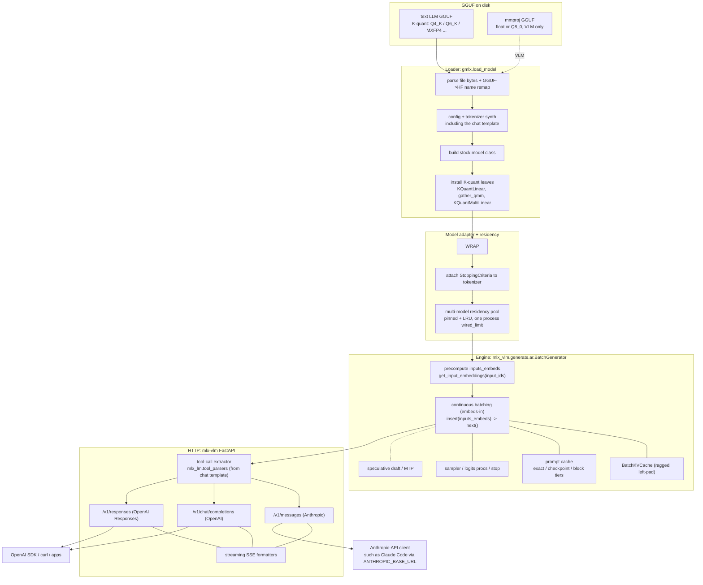
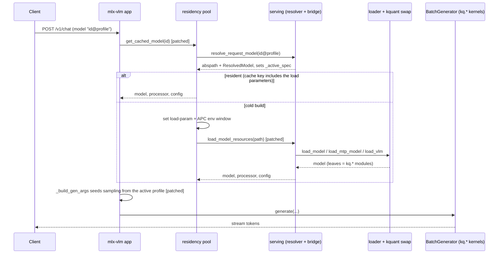

# Serving architecture

How the gmlx server serves a loaded GGUF as a continuously batched HTTP
server, for contributors. This page covers the implementation, while the
config surface is documented in [server-config.md](../server-config.md) and
the endpoints in [api.md](../api.md).

The server is stock mlx-vlm, with its app, batching engine and protocol
handlers untouched, and gmlx reaches into it through patched seams. Loads
route to the gmlx loader, which reads GGUF bytes through mlx-kquant's C++
reader and swaps model leaves for K-quant kernels, and the stock engine then
executes those kernels in its own forward pass. There is no engine fork.
The seam inventory, and why each one is fragile, is in
[upstream-upgrades.md](upstream-upgrades.md).

## From file to response

## What the diagram leaves out

The loader's output is a model, config and tokenizer triple with no
safetensors round-trip. The text-only wrapper it hands to the engine is
gmlx's own copy of the adapter mlx-vlm removed in 0.6.15, vendored in
`gmlx/models/vlm_text_only.py` so the embedding and language-model
interface the engine expects stays stable across upstream releases. The
residency pool that holds wrapped models owns the single process-wide wired
limit.

Prefix reuse is the prompt cache manager, which picks a tier per
architecture ([prompt-cache.md](prompt-cache.md)). Speculative decoding runs
gmlx's own verify round, which keeps the prompt cache available under a
drafter ([speculative-batching.md](speculative-batching.md)).

Tool calls are extracted from the raw token stream by mlx-lm's tool parsers,
selected from the model's chat template and re-emitted in each protocol's
format. Each request's sampling parameters resolve through the config
precedence chain before generation, from the family's model-card defaults up
to the request's own fields ([Precedence](../server-config.md#precedence)).
Served assistant ids are handled in front of the HTTP layer: a request to
one runs the tool loop on a worker thread, and each round re-enters the
server as an ordinary loopback client
([served assistants](../assistant.md#served-assistants)).

Clients are anything that implements either API. Pointing `ANTHROPIC_BASE_URL`
at the server lets Anthropic-API tools such as Claude Code use a local
model.

## The request path through the seams

On this path the patched seams are the residency lookup, the load call and
the generation argument builder. Everything between them is stock.
