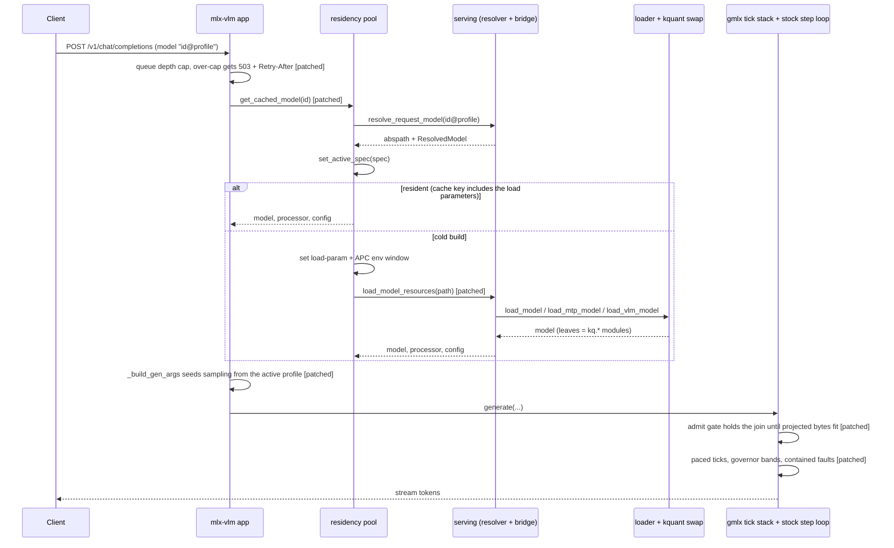

# Serving architecture

The gmlx server serves GGUF models with continuous batching over HTTP, as
a layer of patches and policy over the mlx-vlm server. The config surface
is documented in [Configuration](../config.md) and the endpoints in
[HTTP API](../api.md).

## Mechanism and policy

Stock mlx-vlm supplies the mechanism and gmlx supplies the policy. Upstream
owns the FastAPI app, the protocol handlers and SSE formatters, the
engine's step loop and the fp16 `BatchKVCache` layout. gmlx owns the
loader, the residency pool, the scheduling policy around the step loop and
the verify round of speculative decoding. All of it installs through the
patch layer that
[Upgrading mlx-vlm, mlx-lm and mlx](upstream-upgrades.md) describes.

The loader reads GGUF bytes through mlx-kquant's C++ reader and swaps the
model's leaves for K-quant kernels. The stock step loop then runs
those kernels in its own forward pass, so there is no engine fork. A text
model runs in `gmlx/models/vlm_text_only.py`, a copy of the text wrapper
that gmlx keeps in-tree, so the interface that the engine expects does not
move with upstream releases.

Each architecture gets its own prompt cache tier, as
[Prompt cache internals](prompt-cache.md) describes. gmlx owns the verify
round, so that the prompt cache stays usable under a drafter, and
[Speculative batching](speculative-batching.md) explains how.

## The request path

```mermaid
sequenceDiagram
  participant C as Client
  participant A as mlx-vlm app
  participant R as residency pool
  participant S as serving (resolver + bridge)
  participant L as loader + kquant swap
  participant E as gmlx tick stack + stock step loop
  C->>A: POST /v1/chat/completions (model "id@profile")
  A->>A: queue depth cap, over-cap gets 503 + Retry-After   [patched]
  A->>R: get_cached_model(id)   [patched]
  R->>S: resolve_request_model(id@profile)
  S-->>R: abspath + ResolvedModel
  R->>R: set_active_spec(spec)
  alt resident (cache key includes the load parameters)
    R-->>A: model, processor, config
  else cold build
    R->>R: set load-param + APC env window
    R->>S: load_model_resources(path)   [patched]
    S->>L: load_model / load_mtp_model / load_vlm_model
    L-->>S: model (leaves = kq.* modules)
    S-->>R: model, processor, config
  end
  A->>A: _build_gen_args seeds sampling from the active profile   [patched]
  A->>E: generate(...)
  E->>E: admit gate holds the join until projected bytes fit   [patched]
  E->>E: paced ticks, governor bands, contained faults   [patched]
  E-->>C: stream tokens
```

Two things happen before a request reaches the engine. Its sampling
parameters resolve through the precedence chain that
[How a request gets its settings](../config.md#how-a-request-gets-its-settings)
describes. A request to a
[served assistant](../assistant.md#served-assistants) id never reaches the
model resolver or the engine as itself. The tool loop runs on a worker
thread, and each round enters the server again as an ordinary loopback
client.

## Scheduling policy

The policy modules in `gmlx/serve/` wrap `BatchGenerator._next`.
`install_server_patches` in `gmlx/serve/patches/__init__.py` installs them,
and the last one installed runs outermost.

| Module | Policy |
|---|---|
| `batch_sched.py` | It paces prefill behind decode. A chunk runs only after decode has banked the ratio times the last chunk's time. |
| `auto_ratio.py` | It derives the pacing ratio from a retention floor. Its deadline counts only pacing waits, so a wait for capacity adds nothing. |
| `admit_gate.py` | It projects the bytes a join would commit before a prompt batch forms, and defers the join instead of failing it. |
| `governor.py` | It sets a band from the ticks left before memory runs out, so a band follows the rate of growth and not the level. |
| `queue_cap.py` | It rejects an over-cap request with a 503 before it is queued, instead of holding its socket until the queue timeout. |
| `capacity.py` | It derives the depth-width frontier at boot, which bounds the default decode width. |

Stock `_next` runs one decode step and then one prefill chunk in the same
tick whenever the decode batch has room. At depth that chunk stalls
decode, which is why the pacer exists. Prefill runs at full speed when no
decode batch is live, so the time to first token of a single stream does
not change.

The admit gate must never deadlock. An idle server is never declined, and
past the defer ceiling the gate admits one row per tick with a warning.
The governor keeps dwell minimums and a cap on sheds per minute, so that
its bands do not thrash.

The modules interlock. The governor's band is the admit gate's hard hold.
The admit gate's deferred set keeps `auto_ratio` from charging capacity
waits to pacing. The chunk cost that the pacer observes feeds the
`auto_ratio` threshold and the prefill chunk size. The
default decode width sets the default queue cap.
[Capacity and live-request metrics](../api.md#capacity-and-live-request-metrics)
describes how `/v1/metrics` shows each of them.
