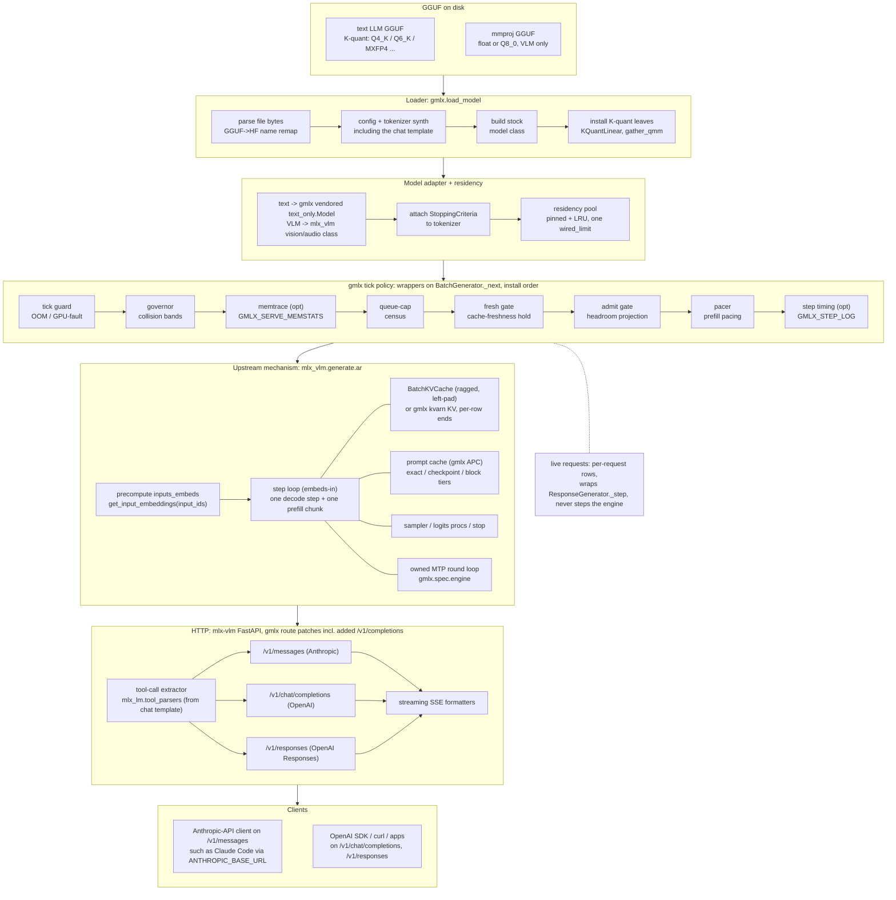
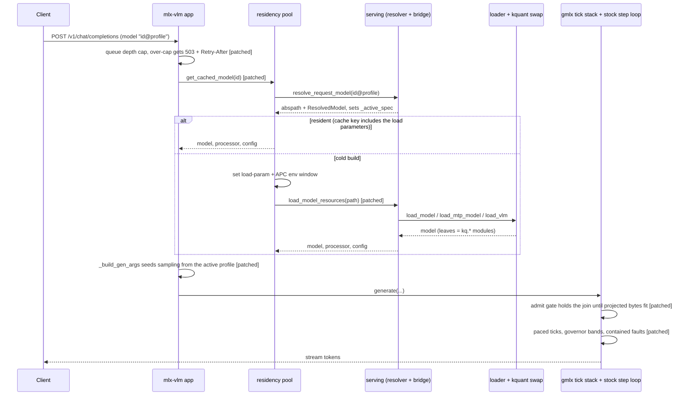

# Serving architecture

The gmlx server serves a loaded GGUF with continuous batching over HTTP,
as a layer of patches and policy over mlx-vlm's server. The config surface
is documented in [Configuration](../config.md) and the endpoints in
[HTTP API](../api.md).

Stock mlx-vlm supplies the mechanism and gmlx supplies the policy. Upstream
owns the FastAPI app object, the protocol handlers and SSE formatters, the
engine's step loop, and the fp16 `BatchKVCache` layout. gmlx owns the
scheduling policy around that loop, which covers admission in `admit_gate`,
prioritization in `batch_sched` with `auto_ratio`, and resource arbitration
in `governor`, `capacity` and `queue_cap`. All of it installs through the
patch layer, whose seam inventory of well over a hundred entries is in
[Upgrading mlx-vlm, mlx-lm and mlx](upstream-upgrades.md).

Loads route to the gmlx loader, which reads GGUF bytes through mlx-kquant's
C++ reader and swaps model leaves for K-quant kernels. The stock step loop
then runs those kernels in its own forward pass, so there is no engine
fork.

## From file to response

```mermaid
flowchart TD
    subgraph DISK["GGUF on disk"]
        direction LR
        LLM["text LLM GGUF<br/>K-quant: Q4_K / Q6_K / MXFP4 ..."]
        MM["mmproj GGUF<br/>float or Q8_0, VLM only"]
        LLM ~~~ MM
    end

    subgraph LOAD["Loader: gmlx.load_model"]
        direction LR
        PARSE["parse file bytes<br/>GGUF->HF name remap"]
        SYNTH["config + tokenizer synth<br/>including the chat template"]
        BUILD["build stock<br/>model class"]
        KQ["install K-quant leaves<br/>KQuantLinear, gather_qmm"]
        PARSE --> SYNTH --> BUILD --> KQ
    end

    subgraph ADAPT["Model adapter + residency"]
        direction LR
        WRAP["text -> gmlx vendored text_only.Model<br/>VLM -> mlx_vlm vision/audio class"]
        STOP["attach StoppingCriteria<br/>to tokenizer"]
        REG["residency pool<br/>pinned + LRU, one wired_limit"]
        WRAP --> STOP --> REG
    end

    subgraph TICK["gmlx tick policy: wrappers on BatchGenerator._next, install order"]
        direction LR
        TG["tick guard<br/>OOM / GPU-fault"]
        GOV["governor<br/>collision bands"]
        MT["memtrace (opt)<br/>GMLX_SERVE_MEMSTATS"]
        QCC["queue-cap<br/>census"]
        FG["fresh gate<br/>cache-freshness hold"]
        AG["admit gate<br/>headroom projection"]
        PACE["pacer<br/>prefill pacing"]
        ST["step timing (opt)<br/>GMLX_STEP_LOG"]
        TG --> GOV --> MT --> QCC --> FG --> AG --> PACE --> ST
    end

    subgraph ENGINE["Upstream mechanism: mlx_vlm.generate.ar"]
        direction LR
        EMB["precompute inputs_embeds<br/>get_input_embeddings(input_ids)"]
        BG["step loop (embeds-in)<br/>one decode step + one prefill chunk"]
        KVC["BatchKVCache (ragged, left-pad)<br/>or gmlx kvarn KV, per-row ends"]
        APC["prompt cache (gmlx APC)<br/>exact / checkpoint / block tiers"]
        SAMP["sampler / logits procs / stop"]
        MTP["owned MTP round loop<br/>gmlx.spec.engine"]
        EMB --> BG
        BG --- KVC
        BG --- APC
        BG --- SAMP
        BG --- MTP
    end

    subgraph PROTO["HTTP: mlx-vlm FastAPI, gmlx route patches incl. added /v1/completions"]
        direction LR
        TOOLS["tool-call extractor<br/>mlx_lm.tool_parsers (from chat template)"]
        ANTH["/v1/messages (Anthropic)"]
        OAI["/v1/chat/completions (OpenAI)"]
        RESP["/v1/responses (OpenAI Responses)"]
        SSE["streaming SSE formatters"]
        TOOLS --> ANTH & OAI & RESP
        ANTH & OAI & RESP --> SSE
    end

    subgraph CLIENTS["Clients"]
        direction LR
        CC["Anthropic-API client on /v1/messages<br/>such as Claude Code via ANTHROPIC_BASE_URL"]
        SDK["OpenAI SDK / curl / apps<br/>on /v1/chat/completions, /v1/responses"]
        CC ~~~ SDK
    end

    LR["live requests: per-request rows,<br/>wraps ResponseGenerator._step, never steps the engine"]

    DISK --> LOAD --> ADAPT --> TICK --> ENGINE --> PROTO --> CLIENTS
    TICK -.- LR
```

Eight wrappers assign `BatchGenerator._next`, shown in install order in the
tick-policy box. Six install by default, and memtrace and step timing are
gated by environment variables. The live-requests publisher sits beside the
stack, not in it. It wraps `ResponseGenerator._step` to publish per-request
rows and never steps the engine.

## What the diagram leaves out

The loader's output is a model, config and tokenizer triple with no
safetensors round-trip. The text-only wrapper in the adapter stage is
gmlx's own copy of the class mlx-vlm removed in 0.6.15, vendored in
`gmlx/models/vlm_text_only.py`. Keeping it in-tree holds the embedding and
language-model interface the engine expects steady across upstream
releases.

Each architecture gets its own prompt cache tier, and
[Prompt cache internals](prompt-cache.md) lists the choices. gmlx owns the
verify round of speculative decoding, which keeps the prompt cache usable
under a drafter, and [Speculative batching](speculative-batching.md)
explains how.

Two things happen before a request reaches the engine. Its sampling
parameters resolve through the config precedence chain, from the family's
model-card defaults up to the request's own fields, as
[How a request gets its settings](../config.md#how-a-request-gets-its-settings)
describes. A request to a [served assistant](../assistant.md#served-assistants)
id never reaches the HTTP layer as itself. The tool loop runs on a worker
thread, and each round enters the server again as an ordinary loopback
client.

## Scheduling policy

Admission, prioritization and resource arbitration run in the gmlx
wrappers around the stock step loop.

| Module | Policy |
|---|---|
| `batch_sched.py` | Paces prefill behind decode. A chunk runs only after decode has banked the ratio times the last chunk's time. |
| `auto_ratio.py` | Derives the pacing ratio from a retention floor, with hysteresis, dwell and a deadline that counts only pacing waits. |
| `admit_gate.py` | Projects committed bytes before a prompt batch forms, and defers the join instead of failing. |
| `governor.py` | Sets a band from the ticks left before memory runs out, with separate rate and one-shot accounting. |
| `queue_cap.py` | Rejects over-cap requests with a 503 and a computed Retry-After instead of holding sockets. |
| `capacity.py` | Derives the depth-width frontier at boot and sets decode concurrency from it. |

Stock `_next` runs one decode step and then, unconditionally, one 2048-token
prefill chunk per tick. At depth that chunk blocks decode. At a depth of 50K
tokens, 80 to 84 percent of the decode wall time was stall, and about 56
percent at 14K. The pacer admits a chunk only once decode has accumulated
ratio x last_chunk_time since the previous chunk. Prefill runs at full speed
whenever no decode batch is live, so single-stream TTFT is untouched.

`auto_ratio` resolves `decode_prefill_ratio: auto` per tick. A retention
floor rho, default 0.5, fixes the paced ratio at rho/(1-rho). The resolver
selects that ratio or zero with an incumbency rule, a chunk-cost threshold
with hysteresis and dwell, and a deadline. The deadline counts only seconds
spent waiting on pacing, so waits blocked on capacity add nothing, and no
term depends on queue depth.

The admit gate prices the bytes a candidate join would commit against
measured headroom before the stock admission arm forms a prompt batch, and
hides the pending list for the tick while the projection does not fit. Two
rules keep it from deadlocking. An idle server is never declined, and past
the defer ceiling the gate admits one row per tick with a warning.

Each tick, the governor computes ticks-to-collision from one shared
accounting and walks a band ladder from green to red. Bands follow rates,
not levels, so a deep batch at flat headroom is green and a shallow one
growing fast is not. Rate and one-shot costs are accounted separately, and
dwell minimums plus a cap on sheds per minute prevent thrash.

The queue cap rejects a request before enqueue instead of holding its
socket until the queue timeout. The HTTP 503 body names the cap and depth,
and Retry-After is the estimated drain time clamped between 2 and 60
seconds.

At model build time, the capacity module derives a table from the same
cost model that prices requests at admission. The table holds the largest
context at width 1, the largest width at representative depths, and the
depth-width frontier. Decode concurrency is the smaller of
`GMLX_DECODE_BATCH` and the frontier width, and the queue cap default
follows it. A configuration that cannot fit at width 1 is refused at boot
with numbers, and `GMLX_OVERCOMMIT=1` disables the refusal and the derived
ceilings.

The modules interlock. The governor's band is the admit gate's hard hold.
The admit gate's deferred set keeps `auto_ratio` from charging capacity
waits to pacing. The pacer's observed chunk cost feeds `auto_ratio`'s
threshold and the prefill chunk sizing. The capacity frontier bounds
decode width, which sets the queue cap default. `/v1/metrics` shows all
of it as the capacity table, the request rows and the rate views, which
[Capacity and live-request metrics](../api.md#capacity-and-live-request-metrics)
describes.

## The request path through the seams

```mermaid
sequenceDiagram
  participant C as Client
  participant A as mlx-vlm app
  participant R as residency pool
  participant S as serving (resolver + bridge)
  participant L as loader + kquant swap
  participant E as gmlx tick stack + stock step loop
  C->>A: POST /v1/chat/completions (model "id@profile")
  A->>A: queue depth cap, over-cap gets 503 + Retry-After   [patched]
  A->>R: get_cached_model(id)   [patched]
  R->>S: resolve_request_model(id@profile)
  S-->>R: abspath + ResolvedModel, sets _active_spec
  alt resident (cache key includes the load parameters)
    R-->>A: model, processor, config
  else cold build
    R->>R: set load-param + APC env window
    R->>S: load_model_resources(path)   [patched]
    S->>L: load_model / load_mtp_model / load_vlm
    L-->>S: model (leaves = kq.* modules)
    S-->>R: model, processor, config
  end
  A->>A: _build_gen_args seeds sampling from the active profile   [patched]
  A->>E: generate(...)
  E->>E: admit gate holds the join until projected bytes fit   [patched]
  E->>E: paced ticks, governor bands, contained faults   [patched]
  E-->>C: stream tokens
```

On this path the patched seams shown are the queue cap, the residency
lookup, the load call, the generation argument builder, the admit gate and
the wrapped tick. The registry in `gmlx/upstream/seams.py` declares every
seam, and `python -m gmlx.upstream.seams` checks each one against the
installed upstream and prints the count. The largest clusters sit on
`mlx_vlm.generate.ar`, `mlx_vlm.server.generation`, `mlx_vlm.apc` and
`mlx_vlm.models.cache`. The step loop inside the wrappers is stock, and the
policy around it is gmlx's.