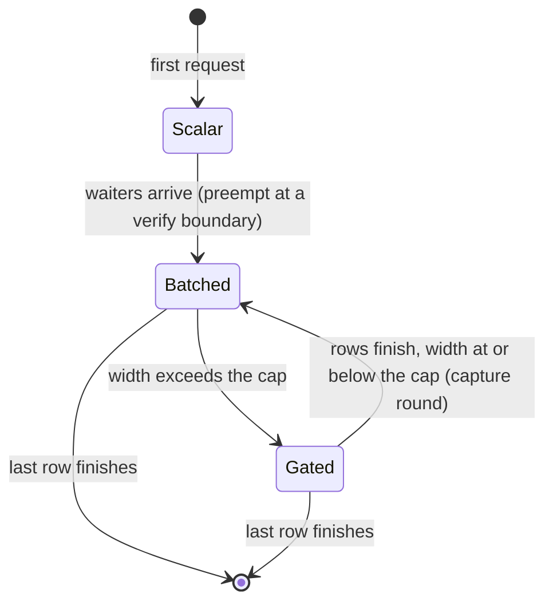

# Speculative decoding under continuous batching

How the server runs speculative decoding and continuous batching together:
the two decode loops, the width cap, and the transitions that move a request
between them without interrupting its token stream. For what speculation is
and how to enable it, see
[performance.md](../performance.md#mtp-speculative-decoding); for the cap key,
[server-config.md](../server-config.md#speculative_width_cap).

## The two decode loops

A speculative generation runs in one of two loops, chosen by live batch
width.

The scalar loop serves one decoding request. Draft and target sampler RNG
streams stay coupled, which lets sampled drafts be accepted against sampled
targets and gives the highest acceptance rate. It is the fastest path and the
common case.

The batch loop serves two or more. It tracks per-row state (bonus token, KV
offset, budget, finished flag), drafts greedily since coupled RNG does not
extend across rows, and checks the per-model width cap: a batch wider than
the cap decodes plain, because verification widens every row's weight reads
and past the measured width the batch is faster without drafting. New
requests join between verify rounds: the loop drains an injection queue,
extends the target KV cache and the drafter with the new rows, and re-checks
the cap.

## Preempting a scalar generation

The scalar loop has no injection boundary; its speed comes from not being a
batch. Making a prefilled request wait for the running request to finish is worse
on both measures: the waiter's time to first token grows to the running request's
remaining generation, and aggregate throughput drops too, because a single
speculating stream is slower than the same hardware decoding several streams
plain. So when waiters queue behind a live scalar generation the server
preempts it:

1. The scalar generator closes at its verify-round boundary. Its cleanup
   rolls the target KV cache back to exactly the delivered tokens, so the
   next undelivered token, the round's bonus token, has no KV entry yet.
2. The generation is rebuilt as a batch-loop generator restarting from that
   bonus token with its real emitted count, but unarmed: no drafter state,
   no captured hidden state. Single-sequence caches are converted to their batch
   classes during the rebuild.
3. The rebuilt loop's first injection drain admits the waiters. If the new
   width exceeds the cap the batch decodes plain, which any second stream
   does under a cap of 1; otherwise the batch arms itself with a capture
   round and keeps speculating at the new width.

Meanwhile the running request's stream continues without a gap. Its rate drops from
solo speculative to shared plain while the batch is wide, and total tokens
per second across streams goes up.

## Re-arming a drained batch

A batch gated to plain decode re-arms when finishing rows bring it back under
the cap. Re-arming needs fresh hidden state and shared KV for every surviving
row, so the resume path re-runs the generator's own cold-start sequence on
fresh captures rather than reusing per-row state:

1. The loop first finishes consuming its plain-decode double buffer. Gated
   rounds dispatch the next round's forward before reading this round's
   tokens, and that step has already appended its KV, so one more plain round
   runs without dispatching a successor.
2. The next round is a capture round: a one-position verify forward of each
   row's pending bonus token with hidden-state and shared-KV capture on. It
   emits one token per row at plain-decode cost.
3. The drafter is reset and cold-started from the capture. Drafters that
   teacher-force a prompt seed from target hidden state accept the one-token
   capture and recover acceptance over the next rounds; shared-KV drafters get their
   view re-set through the same round tail every armed round uses.
4. Subsequent rounds speculate normally at the drained width.

Rows with fewer remaining tokens than a small threshold skip the capture
and finish plain. A new admission in the same round takes precedence over a
pending resume: the injection drain runs first and re-triggers the gate, so a
batch never arms over the cap.

## Semantics

- Token streams are continuous across every transition. Preempt restarts
  from the exact rollback boundary and resume consumes the plain lookahead
  before capturing. Nothing is skipped, re-emitted or re-sampled.
- A preempted request decodes under batch-loop semantics for the rest of its
  generation, including after the batch drains to a single row: greedy
  drafting rather than coupled sampling, which lowers acceptance by a few points
  at temperature. The next request starts scalar again.
- A preempted request drops its prompt-cache retirement context, so its
  prefix is not offered back to the cache when it finishes. Waiters and later
  requests retire normally.
- The capture round emits at plain-decode rate and the speculative speedup
  returns on the round after.

Both transitions have an off switch for A/B runs, the `GMLX_MTP_PREEMPT` and
`GMLX_MTP_RESUME` rows in [env-vars.md](../env-vars.md#server).
