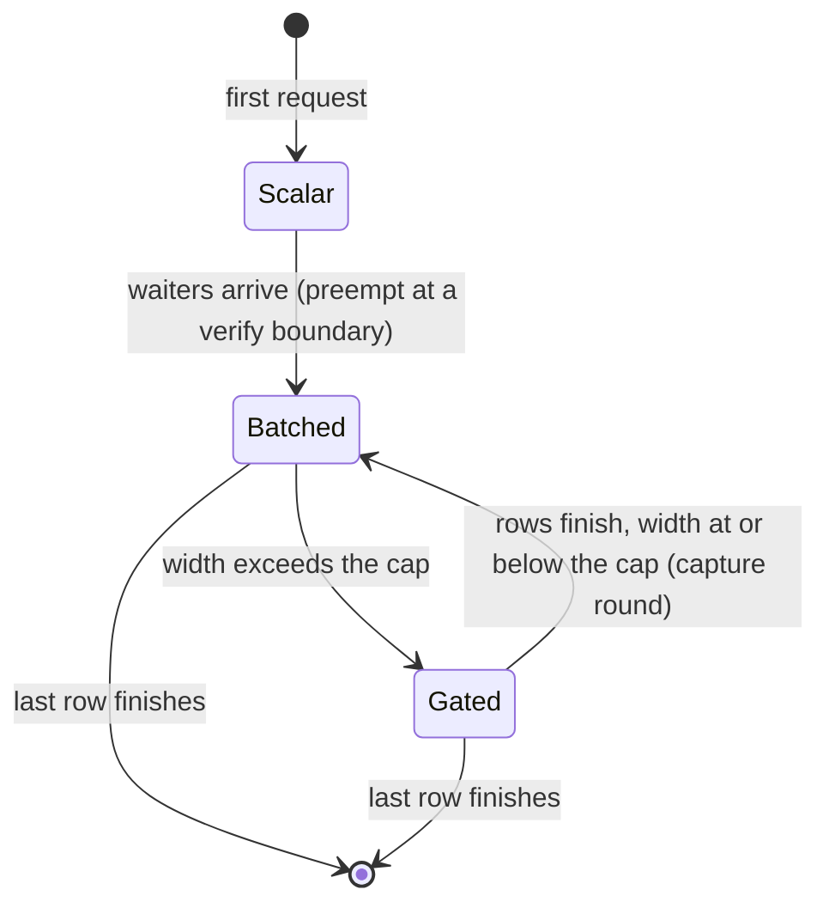

# Speculative decoding under continuous batching

How the server runs speculative decoding and continuous batching together.
This page covers the two decode loops, the width cap and the transitions that
move a request between them without interrupting its token stream. What
speculation is and how to enable it are in
[performance.md](../performance.md#mtp-speculative-decoding). The cap key is
in [server-config.md](../server-config.md#speculative_width_cap).

## The two decode loops

A speculative generation runs in one of two loops, chosen by live batch
width.

The scalar loop serves one decoding request. Its draft and target samplers
share coupled RNG streams, so a sampled draft can be accepted against a
sampled target, which gives the highest acceptance rate. That makes it the
fastest path, and it is the common case.

The batch loop serves two or more. For each row it tracks the KV offset,
the budget, a finished flag and the bonus token, which is the first token a
verify round accepts beyond the drafted run and the point the next round
starts from. Drafting is greedy, since coupled RNG does not extend across
rows. Under kvarn KV each row of the batch cache keeps its own physical
start and end, so a verify round's rollback trims each row by its own
rejected count while the fp16 layers and the shared mask keep upstream's
right-justified geometry, and the block is capped at four queries a row, the
width the decode kernels verify at, for the generator's life.

The loop also checks the per-model width cap. A batch wider than the cap
decodes plain, because verification widens each row's weight reads and past
the measured width the batch is faster without drafting.

New requests join between verify rounds, when the loop drains an injection
queue, extends the target KV cache and the drafter with the new rows and
re-checks the cap. A batch that comes back under the cap re-arms itself
with a capture round, a single plain-cost forward that collects the hidden
state the drafter needs, described under
[Re-arming a drained batch](#re-arming-a-drained-batch).

## Preempting a scalar generation

The scalar loop has no injection boundary, because its speed comes from
not being a batch. Making a prefilled request wait for the running request
to finish is worse on both measures. The waiter's time to first token grows
to the running request's remaining generation, and aggregate throughput
drops too, because a single speculating stream is slower than the same
hardware decoding several streams plain. When waiters queue behind a live
scalar generation the server therefore preempts it:

1. The scalar generator closes at its verify-round boundary. Its cleanup
   rolls the target KV cache back to exactly the delivered tokens, so the
   round's bonus token has no KV entry yet.
2. The generation is rebuilt as a batch-loop generator restarting from that
   bonus token with its real emitted count, but unarmed. It has no drafter
   state and no captured hidden state. Single-sequence caches are converted
   to their batch classes during the rebuild.
3. The rebuilt loop's first injection drain admits the waiters. If the new
   width exceeds the cap the batch decodes plain, which any second stream
   does under a cap of 1. Otherwise the batch arms itself with a capture
   round and keeps speculating at the new width.

The running request's rate drops from solo speculative to shared plain
while the batch is wide, but total tokens per second across streams goes
up.

## Re-arming a drained batch

A batch gated to plain decode re-arms when finishing rows bring it back
under the cap. Because re-arming needs fresh hidden state and shared KV for
each surviving row, the resume path re-runs the generator's cold-start
sequence on fresh captures instead of reusing per-row state:

1. The loop first drains its plain-decode double buffer. A gated round
   dispatches the next round's forward before it reads the current round's
   tokens, and that forward has already appended its KV, so one more plain
   round runs without dispatching a successor.
2. The next round is the capture round: a one-position verify forward of
   each row's pending bonus token with hidden-state and shared-KV capture
   on, which emits one token per row at plain-decode cost.
3. The drafter is reset and cold-started from the capture. Drafters that
   teacher-force a prompt seed from target hidden state accept the one-token
   capture and recover acceptance over the next rounds. Shared-KV drafters
   get their view re-set through the round tail that armed rounds use.
4. Subsequent rounds speculate normally at the drained width.

Rows with fewer remaining tokens than a small threshold skip the capture
and finish plain. A new admission in the same round takes precedence over a
pending resume, because the injection drain runs first and re-triggers the
gate, which keeps a batch from arming over the cap.

## What the transitions guarantee

- Token streams are continuous across both transitions. Preempt restarts
  from the exact rollback boundary and resume consumes the plain lookahead
  before capturing. Nothing is skipped, re-emitted or re-sampled.
- A preempted request decodes under batch-loop semantics for the rest of its
  generation, including after the batch drains to a single row. It drafts
  greedily instead of with coupled sampling, which lowers acceptance by a few
  points at temperature. The next request starts scalar again.
- A preempted request drops its prompt-cache retirement context, so its
  prefix is not offered back to the cache when it finishes. Waiters and
  later requests retire normally.
- The capture round emits at plain-decode rate. The speculative speedup
  returns on the round after.

Both transitions have an off switch for A/B runs, the `GMLX_MTP_PREEMPT` and
`GMLX_MTP_RESUME` rows in [env-vars.md](../env-vars.md#server).
