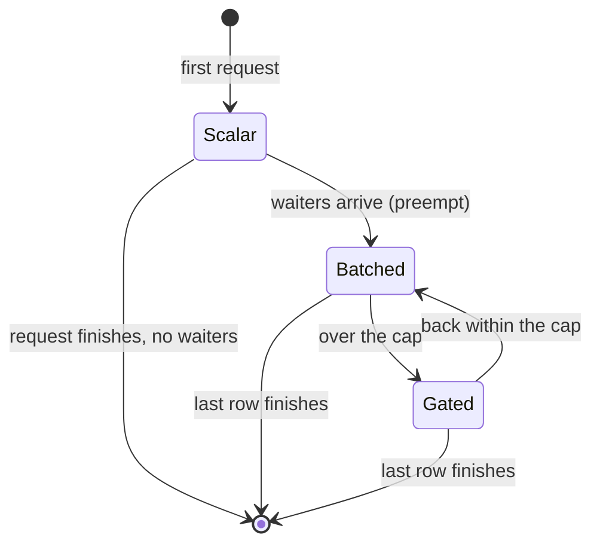

# Speculative batching

The server runs speculative decoding and continuous batching together, with
two decode loops, a width cap, and transitions that move a request between
the loops without interrupting its token stream. What speculation is and how
to enable it are in [Speculative decoding](../speculative-decoding.md). The
cap key is
[`speculative_width_cap`](../config.md#modelsspeculative_width_cap).

## The two decode loops

A speculative generation runs in one of two loops, chosen by live batch
width. The code is in `gmlx/spec/speculative.py`, and the transitions
between the loops are in `gmlx/spec/admission.py`.

The scalar loop serves one decoding request. Its draft and target samplers
share coupled RNG streams, so a sampled draft can be accepted against a
sampled target, which gives the highest acceptance rate. That makes it the
fastest path, and it is the common case.

Two or more decoding requests run in the batch loop. For each row it
tracks the KV offset, the budget, a finished flag and the bonus token, which
is the first token a verify round accepts beyond the drafted run and the
point the next round starts from. Drafting is greedy, since coupled RNG does
not extend across rows. Under kvarn KV, each row keeps its own start and
end, so a rollback trims each row by its own rejected count.

Each round checks the per-model width cap. A batch wider than the cap
decodes plain, because verification widens each row's weight reads,
and past the measured width the batch is faster without drafting.

New requests join between verify rounds, when the loop drains an injection
queue. It checks the cap against the width the admission would reach,
extends the target KV cache with the new rows, and adds the rows to the
drafter only when the batch stays within the cap.

```mermaid
stateDiagram-v2
    [*] --> Scalar: first request
    Scalar --> [*]: request finishes, no waiters
    Scalar --> Batched: waiters arrive (preempt)
    Batched --> Gated: over the cap
    Gated --> Batched: back within the cap
    Batched --> [*]: last row finishes
    Gated --> [*]: last row finishes
```

## Preempting a scalar generation

The scalar loop has no injection boundary, because its speed comes from
not being a batch. Making a waiter wait for the running request to finish
is worse on both measures. Its time to first token grows to the running
request's remaining generation, and aggregate throughput drops too,
because one speculating stream is slower than the same hardware decoding
several streams plain. When waiters queue behind a live scalar generation,
the server therefore preempts it:

1. The scalar generator closes, usually in the middle of a round. The
   round's verified tokens that were not yet delivered go out first, and
   their KV stays in the cache.
2. The generation is rebuilt as an unarmed batch-loop generator that
   restarts from the round's bonus token, with its real emitted count. Single-sequence caches convert to their batch classes.
3. The rebuilt loop's first injection drain admits the waiters. If
   the new width exceeds the cap, the batch decodes plain. Otherwise it
   arms itself with a capture round and keeps speculating.

## Re-arming a drained batch

A batch gated to plain decode re-arms when finishing rows bring it back
within the cap. Re-arming needs fresh hidden state and shared KV for each
surviving row, so the resume path runs the generator's cold-start
sequence again instead of reusing per-row state:

1. A gated round dispatches the next round's forward before it reads its
   own tokens, and that forward has already appended its KV. The loop
   therefore runs one more plain round without dispatching a successor.
2. The capture round runs a one-position verify forward of each row's
   pending bonus token with hidden-state and shared-KV capture on, and
   emits one token per row at plain-decode cost.
3. The drafter resets and cold-starts from the capture.
4. Later rounds speculate normally at the drained width.

A batch whose rows are close to their budgets does not re-arm, since the
capture round would not pay for itself. A new admission in the same round
takes precedence over a pending resume, because the injection drain runs
first and trips the gate again, which keeps a batch from arming over the
cap.

## What the transitions guarantee

- Token streams are continuous across both transitions. Preempt restarts
  from the round's bonus token after the verified tail goes out, and
  resume consumes the plain lookahead before capturing. Nothing is
  skipped, emitted twice or sampled again.
- A preempted request decodes under batch-loop semantics for the rest of
  its generation, including after the batch drains to a single row. It
  drafts greedily, which lowers acceptance at temperature. The next
  request starts scalar again.
- A preempted request drops its prompt-cache retirement context, so its
  prefix is not offered back to the cache when it finishes.
- The capture round emits at plain-decode rate, and the speedup returns
  on the round after.

Both transitions have an off switch for A/B runs, `GMLX_MTP_PREEMPT` and
`GMLX_MTP_RESUME`, which the
[server environment variables](../env-vars.md#server) list.
