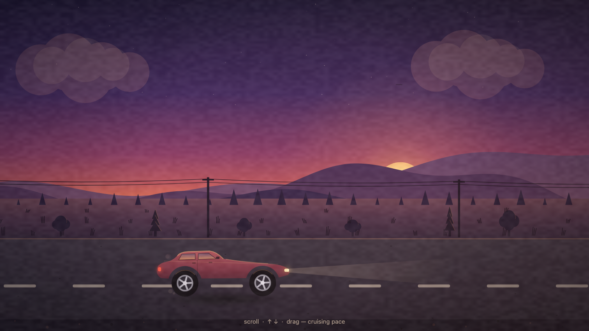
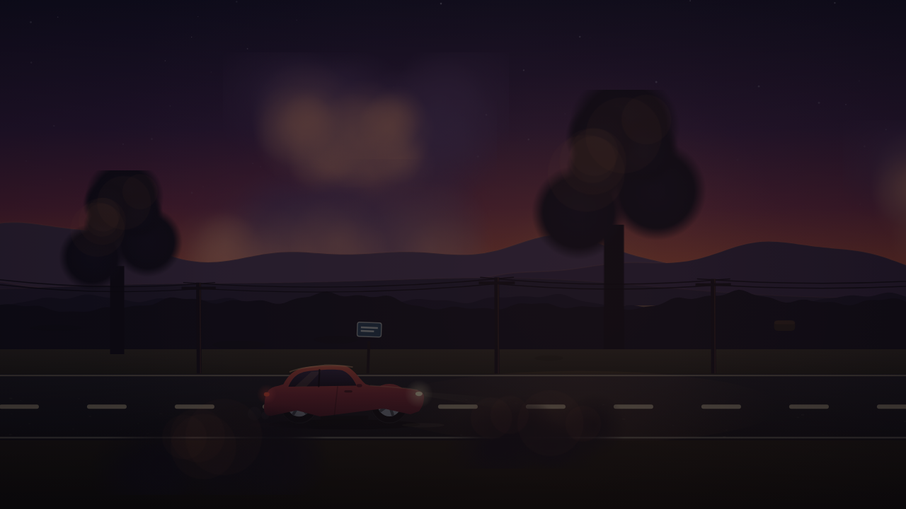
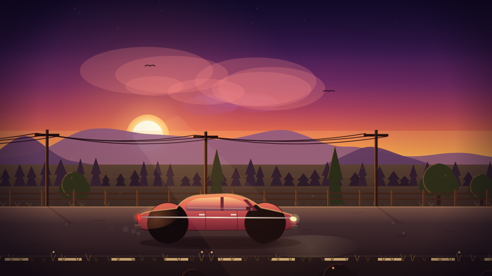

# Streaming measurements

The samples and case studies behind the tables in
[streaming.md](../streaming.md). This page shows what the lossless
over-budget path produces, what each lossy setting did on four models and
how a setting is certified, as contributor evidence rather than an operator
guide.

## What the over-budget case produces

Two single samples from Kimi-K3, a 2.8T-parameter MoE, generated on an M5
Max MacBook Pro with 128 GB. Both used `--stream-experts` at streaming
defaults, on the lossless path. The prompt is the one-shot canvas-animation
prompt that the lossy-setting comparisons also use. Each screenshot links to
the generated page, committed beside it in `docs/assets/perf/`. GitHub shows
the page source. Download one to watch the animation.

| | |
|---|---|
|  UD-IQ2_XXS, 662 GB file. One generation of 30.8k tokens, thinking included, at 1.34 tok/s and temperature 1.0. |  UD-Q2_K_XL, 861 GB file, of which 799 GB of experts stay file-backed. One generation of 23.7k tokens, thinking included, at 1.15 tok/s and temperature 1.0. |

Both pages ran as generated, and the larger quant also added scroll and
drag controls for the cruising pace that the prompt never asked for. What
the samples show is scale: a model five to seven times the machine's RAM
sustained a coherent 30k-token single-file program at the single-digit
rates listed above.

## Hy3: flat router, high hit rate

Hy3 is the flat-router end of the range. It is a 299B-A21B MoE, streamed as
a 159 GB IQ4_XS file on a 128 GB machine with the decode arena at about a
92% hit rate. Decode-only tok/s come from alternated A/B rounds of 512-token
generations. Quality was scored at temperature 0.6 and top-p 0.95 on a
12-task goal battery of JSON extraction, constrained format, code with
asserts, multi-step arithmetic and length control, plus a repetition check.

| setting | decode | quality |
|---|---|---|
| `moe_layer_shed: 0.10` | +8% | clean |
| `moe_miss_shed: 0.90` | +4% | clean |
| both together | +13% | clean |
| the pair softened to 0.07 / 0.93 | +2-4% | clean |
| `moe_expert_mass: 0.90` | ~0%, alone or stacked | clean |

Those are sustained-regime medians. A 14-inch machine started at idle
temperature ran the same arms 15-25% faster for its first twenty minutes,
with the baseline at 5.0 tok/s and the pair at 5.6 or better, until the
chassis throttled, as [Measuring](../performance.md#measuring) describes.
Moving the pair to less aggressive values keeps its quality margin but not
its speed.
Miss-shed's speedup falls steeply as P rises: at 0.93 it sheds only a
third of the experts it sheds at 0.90, and the less aggressive pair gained
a few percent where the full pair gained +13. Near these values the quality
boundary is real. In single long-generation checks at this model card's
temperature of 0.9, the pair at 0.09/0.91 emitted a stray token into code
even under top-p 0.97, while 0.07/0.93 ran clean, so the safe
high-temperature setting on this model is the less aggressive pair and its
few percent. Workloads that can run lower-temperature sampling, or accept
an occasional stray token, get the larger speedups.

That ordering is specific to this model. With a flat router, expert-mass
had no low-mass experts to drop, and at a 92% hit rate misses were rare
enough that the per-layer overhead was the constant cost, so layer-shed
gained more. The two shed settings combined because they cut disjoint
costs, and +8% and +4% multiply to roughly the observed +13%. On a
concentrated-router model with a high hit rate the probe shows the reverse,
most reads removed for a few percent of mass, before any lossy run needs to
be made.

## MiniMax-M3: low hit rate

MiniMax-M3 is the low-hit-rate end of the range. It is a 4-of-128-expert
MoE, streamed as a 264 GB Q4_K_M file on the same 128 GB machine with the
decode arena at about an 87% hit rate, measured by the alternated A/B above
with decode-only medians over 512-token generations. A layer stalls when
any one of its four routed experts misses, so at 87% per-expert residency
roughly half of all token-layer calls stall, and the miss-targeted setting
gains more.

| setting | decode | disk stall time |
|---|---|---|
| `moe_miss_shed: 0.85` | +1% | -14% |
| `moe_miss_shed: 0.80` | +6.5% | -31% |
| `moe_expert_mass: 0.85` | ~-3% | -9% |

The probe put this router in the middle of the concentration range, where
P=0.85 keeps 3.7 of 4 experts on decode for 4% dropped mass. Expert-mass
did remove reads, but most of the reads it removed were arena hits that
cost nothing, so its router-side filtering cost more than the stalls it
saved. Miss-shed drops mass only where a stall is otherwise certain, which
also means its realized cost sits far below the probe's unconditional
number: at P=0.80 the probe predicts 12% dropped mass, while the
residency-aware shed dropped 2.9%, shedding 8% of routed experts across a
third of token-layer calls. Two 10k-token generations at temperature 0.6
and top-p 0.95 ran clean, producing complete working artifacts with no
stray tokens. The probe sizes expert-mass but does not account for
residency, so when the exit stats show a low hit rate, try miss-shed first.

## GLM-5.2: wider routing

This point changes routing width. GLM-5.2 is a 282 GB UD-IQ3_XXS file
with 256 experts routed top-8 under sigmoid gating, and it streams on the
same machine at a per-expert hit rate near 88%, higher than M3's, yet
stalls more, because a layer stalls when any of eight routed experts miss
rather than four. At hit rate h the stall odds are `1 - h^k`, and k = 8
roughly doubles them at the same h. That amplification works in both
directions, since each point of hit rate miss-shed recovers is worth about
twice as much, so the same setting measured stronger here, +16.5% decode
at P=0.80 with stalls halved and +10.7% at P=0.85, both as even-round
alternated 512-token medians. Arena size, flat on M3, mattered too, with
each arena GB adding about 0.2 points of hit rate.

Wider routing also concentrates more meaning in each expert, which moved
the quality threshold. P=0.80, clean on M3, broke GLM-5.2 in a way
character scans cannot detect: a 12k-token one-page-app generation
completed with no stray tokens, valid markup and working code, but the page
it drew was missing its subject, showing a sky with no road and no car on a
prompt asking for a car on a road. The lossless run at the same seed drew
the full scene, and so did P=0.85. Dropped gate mass degrades content
before it degrades form, so a shed level cannot be certified by scanning
the output for corruption. Instead, render the artifact and look at it, at
deploy sampling settings, against a lossless run at the same seed. Miss-shed's
safe range depends on the architecture, so re-gate it whenever routing
width or gating changes.

## Kimi-K3: far over budget

The most over-budget point runs the scale sample from the top of this page
with the settings on. Kimi-K3 UD-Q2_K_XL is 861 GB on the same 128 GB
machine, with 896 experts routed 16 to a token across 92 streamed expert
layers. This far over budget, the arena holds a small fraction of the
expert set, the lossless hit rate is about 50% and demand stalls take about
two thirds of decode wall time, so the miss-targeted setting gains by far
the most. Each shed arm pairs it with keeper prestage through
`--moe-prestage keepers`. Every setting ran one long generation on the same
one-shot prompt as the samples above, at temperature 1.0, for 23-30k tokens
with thinking included, and these are whole-run averages rather than
alternated A/Bs.

| setting | dropped mass | hit rate | decode |
|---|---|---|---|
| lossless, ranked prestage | none | 49.9% | 1.15 tok/s |
| `moe_miss_shed: 0.80` | 17.1% | 68.0% | 1.19 tok/s (+3%) |
| `moe_miss_shed: 0.70` | 26.1% | 71.9% | 1.33 tok/s (+16%) |
| `moe_miss_shed: 0.65` | 30.4% | 74.2% | 1.39 tok/s (+21%) |

The runs span several days, and ambient memory pressure sized the wired
arena differently across them, from 29 to 33 GB, so read the
mechanism columns as a trend and not as a controlled sweep. Two results are
still clear. Shedding raised the hit rate of the remaining experts, because
the arena stops loading and evicting experts that would be dropped anyway,
which is the self-reinforcement miss-shed relies on. The speedup for each
step is also non-linear, as on the other models: going from lossless to
0.80 gained little in this sample, while 0.70 and 0.65 returned +16% and
+21%.

All three shed levels produced complete working pages on this long-form
prompt, and what separates them is content drift, compared side by side in
the Kimi-K3 screenshot table further down. One step further down broke
form, not just content: at 0.60 a code generation on this model produced a
nonfunctional program in one try. The usable range on this model at this
quant is therefore 0.65 to 0.80, and where to sit within it depends on how
much content fidelity the workload can lose.

## Certifying a setting

Quality degrades in a consistent order as the settings become more
aggressive. On Hy3, multi-step arithmetic broke first, well before
coherence, formatting or code: `moe_layer_shed: 0.20` alone dropped
arithmetic tasks, and so did `moe_layer_shed: 0.10` with
`moe_miss_shed: 0.75`, even though each is clean alone. On the same
battery, miss shed alone stayed clean down to 0.75 and expert mass down to
0.70. Past the quality threshold, long generations show a second symptom,
stray token substitutions such as wrong-script digits or a bullet character
inside code.

The procedure is repeatable on any model:

1. Run the lossless run and the candidate setting on the same prompt at the
   same seed, at the temperature and top-p you deploy with. A check at a
   lower temperature does not cover a higher one, and untruncated sampling
   exposes the whole perturbed tail that nucleus truncation hides.
2. Score a short goal battery: JSON extraction, constrained format, code with
   asserts, multi-step arithmetic, length control and a repetition check.
   Put chained arithmetic in first if the workload depends on it.
3. Generate something long, 10k tokens or more, and scan it for stray
   tokens. A per-token error rate too small to appear in a short check still
   accumulates.
4. Render the artifact and compare it with the lossless run. Dropped gate
   mass degrades content before form, so a page can be valid and complete
   with its subject missing.
5. Leave margin on each stacked setting, since their effects add up against
   a single quality threshold. Re-gate whenever routing width or gating
   changes.

## One prompt, four settings

The quality loss is easier to see than to score. This one-shot prompt asks
for a single-file HTML canvas animation of a car driving through parallax
scenery, and it ran once for each setting on the same Hy3 IQ4_XS build, at
the model card's temperature of 0.9 with low reasoning effort, with each
generated page screenshotted. These are single samples at high temperature,
so read them as an illustration rather than a certification.

The prompt (identical for all four runs)

> Write a single HTML file with a full-page canvas and no libraries.
> Simulate a realistic side-view of a moving car as the main subject.
> Keep the car visible in the foreground while the background landscape
> scrolls continuously to create the feeling that the car is driving
> forward. Use layered scenery for depth: nearby ground, roadside
> elements, trees, poles, and distant hills or mountains should move at
> different speeds for a natural parallax effect. Animate the wheels
> spinning realistically and add subtle body motion so the car feels
> connected to the road. Let the environment pass smoothly behind it,
> with repeating but varied scenery that makes the movement feel
> believable. Use cinematic lighting and a cohesive sky, such as sunset,
> dusk, or daylight, to enhance atmosphere. The overall motion should
> feel calm, immersive, and realistic, with a seamless looping
> animation.

| | |
|---|---|
|  lossless, top-p 1.0. 13.2k tokens at 3.0 tok/s. |  `moe_layer_shed 0.07` + `moe_miss_shed 0.93`, top-p 0.97. 10.6k tokens at 3.5 tok/s. |
|  `moe_layer_shed 0.10` + `moe_miss_shed 0.90`, top-p 0.95. 11.1k tokens at 3.6 tok/s. |  `moe_layer_shed 0.20` + `moe_miss_shed 0.80`, top-p 1.0. 10.0k tokens at 4.2 tok/s. |

The scene simplifies as the settings become more aggressive, well before
anything breaks, and all of the first three pages ran clean. The black
frame is the past-the-threshold symptom on a real run: that page failed on
its first stray token, a bullet character where an operator belonged, with
CJK characters spliced into two identifiers further down the file. The
middle setting also shows the sampling interaction described under Hy3,
since its page was generated clean at top-p 0.95 while the same setting
sampled untruncated put one wrong-script token into an 11k-token run. The
tok/s figures are whole-run averages of these single generations at
different lengths, not controlled A/B numbers, so for the measured
comparison read the Hy3 table. Each screenshot links to its generated page.

The sampling interaction can also be used to advantage. Here the full pair
was rerun once on the same prompt and build with lower-temperature
sampling, at temperature 0.6 and top-p 0.95 instead of the model card's
0.9:

 `moe_layer_shed 0.10` + `moe_miss_shed 0.90`, temperature 0.6, top-p 0.95. 10.2k tokens at 3.8 tok/s.

It ran clean and produced one of the strongest scenes of the whole set,
from the full pair that needed less aggressive values to run clean at
temperature 0.9. This is a single sample like the others, but it suggests
the practical setting on this model. Keep the full pair and its whole +13%
and lower the temperature slightly. Making the settings less aggressive at
the card's temperature loses most of the speedup instead.

## One prompt, four shed levels: Kimi-K3

The same comparison at the most over-budget end of the range. Each of the
four Kimi-K3 settings measured above ran the same prompt once to completion
at temperature 1.0. Screenshots link to the generated pages as before.

| | |
|---|---|
|  lossless, ranked prestage. 23.7k tokens at 1.15 tok/s. |  `moe_miss_shed 0.80` + keeper prestage. 24.2k tokens at 1.19 tok/s. |
|  `moe_miss_shed 0.70` + keeper prestage. 29.6k tokens at 1.33 tok/s. |  `moe_miss_shed 0.65` + keeper prestage. 28.3k tokens at 1.39 tok/s. |

All four pages ran as generated, with valid markup, a working animation
loop and no stray tokens, and what varies is the scene, not monotonically.
The lossless page drew the cohesive film-grain dusk. At 0.80 the scene is
clean and bright, but the car body has small geometry glitches and the
lighting is the flattest of the set. The 0.70 composition is complete but
the tone mapping overshot, so that page renders far darker than its palette
intends and the foreground trees reduce to blurred dark masses. At 0.65 the
sky and landscape are the richest of the four while the car is the most
damaged subject, with oversized featureless wheels and a stray light streak
across the body. Between 0.65 and 0.80 the flaws differ in kind, not in
degree, so a single sample for each setting cannot rank adjacent levels,
although it can show that all three are above the quality threshold, which
is one step further down at 0.60, where a code generation broke outright.
As on GLM-5.2, dropped mass degraded what the pages drew long before it
corrupted what they wrote. Certifying a level means rendering the artifact,
and ranking neighboring levels takes more samples than one.

## Lossless setting measurements

The numbers behind the lossless settings table in
[streaming.md](../streaming.md#the-lossless-settings). All are alternated A/B
medians unless noted.

| Setting | Model and machine | Without | With |
|-------|-------------------|---------|------|
| prefill feeder, short prompt | MiniMax-M2 Q5_K_M 162 GB, M3 Max 128 GB, 53-token prompt | 19.4 s to first token | 11.4 s |
| decode feeder | same model and machine, 512-token generation | 2.4 tok/s page cache, 3.0 tok/s `--stream-cpu` | 4.0 tok/s average, 4.7 steady at 90% arena hits |
| arena token split, second-turn prefill | Kimi-K3 UD-IQ2_XXS, M5 Max 128 GB, 48-token turn | 0.25 tok/s | 2.13 tok/s |
| weight pin | Kimi-K3 UD-IQ2_XXS 662 GB, 62 GB every-token set, M5 Max 128 GB | 0.10 tok/s decode, 0.62 prefill | 0.38 decode, 0.97 prefill |
| pin excludes converted tensors | HY4-preview, F32 output head held as bf16 | 22.6 GB pinned | 19.7 GB pinned, 3.5% fewer expert bytes per token |
| GPU keep-warm | GLM-5.2 UD-IQ3_XXS, arena 70 GB, miss shed 0.85, lookahead off | 2.51 tok/s | 3.64 tok/s |
| GPU keep-warm | Hunyuan3 IQ4_XS, layer shed 0.10 with miss shed 0.90 | 4.01 tok/s | 5.29 tok/s |
| streamable lookup table | Qwen4-Exp Q6 169 GB, short context | 8.4 tok/s, 106 GB wired | 12.6 to 13.4 tok/s, 54 GB wired, converging at 16k depth |

Lookahead prestage recall of the next layer's actual top-k is about 78% on
GLM-5.2 at 8 experts and MiniMax-M3 at 4, against about 35% for reusing the
previous token's routing, measured with the recall probe in
[debug-switches.md](debug-switches.md).

Keep-warm does not change stall time or arena hit rate, because the disk
does the same work, and the gain is clock residency. With the heartbeat alone
on an idle M5 Max, GPU power went from 199 mW to 287 mW while active
residency went from 58% to 99.8% at the 338 MHz floor, and the real cost is
holding the decode-level clock through the gaps, which scales with the
workload. A streamed model whose per-token time sits in the eval and sync
bucket rather than in stalls, in the phase breakdown the same page lists,
is the case keep-warm helps.

Weight pinning matters because without it the every-token weights are
plain file-backed pages, which the kernel evicts between uses on a machine
at its free-page minimum. Each token then re-faults the whole set, which
saturates the SSD before the experts read a byte and shows as compute time
rather than stall time. The symptom is a decode rate close to every-token
bytes divided by SSD bandwidth, whatever the arena hit rate.
