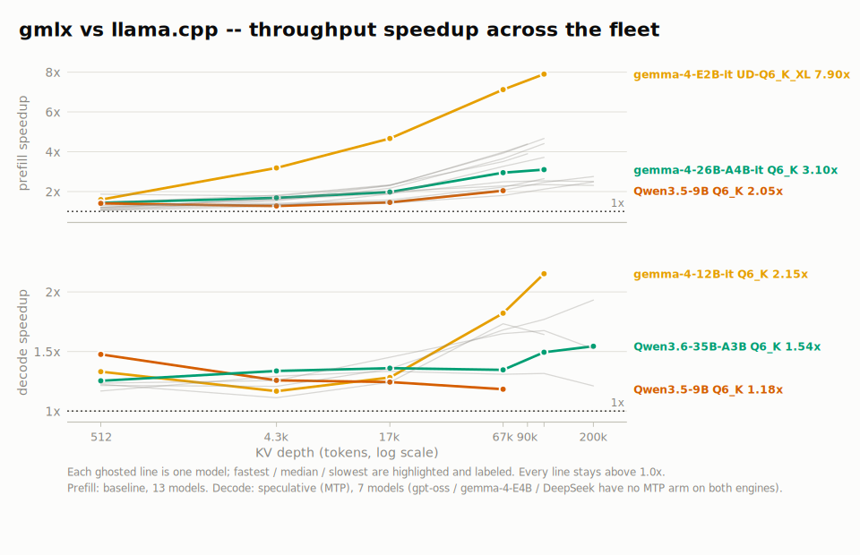

# Performance

What makes a local model fast on Apple Silicon, what each gmlx lever buys, and
how to run your own benchmarks.

## What determines speed

Single-stream decode is memory-bandwidth-bound: every token reads the model's active
weights once, so tokens per second is roughly bandwidth divided by active bytes.
That has three practical consequences. Smaller quants decode faster when nothing
else gets in the way. MoE models decode like small models (only the routed experts
are read per token) while answering like big ones. And chips with more memory
bandwidth are faster in proportion, independent of anything gmlx does.

Prefill (prompt processing) is compute-bound instead, so it rewards the GPU and
batching rather than small weights. Long-context work shifts time from weights to
the KV cache and attention. The levers below each attack one of these regimes.

## Measuring

```sh
# prefill + decode throughput at several prompt lengths
gmlx run model.gguf --bench "128,512,2048" --bench-runs 3

# decode speed AT depth: how fast is token 16,001?
gmlx run model.gguf --bench-depths "0,4096,16384"
```

`--bench-runs 3` reports the best (max-tps) run per length, which matters on
laptops: sustained runs throttle, and picking the best run keeps a thermally
degraded repeat from dragging the number. Back-to-back A/B comparisons still
hand the second arm a hotter chip - let the machine cool between arms you
intend to compare.

A note on `pp512`-style numbers: prefill throughput at a 512-token prompt is the
conventional benchmark figure, and it is a short-context number. If your real
workload is a coding agent with a 30k-token prompt, compare engines and models at
that depth, not at 512.

When a depth number looks wrong, check which attention kernel is actually
running before anything else. `GMLX_ROUTE_LOG=1` prints per-route SDPA call
counts at process exit; `GMLX_SDPA_DEBUG=1` traces the first deep calls
live. Deep decode and speculative verify should land on fused routes
(`gqa_decode`, `fa_decode`, `fa_verify`, `verify_gemm`, `sdpa_vector`); `stock`
at depth means the shape missed every eligibility gate and is paying for
materialized attention scores. A one-shot warning fires automatically when a
verify-shaped call does this. These flags work in the server process too, which
is where serve-path numbers must be measured (`GMLX_ROUND_PROFILE=1` +
`GMLX_ROUND_LOG=path` writes a per-round phase log there).

## Reference numbers

Measured on an M5 Max MacBook Pro (128 GB), 512-token prompts, medians of
repeated runs:

| Model | File | Decode | Decode (MTP) | llama.cpp decode (spec) | Prefill | llama.cpp prefill |
|-------|------|--------|--------------|-------------------------|---------|-------------------|
| gemma-4-12B-it (dense) | Q6_K | ~44 tok/s | ~72 tok/s | ~54 tok/s | ~850 tok/s | ~730 tok/s |
| Qwen3.5-9B (dense) | Q6_K | ~70 tok/s | ~112 tok/s | ~76 tok/s | ~1600 tok/s | ~1140 tok/s |

These are the 512-token-depth medians from the July 2026 fleet round; the
per-model tables in [benchmarks.md](benchmarks.md) carry the same runs to
200k tokens with run-to-run ranges.

Against llama.cpp on the same GGUF, in the July 2026 fleet round: prefill is
faster on every model at every depth measured, 1.2-1.6x at short context and
2-4x past 100k tokens; decode is faster in every cell but one at 512 tokens
(0.95x on gpt-oss-20b) and widens as the KV cache
deepens; and with speculative decoding active on both engines, decode runs
1.1-2x ahead at every depth.

<picture>
  <source media="(prefers-color-scheme: dark)" srcset="assets/perf/fleet-ratio-dark.svg">
  
</picture>

Per-model charts, the full tables, methodology, and exact weight provenance
are in [benchmarks.md](benchmarks.md). Your absolute numbers scale with your
chip's memory bandwidth: as
a rough guide, a Pro-tier chip has about half the bandwidth of a Max and a base
M-series chip a quarter to a fifth, so scale the table accordingly. The ratios
between models and quants hold.

A scope note on hardware: every number and every llama.cpp comparison in this
guide was measured on an M5 Max (40-core GPU, 128 GB). The kernels are written
for the matrix hardware in recent Apple GPU generations (M3 and later), and
tuning is no longer M5-only: MoE prefill and expert-gather batches route
through a kernel tuned and validated on an M3 Max (128 GB), with the M5's
tensor units still taking over where the hardware has them. M1 and M2 run the
standard kernel paths but have not been a tuning focus, and we have not
benchmarked them against llama.cpp. The bandwidth scaling above transfers
gmlx's own numbers between chips; the comparative claims are measured on
M5-family hardware. If you run the bench commands on an M1 or M2, an issue
with your numbers is welcome.

## Choosing a quant for speed

The file you download matters as much as any runtime flag. Community GGUFs come in
two styles: uniform files, where every quantized tensor uses one K-quant codec
(`Q6_K`, `Q4_K_M`), and mixed files (Unsloth's `UD-*` builds and similar), which
promote some tensors to Q8_0 or float to protect quality at low average bits.
(For how K-quants themselves compare with MLX's native affine quantization,
roughly half the KL divergence at equal bitrate, see
[mlx-kquant's KLD table](https://github.com/asher/mlx-kquant#why).)

Mixed files cost real decode speed. At single-stream decode, every layer's slowest
matmul gates the token, and the promoted float and Q8_0 tensors run below the
K-quant kernels' pace. In our M5 Max measurements, switching from the mixed UD build
to a uniform Q6_K of the same model sped decode up 64% on Qwen3.6-27B (dense) and
15% on Qwen3.6-35B-A3B (MoE), with equal or better output quality.

The practical rules:

- If a flat Q6_K fits your memory, prefer it over a mixed UD-Q4_K_XL: it is faster
  to decode and more accurate. The mixed file's advantage is footprint only.
- Check before downloading: `gmlx validate <ref>` lists every codec in the file.
  Prefer files that are one K-quant codec end to end.
- Reach for mixed low-bit builds when memory forces the choice, not as a default.

## MTP speculative decoding

Models that ship a native multi-token-prediction head (Qwen3.5 and Qwen3.6) get
speculative decoding automatically on `run` and `chat`: the head drafts tokens ahead
and the base model verifies them, so output is exactly what the base model would
have produced, just faster when drafts are accepted. `--no-mtp` turns it off.
gemma-4 models take the two-file shape instead: a small companion drafter GGUF via
`--draft-gguf`. On the server it is the `speculative:` config key.

Gains depend on acceptance rate and context depth. In our serve benchmarks (M5
Max, the same server with MTP off as the baseline), speculation roughly
doubles dense-model decode at short context (1.9-2.1x on Qwen3.6-27B and, via
the companion drafter, gemma-4-12B/31B), still delivers 1.4-1.8x from 17k
through 110k, and holds 1.2-1.4x at 200k. MoE models gain less (1.1-1.3x) and
the lift can invert at depth (gemma-4-26B-A4B drops to 0.86x past 100k), so
benchmark before enabling it there. The verify pass runs on kernels built for
it, which is what keeps the speedup alive at depth. The per-model lift curves
are charted in [benchmarks.md](benchmarks.md). Predictable text (code,
structured output) accepts more drafts than freeform prose. Measure your model
and workload:

```sh
gmlx run model.gguf --bench-depths "0,4096" --speculative     # accept rate + speedup
```

One interaction to know about: on MoE models under concurrent load, speculation and
batching compete (verification widens each request's expert reads). If you serve
many parallel clients on an MoE model, benchmark with speculation off before
enabling it.

A second: quantizing the KV cache (`--kv-bits`) shifts the target model's verify
logits away from the draft head and costs accepted drafts -- about a third fewer
at 4-bit in our measurements (9B hybrid, temperature 0.6), which can outweigh the
memory saved. Keep the KV cache in full precision when speculation is on if you
can; if memory forces quantization, prefer 8-bit, which perturbs the
distribution far less.

### Stochastic acceptance (opt-in)

By default a draft is accepted only when it matches the token the base model
itself would emit - that exact-match rule is what keeps MTP output
token-identical. At temperature > 0 it is also a ceiling: however good the
draft head, a draft can't match a sampled token more often than the target's
own probabilities allow. `--stochastic-mtp` (run/chat/serve) or
`stochastic_mtp: true` in the server config lifts that ceiling with rejection
sampling: drafts are sampled and accepted with probability `min(1, p/q)`,
which provably preserves the sampling distribution - output remains a true
sample from exactly what non-speculative decoding samples from - but tokens
are no longer bit-identical to a non-speculative run. Greedy requests are
unaffected and stay token-identical.

Measured A/Bs (temp 1.0 unless noted): Qwen3.6-27B coding 73 -> 77%
acceptance; Qwen3.6-35B-A3B +2 to +12 points across coding/chat/creative
profiles; DeepSeek-V4-Flash at IQ2_XXS is the big winner at 55 -> 69% (+11%
decode throughput) - the lower the trunk precision and the flatter the text,
the more exact-match leaves on the table. Long-context chat (ultrachat at 4k
depth) gains a smaller +3-5% expected tokens per round. Turn it on when you
sample and want throughput; leave it off and output is exactly what plain
non-MTP decoding produces - MTP does not change output unless stochastic
acceptance is enabled.

## The prompt cache

The server keeps a cross-request prompt cache: a request whose prefix was seen
before skips prefill for the cached span. A repeated 32k-token prefix turns tens of
seconds of prompt processing into a sub-second time-to-first-token. Dense-attention
models reuse at block granularity; hybrid and sliding-window models reuse exact
snapshots.

This is the single biggest lever for agent workloads: coding harnesses resend a
large, mostly stable system prompt every turn, and multi-turn chat resends the whole
history. The optional SSD tier (`gmlx init --disk-cache`, or the `cache:` block in
the config) persists entries across restarts and holds more than RAM comfortably
would; entries are evicted by size budget. Configuration keys:
[server-config.md](server-config.md#cache-keys-cache).

The cache composes with MTP, and a finished request stores its generated
tokens too: turn N+1 of a conversation warm-starts past the whole of turn N
instead of re-prefilling the previous reply, and a warm hit restores the
draft head's state along with the base model's. Details and switches:
[server-config.md](server-config.md#speculative-decoding--the-prompt-cache).

## Memory and the KV cache

Weights cost about the GGUF file size. The KV cache, for a standard dense model:

```text
bytes per token = 2 (K and V) x layers x kv_heads x head_dim x 2 (bf16)
```

An 8B-class model (32 layers, 8 KV heads, head dim 128) pays 128 KB per token: 4 GB
for a 32k-token session. A 32B-class dense model (64 layers) pays 256 KB per token:
8 GB at 32k. Long-context agent work can make the cache rival the weights.

Levers, cheapest first:

- `--kv-bits 8` roughly halves the cache at nearly no quality cost; `--kv-bits 4`
  roughly quarters it with a small cost at long range. Server-side these are the
  `kv_bits` and friends load keys ([server-config.md](server-config.md#load-keys-load)).
  `--quantized-kv-start` keeps the first stretch of context in full precision.
  With speculative decoding on, quantized KV also costs draft acceptance --
  see the interaction note in the speculation section above.
- `--max-kv-size` caps the cache as a rolling window, trading away the oldest
  context.
- Long prompts prefill in chunks automatically (2048 tokens), which bounds
  prefill's working memory on top of the cache itself. `--prefill-step-size`
  (on `serve`, `run`, and `chat`; server config `server.prefill_step_size`, or
  a `PREFILL_STEP_SIZE` env) shrinks the chunk to cap peak memory further, at
  some prefill-throughput cost. Applies to speculative (MTP) serving too.

Several families are much cheaper than the formula. Sliding-window layers (gemma)
stop growing at the window size. Hybrid linear-attention models (Qwen3.5/3.6,
Falcon-H1, Granite 4.x, Nemotron-H) keep a small fixed state on most layers and pay
full KV only on their few full-attention layers, which is why a Qwen3.6 at 64k
context is unremarkable on a 64 GB machine. MLA models (DeepSeek-family) store a
compressed cache.

macOS also caps how much RAM the GPU may wire, at a machine-dependent majority
share of total memory. gmlx handles the over-budget MoE case itself (next
section), and the multi-model server budgets resident weights to a configurable
share of RAM (`--budget-gb`). If a single dense model plus cache sits right at the
cap on a high-RAM Mac, the ceiling can be raised at your own risk with
`sudo sysctl iogpu.wired_limit_mb=<MB>`. It resets at reboot; leave the OS several
GB of headroom.

### The MLX buffer cache at deep context

MLX keeps freed GPU buffers in a wired reuse pool (the buffer cache). That is
normally free performance, but deep-context serving of a near-RAM-size model
retains multi-gigabyte prefill transients in the pool, and the accumulated
wired footprint can exhaust free pages -- the failure is a system freeze, not
a clean error. The server therefore bounds the cache automatically when the
biggest configured model uses more than ~60% of the GPU working set, capping
it at a quarter of the remaining slack (clamped to 4-12 GiB) and logging one
`[serve] MLX cache limit: ...` line. Models with ample slack keep an
unbounded cache -- the policy never engages there.

Override it explicitly when needed: the `server.cache_limit_gb` config key or
the `GMLX_CACHE_LIMIT_GB` env (env wins). A GiB value pins the limit --
benchmarks should pin it for reproducibility; a negative value (or env
`off`/`none`/`unlimited`) forces an unbounded cache and suppresses the auto
policy; `0` disables buffer caching entirely. A bounded cache trades a little
allocator churn for a bounded footprint: transients up to the limit are
recycled in place, larger ones fall through to fresh allocations.

## Bigger than memory: MoE offload

Two placements run MoE models whose files exceed what the GPU can wire:

- `--stream-experts` keeps the every-token layers (attention, routers, shared
  experts, KV cache) on the GPU and streams the routed experts, which run on
  the CPU stream. Historically slower than `--stream-cpu` at short context
  because of the per-layer handoff; the decode feeder (below) reverses that,
  and `--stream-experts` keeps its long-context advantage with a quantized KV
  cache, where the large KV stays on GPU.
- `--stream-cpu` runs the whole model on the CPU device, mmap-backed, so the page cache
  streams weights from disk on demand. Past the wired budget the runtime adds
  sequential expert prefetch, advising the kernel a couple of layers ahead so
  prefill reads expert stacks at sequential bandwidth instead of demand-faulting
  them.

### The feeder paths

Streaming models engage two *feeder* paths by default:

- The **prefill feeder** (`--no-prefill-feeder` disables) stages each layer's
  expert stacks straight from the GGUF into GPU-visible ring slots while the
  previous layer computes, so every byte makes one trip - the page-cache path
  reads each expert byte twice on a machine that is at memory capacity by
  definition. Short prompts stage only the experts the router actually chose
  instead of whole layers (measured on an M3 Max, 162 GB MiniMax Q5_K_M: a
  53-token prompt's time-to-first-token dropped from 19.4 s to 11.4 s).
- The **decode feeder** (`--stream-experts` only; `--no-decode-feeder`
  disables) keeps the most-routed experts of every layer in a wired,
  popularity-managed GPU arena sized to the machine (`GMLX_DECODE_ARENA_GB`
  overrides) and reads only the misses from the GGUF, at SSD queue depth. The
  arena starts empty and converges within a few dozen tokens. The arena is
  wired, so it also polices itself: under system memory pressure (another
  model, a build) it shrinks, keeping its most popular experts, and regrows
  once pressure clears - a long-running model stays a good citizen on a
  machine that is doing other work (`GMLX_DECODE_PRESSURE=0` pins it instead).
  Same model and
  box: decode went from 2.4 tok/s on the page-cache path to 4.0 tok/s averaged
  over a 512-token generation (~4.7 steady, ~90% arena hits), against 3.0
  tok/s for `--stream-cpu` - so `--stream-experts` now matches `--stream-cpu`
  on short generations and pulls ahead roughly 1.5x once the arena warms,
  before the KV-cache advantage at depth.

In server configs the placement is the per-model `stream: experts | cpu`
key and the feeder opt-outs are `prefill_feeder: false` /
`decode_feeder: false`.

### Lookahead prestage

With the decode feeder on, arena misses are also *prestaged by lookahead*
(`GMLX_DECODE_LOOKAHEAD=0` disables): each MoE layer runs the next MoE layer's router
on its own input and pre-reads the predicted misses on a small dedicated pool
while the current layer computes. The residual changes little between
adjacent sublayers, so the prediction lands: measured recall of the next
layer's actual top-k is ~78% on GLM-5.2 (@8) and MiniMax-M3 (@4), against
~35% for previous-token routing reuse. Predictions move bytes and nothing
else - routing and outputs are bit-identical - and speculation is kept off
the demand path three ways: prestage reads are submitted only after the
current layer's demand misses have finished, the read threads run at
utility disk-I/O priority so the kernel services demand misses first
(`GMLX_DECODE_LOOKAHEAD_IOPOL=0` restores default priority), and every
layer settles its in-flight prestages before serving. A per-layer rank
gate watches how often each prediction rank actually lands and stops
submitting ranks that measure below `GMLX_DECODE_LOOKAHEAD_MIN_P` (default
`0.5`); predictions the router then does not route to are cancelled before
they reach the disk when their reads have not started
(`GMLX_DECODE_LOOKAHEAD_CANCEL=0` disables). Together these keep the
wasted-read tax near zero on models where the SSD is the bottleneck.
`GMLX_DECODE_LOOKAHEAD_PROBE=1` prints the per-layer recall table at exit without
issuing reads, the check worth running on a new model family.

When a larger-than-RAM model is released, its page cache is also released, via
`msync(MS_INVALIDATE)` over the shards - at process exit, or at unload on a
running server (`GMLX_RELEASE_PAGECACHE=0` disables).

### Lossy levers

Four levers trade a bounded amount of output quality for decode speed on
streamed MoE models. None is ever on by default: absent flags and absent
config keys mean lossless routing. All are decode-side - a large prefill
chunk routes to nearly every expert either way - and all act only on
streamed layers.

A streamed decode token pays three distinct costs, and each lever cuts a
different one. Experts that miss the decode arena are read from disk at
demand latency - the dominant cost when the hit rate is low. Experts
already resident in the arena cost only gather compute, which is small.
And every streamed MoE layer pays a fixed per-layer overhead (kernel
launches plus a host synchronization) that does not shrink when fewer
experts are routed.

The router-side levers thin the routed set itself, cutting reads and
compute in proportion. `--moe-experts K` caps the router at a fixed K
experts per token. `--moe-expert-mass P` is the adaptive version and
usually the better trade of the two: each token keeps the smallest set of
its routed experts covering share P of the gate mass, so the dropped mass
is bounded by 1-P and lands on tokens where the router was already
confident. A token whose top 3 experts carry 92% of the mass reads 3
experts at P=0.9, while an uncertain token keeps the full fan-out. How
much expert-mass buys is a property of the model's router. On a
concentrated router it is the strongest lever available: most reads
disappear for a few percent of dropped mass. On a flat router it buys
almost nothing - a 299B model we measured keeps 7.1 of its 8 experts at
P=0.90. Measure rather than guess: `--moe-expert-probe` runs the trained
routing losslessly and prints, per candidate P, the experts kept, the
implied read fraction, and the mass actually dropped, with decode and
prefill tabled separately. Size P against the decode table. The two router levers
compose (`--moe-experts 6 --moe-expert-mass 0.9` caps at 6, then drops
within the 6).

The staging levers act at the decode feeder instead of the router.
`--moe-miss-shed P` drops routed experts that would demand-miss the
arena, lowest scores first, keeping at least share P of the token's gate
mass, so its quality budget is spent exactly where the disk stalls are:
an arena-resident or prestage-inflight expert is never dropped, and a
shed expert earns no popularity credit, so the arena keeps its hot set.
It needs the decode feeder and a block that hands router scores to the
expert call; where it engages, it is the most targeted lever per point of
quality spent, and its payoff scales directly with the miss rate.
`--moe-layer-shed P` skips a streamed MoE layer's routed experts entirely
with probability P per token (the layer's shared expert still runs). It
is the blunt end of the scale, and the only lever that also cuts the
per-layer overhead - which makes it the one that still pays when the
arena hit rate is high and misses are rare.

Which to reach for is a measurement, not a doctrine. Run the probe once,
and read the decode feeder's exit stats (arena hit rate; printed by
`run`/`chat` at `-v`, and always in server logs) from a representative
session. A concentrated router points to
`--moe-expert-mass` first, whatever the hit rate: it removes reads and
compute together at minimal dropped mass. A flat router takes it off the
table. A low hit rate - an arena small relative to the model - makes
`--moe-miss-shed` valuable; a high hit rate leaves the per-layer overhead
as the standing cost, which only `--moe-layer-shed` touches.

One measured point, from the flat-router end of that space: a 299B-A21B
MoE (161 GB IQ4_XS streaming on a 128 GB machine, decode arena at a ~92%
hit rate; decode-only tok/s from alternated A/B rounds of 512-token
generations; quality scored at temperature 0.6 / top-p 0.95 on a 12-task
goal battery of JSON extraction, constrained format, code with asserts,
multi-step arithmetic, and length control, plus a repetition check):

| setting | decode | quality |
|---|---|---|
| `moe_layer_shed: 0.10` | +8% | clean |
| `moe_miss_shed: 0.90` | +4% | clean |
| both together | +13% | clean |
| `moe_expert_mass: 0.90` | ~0%, alone or stacked | clean |

That ordering is this model's, not a law. With a flat router,
expert-mass had nothing cheap to drop; at a 92% hit rate, misses were
rare enough that the per-layer overhead was the standing cost, so
layer-shed led and the shed pair composed (+8% and +4% multiply to
roughly the observed +13%: they cut disjoint costs). On a
concentrated-router model the probe will show the inversion - most reads
removed for a few percent of mass - before any lossy run needs to be
made.

On that same model, quality degraded in a consistent order as the levers
hardened: multi-step arithmetic broke first, well before coherence,
formatting, or code. `moe_layer_shed: 0.20` alone dropped arithmetic
tasks, and so did
`moe_layer_shed: 0.10` combined with `moe_miss_shed: 0.75` even though
each setting is clean alone - stacked levers compound onto the same
cliff, so leave margin on both. On the same battery `moe_miss_shed`
alone stayed clean down to 0.75 and `moe_expert_mass` down to 0.70. If a
workload leans on chained arithmetic, put that in the test set before
sizing any of these.

Past the edge, long generations add a second signature: stray token
substitutions such as wrong-script digits or a bullet character inside
code. The
levers widen the low-probability tail that sampling can reach, so their
safe range depends on the sampling regime: untruncated sampling (top-p
1.0, which some model cards recommend) exposes the whole perturbed tail
that nucleus truncation would mask. Certify at the temperature and top-p
you deploy with - a check run at a lower temperature does not cover a
hotter one. And a short check certifies short answers: a per-token slip
rate too small for it to see still accumulates over a 10k-token
generation, so size levers softer for long-form code than short-form
checks suggest.

In server configs the lossy levers are the per-model `moe_experts: K` /
`moe_expert_mass: P` / `moe_miss_shed: P` / `moe_layer_shed: P` keys (or
the matching `serve` flags for a single positional model); the probe
stays CLI-only, so size P with a `gmlx run --moe-expert-probe` pass
before pinning a value in a config.

### Native-fp experts (MXFP4/NVFP4)

Models with MXFP4/NVFP4 expert tensors (gpt-oss, DeepSeek-V4-Flash Q4_K_XL
quants) participate in all of the above on equal terms. By default these
tensors are eagerly repacked into MLX's packed layout at load - fine in RAM,
fatal over it (the repack materializes every expert). `GMLX_NATIVE_FP`
picks the layout: `wire` keeps them as zero-copy GGUF wire bytes served by
mlx-kquant's fp4 kernels (loads in seconds, streams like any k-quant),
`packed` forces the repack, and the default `auto` chooses wire whenever a
CPU placement is requested or the file exceeds ~90% of the wired budget.
Wire mode is a hair slower than packed when the model fits in RAM (gpt-oss
decode ~5% at depth 0, converging at depth; prefill is at parity or better)
but is what makes the over-RAM case work at all, and it cuts the load time
from minutes of repack to a mmap.

Be honest with expectations: when experts stream from disk, decode is bound by SSD
and CPU, not the GPU, and single-digit tokens per second is normal - the feeders
raise the constant, not the nature of the bound. This is a capacity feature that
makes a 200B-class MoE usable on a 64 GB machine, not a speed feature. And it is
strictly for the over-budget case: a model that fits in memory runs several times
faster on the normal GPU path.
