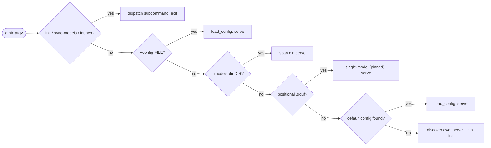
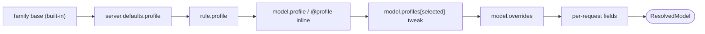
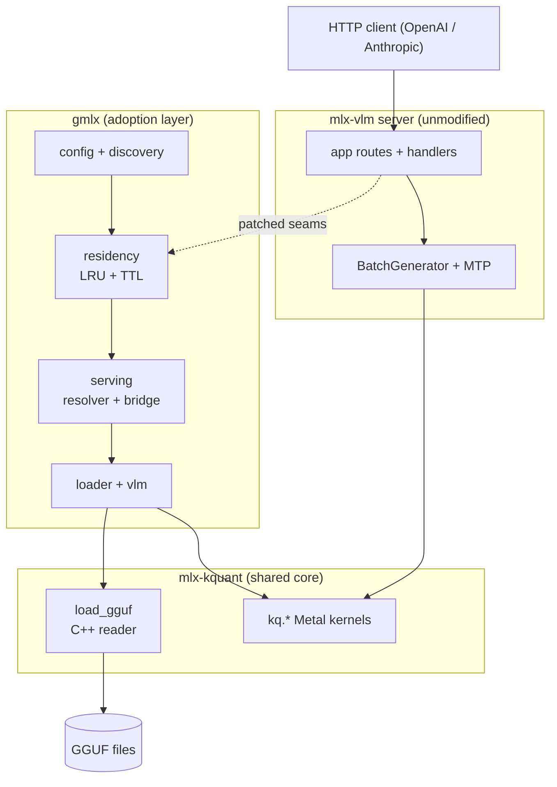

# gmlx server configuration

`gmlx serve` is the platform's server: a multi-model, continuously batched,
OpenAI/Anthropic-compatible API for GGUF models, driven by a composable YAML
config: named models, reusable profiles (sampling, load, prompt-cache, system-prompt,
and chat-template params), glob rules, friendly aliases, and opt-in directory
discovery.

The mental model in one paragraph: `models:` names each GGUF and says where it
lives; `profiles:` bundles reusable settings; `rules:` attach a profile to
model ids by glob; `aliases:` add friendly handles; `server:` configures the
process itself. A request names a model id, optionally with an `@profile`
suffix, and its effective settings are merged from the family's model-card
defaults, then the configured profile layers, then per-model settings, then
the request's own fields. Each layer only fills what the layers above leave
unset.

Sampling is model-aware from the first request: every model starts from its family's
model-card recommended defaults (Qwen3.6, Gemma, and gpt-oss all publish
different numbers), and the built-in intents (`@coding`, `@instruct`,
`@creative`, `@reasoning-low|-medium|-high`) are addressable on any model with
zero configuration. See
[Sampling profiles and built-in intents](#profiles-sampling-profiles-and-built-in-intents).

Two privacy properties are load-bearing:

- `/v1/models` lists exactly your configured/discovered ids, never the
  Hugging Face cache.
- No Hugging Face access unless you opt in (`server.hf_cache: true`), and
  even then only the local cache is read, never the network.

Serving needs no optional extra, even for multimodal models: everything the
server needs installs with gmlx.

This document is the canonical reference for the config surface and the start
modes. Every YAML example here is parsed by a CPU test
(`tests/test_docs_config.py`), and the complete examples are run through the
real loader, so the reference can't drift from the code.

---

## Quick start

```sh
# 1. Serve a single GGUF (pinned, addressable by its derived id).
gmlx serve model-Q4_K_M.gguf

# 2. Scan a folder and write a starter config you can edit (-> ~/.config/gmlx/gmlx.yaml).
gmlx init --models-dir ~/models
gmlx serve                       # bare start finds ~/.config/gmlx/gmlx.yaml

# 2b. After hand-moving or deleting GGUFs, reconcile the config
#     (`gmlx pull` registers its own downloads; `rm` removes its entry).
gmlx sync-models                 # keeps edits/comments; adds new, drops gone

# 3. Serve a directory directly, no config file.
gmlx serve --models-dir ~/models
```

Then point a request at a model by its id (the ids `init` printed - auto-named
ids carry the quant tag, e.g. `qwen3.6-27b-q6`; `gmlx list` shows them):

```sh
curl localhost:8080/v1/chat/completions -d '{
  "model": "qwen3.6-27b",
  "messages": [{"role": "user", "content": "Explain entropy."}]
}'
```

Sampling defaults come from the model's family card automatically; add
`@coding` / `@instruct` / `@creative` / `@reasoning-low|-medium|-high` to any
id to switch operating point (`"model": "qwen3.6-27b@coding"`).
`gmlx profiles` prints the table.

---

## Start modes

`main()` resolves the first matching mode, top to bottom:

| Mode | Invocation | What it does |
|------|------------|--------------|
| init | `gmlx init (--models-dir DIR \| --from-hf-cache) [--out FILE] [-r] [--force]` | Discover GGUFs (streaming scan progress) from a directory and/or the local hf cache (`--from-hf-cache` writes portable `hf:` entries and sets `server.hf_cache`) and write a starter YAML to `--out` (default `~/.config/gmlx/gmlx.yaml`). A bare `gmlx init` on a terminal runs the guided wizard. The flag-driven path needs `--models-dir` (or `--from-hf-cache`), and `--no-interactive` skips the wizard. Refuses to overwrite without `--force`. An empty dir is fine; it writes a valid zero-model config. |
| sync-models | `gmlx sync-models [--config FILE] [--models-dir DIR] [--from-hf-cache] [--no-recursive] [--dry-run]` | Reconcile an existing config's `models:` with disk (and, with `--from-hf-cache` or `hf_cache: true`, the hf cache): keep configured models that still exist (comments/edits preserved), drop ones whose file is gone / no longer cached, add newly-discovered GGUFs. Default config unless `--config`. Scans recursively by default. |
| launch | `gmlx launch <harness> [options]` | Point an external coding harness / agent runtime (opencode / pi / omp / hermes / goose / claude-code), chat TUI (aichat / elia), or web app (open-webui) at a server (auto-starting one if down) and exec it. See [launch a coding harness](#launch-a-coding-harness). |
| --config | `gmlx serve --config FILE` | Serve a YAML config (named models + profiles). Enables `POST /v1/reload`. |
| --models-dir | `gmlx serve --models-dir DIR [--hf-cache] [--recursive]` | Serve a header-only discovery scan of a directory (in-memory config). |
| positional | `gmlx serve model.gguf [--mmproj/--draft-gguf/--speculative ...]` | Serve a single model (pinned), id derived from the filename. |
| bare | `gmlx serve` | Load the first existing [default config](#default-config-locations); else discovery-scan the current directory and print a hint to run `init`. |



### Default config locations

Bare start searches these in order (first existing wins). A project-local
`./gmlx.yaml` is searched first so a repo can override your user-level
config. `init` writes to `~/.config/gmlx/gmlx.yaml` by default (the
XDG-style location, alongside other local AI services). Override the write
target with `init --out FILE`.

1. `./gmlx.yaml` (project-local override)
2. `~/.config/gmlx/gmlx.yaml` (where `init` writes)
3. `~/.gmlx.yaml` (legacy dotfile)

### Single-model flags

When serving one positional GGUF: `--mmproj FILE` (float mmproj, makes it a
VLM), `--draft-gguf FILE` (assistant-shape drafter, implies `--speculative`),
`--speculative` (native-head MTP), `--adapter FILE` (live GGUF LoRA over the
base; text only), `--chat-template STR|PATH` (replace the GGUF's template),
`--stream-experts` / `--stream-cpu` (over-RAM MoE execution placement, see `stream:`
below), `--moe-expert-mass P` (adaptive lossy MoE fan-out on the streamed
experts, see `moe_expert_mass:` below),
`--hf-source REPO` (processor/config override, rarely needed),
`--host`, `--port`, `--budget-gb`, `--max-models`, `--pin ID_OR_PATH`
(repeatable), `--max-tokens`, `--no-auth` (the API key is config-only: see
`server.api_key` in the `server` key reference), `--foreground`/`-f` (stay
attached, since `serve` detaches by default) with `--log`/`--start-timeout`
and `--no-menubar` (skip the macOS menu-bar monitor; see
[cli.md](cli.md#background-mode--server-lifecycle)), `--stt [MODEL]`,
`--tts [MODEL]`, `--hf-cache`. `--mmproj` combines with `--speculative` when the
VLM has a native MTP head or a `--draft-gguf` drafter (text turns speculate, media
turns fall back); `--mmproj` and `--adapter` remain mutually exclusive.

---

## Config file reference

A config is a YAML mapping with up to six top-level keys, all optional:

```text
server:   bind, residency budget, path roots, HF policy, prompt cache, defaults
profiles: user profiles layered over built-in per-family intents (sampling + load + cache + system)
rules:    glob a model id -> a profile
models:   named entries (id == /v1/models id == request `model`)
aliases:  friendly names / profile presets (listed in /v1/models)
discover: opt-in header-only directory scan
```

Unknown keys in the structural namespaces (top-level, `server`, `profiles`,
`models`, `rules`, `discover`) are a hard error: a typo like `pinned:` for
`pin:` fails the load instead of silently no-op'ing. To see the whole schema
with every key and its effective default, run `gmlx serve --print-config`
(optionally with `--config FILE` / `--models-dir DIR` / a positional GGUF); it
resolves the config for that start mode, prints it as YAML, and exits without
starting the server.

### `server`

```yaml
server:
  host: 127.0.0.1            # bind address; non-loopback requires api_key (or no_auth)
  port: 8080
  api_key: null              # require this key on every endpoint except /health
  no_auth: false             # explicit opt-out: non-loopback bind with no key
  model_dirs: [~/models]   # roots for relative model/mmproj/draft paths + default scan target
  budget_gb: 96              # resident weight-byte budget (null => 0.8x the GPU working set)
  max_models: null           # optional secondary cap on resident model count
  hf_cache: false            # true => named hf ids + hf: model paths resolve from the LOCAL cache (no download)
  menubar: true              # macOS: a background `serve` auto-raises the menu-bar monitor (false to disable)
  token_queue_timeout_s: null # seconds to wait for the NEXT token before aborting a request
                             #   (null => mlx-vlm's own default, 600; 0 => never)
  prefill_step_size: null    # prefill chunk size in tokens for every model on this server
                             #   (null => the default, 2048; lower caps peak memory on long prompts)
  cache_limit_gb: null       # MLX buffer-cache cap in GiB (null => auto: bounded only when the
                             #   biggest model leaves little working-set slack; negative => never bound)
  family_defaults: true      # built-in per-family model-card sampling + @intents (false turns them off)
  stochastic_mtp: false      # p/q acceptance for sampled MTP requests: same output
                             #   distribution, higher acceptance, NOT token-identical
                             #   (see performance.md; applied at startup)
  gpu_keepwarm: false        # hold GPU clocks up while a streamed model is decoding
                             #   (heartbeat parks between requests, so idle costs nothing;
                             #   only acts on stream: experts models; applied at startup)
  cache:                     # the prompt cache (APC, automatic prefix cache) + SSD disk tier; see the cache key table
    enabled: true
    disk: {path: ~/.cache/gmlx/apc, max_gb: 200}
  stt: whisper-turbo         # speech-to-text -> POST /v1/audio/transcriptions (see below)
  tts: kokoro                # text-to-speech  -> POST /v1/audio/speech (see below)
  embeddings: qwen3-embed    # text embeddings -> POST /v1/embeddings (see below)
  assistants:                # served assistant ids: the built-in tool loop, server-side
    helper:                  #   (full contract + security model: assistant.md)
      model: qwen3.6-27b     # required: the underlying configured model id
      memory: false          # true = ONE shared store for every client of this id
      mcp: null              # null = inherit assistant.mcp; [...] = own tool scope; [] = tool-less
  assistant_allow_remote: false  # required true to serve assistants on a non-loopback bind
  defaults:
    profile: null            # default profile for EVERY model (lowest configured layer;
                             #   rules and per-model settings beat it. Rarely needed: each
                             #   model already starts from its family's model-card sampling)
    ttl_s: 900               # idle auto-unload seconds (null/0 = never); pinned exempt
    model: qwen3.6-27b        # fallback when a request omits/empties `model`
    preload: null            # warm models at startup: `all`, or a list of model ids
                             #   (validated against `models:`); null/[] = warm none
```

Paths in `model_dirs` expand `~`/`$VAR`. A relative `path`/`mmproj`/`draft_gguf`
on a model is searched against `model_dirs` in order (first existing wins); a
miss raises, listing the roots searched. One root lets every model entry use a
bare filename.

`token_queue_timeout_s` bounds how long the request loop waits for the next
token. On timeout the server cancels the in-flight generation (freeing the GPU
work) and returns an error to the client; a streaming request gets a final
`data: {"error": ...}` event. The failure is recorded as `last_error` in
`/v1/metrics` and logged as a `[req] ... FAILED ...` line. Unset, gmlx
defaults it to 1800 seconds (an exported `MLX_VLM_TOKEN_QUEUE_TIMEOUT` wins);
mlx-vlm's own 600-second default is shorter than a deep-context dense prefill.
The timeout triggers mainly on a very long prefill that hasn't emitted its
first token yet (a big prompt on a large or over-RAM model); raise it for
those, or set `0` to wait indefinitely. The value drives mlx-vlm's
`MLX_VLM_TOKEN_QUEUE_TIMEOUT`; the config is authoritative for a server it
starts.

`prefill_step_size` sets the prefill chunk size, in tokens, for every model
this server runs (default 2048). Long prompts prefill chunk by chunk, and the
peak working memory of a request scales with chunk size x context depth -- lower
the chunk to fit deep-context requests on big models, at some prefill-throughput
cost (see [performance.md](performance.md#memory-and-the-kv-cache)). Server-wide
by design: the engine reads it per request, after the per-model load window has
closed, so it cannot be a per-model `load:` key. Also available as
`--prefill-step-size` on `serve` (the flag wins over the config) or an exported
`PREFILL_STEP_SIZE`. Applies to speculative (MTP) serving too.

`cache_limit_gb` caps MLX's buffer cache (the wired pool of freed GPU buffers
kept for reuse). Left `null`, the server bounds it automatically only when
the biggest configured model leaves little GPU working-set slack -- the
deep-context safety case; see
[performance.md](performance.md#the-mlx-buffer-cache-at-deep-context) for the
policy, the `GMLX_CACHE_LIMIT_GB` env override (env wins over this key), and
the explicit-unlimited escape.

While a streaming request is silent (most notably during that long prefill),
the server emits an SSE comment line (`: keepalive`) every 15 seconds so
clients with a between-bytes read timeout don't drop the connection before
the first token. Comments are part of the SSE spec and invisible to event
parsers. `GMLX_SSE_KEEPALIVE_S` changes the interval (seconds, `0`
disables).

With an `api_key` set, every endpoint except `/health` requires it. Clients
send `Authorization: Bearer <key>` (OpenAI-style) or `x-api-key: <key>`
(Anthropic-style). `/health` stays open deliberately, and because it is the
one unauthenticated route it returns liveness only (`{"status": "healthy"}`,
no paths). That keeps liveness probes and `launch`'s reachability check
working against an authed server. `gmlx ps` reads the authed `/v1/metrics`
and takes `--api-key`. `OPTIONS` requests are also exempt: browsers send CORS
preflights credential-less by spec, so a browser client holding a key still
works, and the actual request authenticates as usual.

`server.api_key` is the sole server-side key source. There is no
`serve --api-key` flag and no `GMLX_API_KEY` server fallback; this is a
deliberate simplification, one key in one file, which the lifecycle tools and
the menu bar can also read. The runfile records only whether a key is set,
never the key.

Bind policy: a loopback `host` needs no key; a non-loopback `host` refuses to
start without `api_key` unless `no_auth: true` (or `--no-auth`) opts out
explicitly, for setups that authenticate in front (mTLS, a reverse proxy).
The client tools (`ps`, `status`, `launch`, `menubar`) still take `--api-key`
to present a key to the server.

Two more pieces of hardening, aimed at browser-borne attacks on a local
server:

- DNS-rebinding Host guard (loopback binds only): a request whose `Host`
  header isn't a loopback name gets 403. A malicious page can re-point its
  own hostname at `127.0.0.1` and reach a loopback-bound server same-origin,
  bypassing CORS entirely, but the browser still sends the attacker's `Host`,
  so checking it defeats the attack. A non-loopback bind doesn't get the
  guard; it is covered by the api-key policy above.
- Credential-less CORS: stock mlx-vlm reflects any request `Origin` with
  `Access-Control-Allow-Credentials: true`; gmlx serves a literal `*`
  without credentials instead. Auth here is header-based (no cookies), so
  legitimate clients are unaffected.

`assistants:` serves assistant ids: pseudo-models that answer through the
built-in MCP tool loop, run server-side, so a thin client gets tools with no
loop of its own. Because their tools execute on the server host, they carry
their own bind gate on top of the key policy above: a non-loopback bind with
assistants configured refuses to start unless `assistant_allow_remote: true`,
and a remote-exposed assistant must declare an explicit per-id `mcp:` scope
rather than inheriting the shared tool list. The full contract -- routing,
streaming and usage semantics, memory, and the security model -- is in
[assistant.md](assistant.md#served-assistants).

### `profiles`: sampling profiles and built-in intents

Two things live here: built-in family defaults and intents (shipped in code,
zero config) and user profiles (reusable, composable bundles of sampling +
load + cache + system + chat_template + chat_template_kwargs params).

#### Built-in family defaults (model-card sampling)

Model vendors publish recommended sampling per family, and they disagree: the
Gemma card says low temperature degrades output, Qwen3.6 publishes three
distinct operating points, and gpt-oss wants `top_k` disabled entirely.
gmlx ships those recommendations as data: each model's family is detected
from its GGUF header (`general.architecture`) at registration/scan, its base
group becomes the lowest sampling layer, and the intents become addressable
profiles. `gmlx profiles` prints this table live (add a model id to see one
model fully resolved); values are cited to the primary model cards in
`gmlx/profiles.py`:

| family | GGUF arches | base (general use) | family intents |
|--------|-------------|--------------------|----------------|
| `qwen3.6` | `qwen35`, `qwen35moe`, `qwen3next` | temperature=1.0 top_p=0.95 top_k=20 min_p=0.0 | `@coding`: temperature=0.6 top_p=0.95 top_k=20 min_p=0.0; `@instruct`: temperature=0.7 top_p=0.8 top_k=20 min_p=0.0 presence_penalty=1.5 enable_thinking=False |
| `qwen3` | `qwen3`, `qwen3moe`, `qwen3vlmoe` | temperature=0.6 top_p=0.95 top_k=20 min_p=0.0 | `@instruct`: temperature=0.7 top_p=0.8 top_k=20 min_p=0.0 enable_thinking=False |
| `qwen2.5` | `qwen2`, `qwen2moe` | temperature=0.7 top_p=0.8 top_k=20 repetition_penalty=1.05 | - |
| `gemma` | `gemma`, `gemma2`, `gemma3`, `gemma3n`, `gemma4`, `diffusion-gemma` | temperature=1.0 top_p=0.95 top_k=64 | - |
| `gpt-oss` | `gpt-oss` | temperature=1.0 top_p=1.0 | `@reasoning-high`: temperature=1.0 top_p=1.0 reasoning_effort=high; `@reasoning-low`: temperature=1.0 top_p=1.0 reasoning_effort=low; `@reasoning-medium`: temperature=1.0 top_p=1.0 reasoning_effort=medium |
| `glm` | `glm4`, `glm4moe`, `glm-dsa` | temperature=1.0 top_p=0.95 | - |
| `deepseek` | `deepseek2`, `deepseek4` | temperature=0.6 top_p=0.95 | - |
| `minimax` | `minimax-m2`, `minimax-m3` | temperature=1.0 top_p=0.95 top_k=40 | - |
| `nemotron` | `nemotron_h_moe` | temperature=1.0 top_p=0.95 | - |
| `hunyuan` | `hunyuan-moe` | temperature=0.7 top_p=0.8 top_k=20 repetition_penalty=1.05 | - |
| `hy3` | `hy_v3` | temperature=0.9 thinking_start_token=<think:opensource> thinking_end_token=</think:opensource> | `@reasoning-high`: temperature=0.9 thinking_start_token=<think:opensource> thinking_end_token=</think:opensource> reasoning_effort=high; `@reasoning-low`: temperature=0.9 thinking_start_token=<think:opensource> thinking_end_token=</think:opensource> reasoning_effort=low |
| `llama` | `llama`, `smollm3` | temperature=0.6 top_p=0.9 | - |
| `mistral` | `mistral3` | temperature=0.15 | - |
| `default` | *(anything else)* | temperature=0.7 top_p=0.95 | `@coding`: temperature=0.3 top_p=0.95; `@creative`: temperature=1.0 top_p=0.95 min_p=0.05; `@instruct`: temperature=0.7 top_p=0.95 |

(This table is asserted in sync with the code by `tests/test_docs_config.py`.)

Every intent is addressable on every model, whichever family defined it: as
the request `model` (`qwen3.6-27b@coding`), as a request `profile` field, or
as `gmlx run/chat --profile coding`, even on a bare path
(`gmlx run path/to/model.gguf@coding`).
An intent the family has no card value for resolves to that family's own base
(not to another family's number): `@coding` on a Gemma model deliberately
stays at temperature 1.0, per the card's low-temperature warning. Intents
ride the same request machinery as user profiles, so an explicit request
field (or CLI flag) always wins.

Notes on individual families:

- gpt-oss: the `@reasoning-*` intents set `reasoning_effort` as a
  `chat_template_kwargs` variable; the GGUF-embedded harmony template renders
  it (the base template default is `medium`).
- qwen3.6 / qwen3: `@instruct` also sets `enable_thinking: false` (the card's
  non-thinking operating point).
- `default`: the fallback for unknown architectures, the historic scaffold
  defaults plus generic `@coding` / `@creative` / `@instruct` deltas.

Sampler semantics (matching unpatched mlx_lm / mlx-vlm): a `top_p` or `min_p`
of `0` means *disabled* (no filter), not "keep only the argmax" - so `top_p: 0`
is a no-op, exactly as on the stock server. When only `top_p` is set (no
`top_k`), the nucleus is bounded to the top 1024 candidates so the sort stays
batched; on a very flat distribution the tail past rank 1024 is dropped.

Detection reads only the GGUF header (cached across runs in
`~/.cache/gmlx/header-meta.json`, keyed by mtime+size). An explicit
`family:` on a model entry overrides detection, the escape hatch for a
not-yet-downloaded file or a family the table maps wrong. The kill switch is
`server: {family_defaults: false}`: no family base layer, no built-in profile
names.

#### Overriding the built-ins

Three levels, from global to surgical:

1. Shadow by name: a user profile named after an intent (e.g. `coding:`)
   replaces that built-in everywhere.
2. Compose: `extends: coding` inherits the intent (resolved per model family)
   and overrides just what you set.
3. Per-model reshape: a model's `profiles:` block changes what a named
   profile/intent means for that one model (see [`models`](#models)).

```yaml
profiles:
  coding:                                      # level 1: replaces @coding everywhere
    sampling: {temperature: 0.4, min_p: 0.05}
  my-coding:                                   # level 2: compose over the built-in
    extends: coding
    load: {kv_bits: 8}
```

#### User profiles

Reusable, composable bundles. A profile may `extends` another, or a built-in
intent (parent applied first, child overrides). Cycles and unknown parents
fail fast at load.

```yaml
profiles:
  brief:
    sampling: {max_tokens: 512}
  qwen-coder:
    extends: brief                             # inherit, then override
    system: "You are a terse senior engineer."  # injected only if the request has no system message
    sampling: {temperature: 0.2, repetition_penalty: 1.05}
    load: {kv_bits: 8, kv_group_size: 64}      # applied at model build via the residency env window
    chat_template: ./templates/qwen-tools.jinja  # inline Jinja or a .jinja/.txt path
```

`chat_template` replaces the GGUF's own chat template at load and is baked
into the tokenizer, so unlike `sampling`/`system` it is load-affecting: two
ids on the same GGUF under different templates are distinct resident entries.
The value is an inline Jinja string or a path to a `.jinja`/`.txt` file. It
applies to text and native-head/assistant MTP models; a VLM keeps its
mmproj-synthesized processor template.

`chat_template_kwargs` passes extra variables to the template's
`apply_chat_template` call. Use it for template flags the model exposes, most
notably `preserve_thinking` (Qwen3.6, recent Gemma-4), which keeps prior-turn
`<think>` blocks in the rendered prompt instead of stripping them. It's off
by default in those templates but a must-enable for agent / tool-use loops,
which depend on the model seeing its own prior reasoning. Unlike
`chat_template`, it is applied per request (not baked into the tokenizer), so
it is not load-affecting. A client may also send `chat_template_kwargs` on
the request body (OpenAI-extension style); request keys win over the
profile's.

```yaml
profiles:
  agent:
    chat_template_kwargs: {preserve_thinking: true}   # keep prior-turn <think>
```

The KV / disk cache stays correct regardless: reuse is keyed on the exact
token prefix, so changing this flag only changes the rendered tokens (and
thus the cache hit rate), never the validity of a hit.

### `rules`

Glob a model id to a profile. First match wins (`fnmatch`, not regex). Sits
below a model's own `profile`, above the server default.

```yaml
rules:
  - {match: "*coder*",   profile: qwen-coder}
  - {match: "qwen3.6-*", profile: qwen-creative}
```

### `models`

Each entry's key is the id used everywhere (`/v1/models`, the request `model`
field). The four common shapes:

```yaml
models:
  qwen3.6-27b:                       # native-head MTP (drafter inside the target GGUF)
    path: Qwen3.6-27B-MTP-GGUF/Qwen3.6-27B-Q4_K_S.gguf   # relative to model_dirs
    profile: qwen-creative
    speculative: true
    overrides: {sampling: {max_tokens: 2048}}            # wins over the profile
    pin: true                                            # never evicted
  gemma-31b-mtp:                     # assistant-shape MTP (separate drafter GGUF)
    path: google_gemma-4-31B-it-Q6_K_L.gguf
    draft_gguf: gemma-4-31B-it-assistant.Q8_0.gguf       # implies speculative
  gemma-e4b-vlm:                     # VLM (LLM GGUF + float mmproj GGUF)
    path: gemma-4-E4B-it-Q6_K.gguf
    mmproj: mmproj-gemma-4-E4B-it-bf16.gguf
  qwen3.6-27b-pure:                  # plain text
    path: Qwen3.6-27B-Q4_K-pure/Qwen3.6-27B-Q4_K.gguf
    family: qwen3.6                  # override family detection (rarely needed)
    profiles:                        # reshape what @coding means for THIS model
      coding: {sampling: {min_p: 0.05}}
```

Per-model keys: `path` (required), `profile`, `family`, `profiles`, `mmproj`,
`draft_gguf`, `adapter`, `stream`, `moe_experts`, `moe_expert_mass`,
`moe_miss_shed`, `moe_layer_shed`, `prefill_feeder`,
`decode_feeder`, `speculative`, `overrides` (`{sampling, load, cache, system,
chat_template, chat_template_kwargs}`), `pin`, `ttl_s`.

An entry whose file is gone from disk does not stop the server: it is skipped
with a log warning at startup (and on config reload), disappears from
`/v1/models`, and a request for it gets a 404 naming the problem. Restore the
file (it comes back on the next reload or request), or run `gmlx sync-models`
to drop dead entries and register new files in one pass. The same rule covers
`server.embeddings` / `server.rerank`: a missing service GGUF disables that
service with a warning instead of failing startup. A *malformed* entry (a
typo'd key, a bad value) still fails fast - disk state degrades, config shape
errors don't.

`family` overrides GGUF-header family detection (see the
[family table](#profiles-sampling-profiles-and-built-in-intents)); an unknown
value warns (forward-compatible) and falls back to `default`. `profiles` is a
per-model tweak map `{profile-or-intent-name: {sampling, load, ...}}`. When
the named profile is the one selected for a request, the tweak merges on top
(above the profile, below `overrides`). Naming an unknown profile there is an
error.

`stream: experts` streams a MoE model's routed-expert stacks from disk while
the every-token layers (attention, norms, routers, shared experts) and the KV
cache stay on GPU. With the decode feeder (default, below) it matches
`stream: cpu` on short generations and pulls ahead once the arena warms. A
quantized KV cache extends the advantage to long context. `stream: cpu`
instead runs the whole model on the CPU device: weights stream from the page
cache, so a MoE bigger than the wired-memory budget stays serveable.
Load-affecting (part of the residency identity), text-only models; rejected
on VLM and speculative/MTP entries. A `stream: cpu` entry switches the whole
process to the CPU device, so it suits a single-model server rather than
mixing with GPU-resident models. (The old key `cpu_moe: full | hybrid` is a
deprecated alias for `stream: cpu | experts` and warns at config load.)

`moe_expert_mass: P` (a share in `(0, 1]`) installs the adaptive lossy
fan-out filter over a `stream` entry's routers: each token keeps only the
smallest set of its routed experts covering share P of the router's gate
mass, so confident tokens read fewer expert bytes during decode. Same
semantics as `run --moe-expert-mass`; size P first with a lossless
`gmlx run --moe-expert-probe` pass on the same GGUF (see
[performance.md](performance.md#bigger-than-memory-moe-offload)). Requires
`stream: experts | cpu` (announced as ignored otherwise), out-of-range
values fail config validation, and the key is load-affecting: two ids that
differ only in `moe_expert_mass` are distinct resident entries.

The other lossy MoE levers follow the same rules (require `stream`,
validated at config load, load-affecting): `moe_experts: K` caps the router
at a fixed K experts per token (composes with `moe_expert_mass`).
`moe_miss_shed: P` (a share in `(0, 1]`) drops routed experts that would
demand-miss the decode arena, lowest scores first, keeping at least share P
of each token's gate mass - it targets the disk stalls directly and never
drops an arena-resident expert. `moe_layer_shed: P` (a probability in
`(0, 1)`) skips a streamed MoE layer's routed experts entirely with
probability P per token; the layer's shared expert still runs. All three
change outputs relative to the trained router - evaluate quality on your
own tasks before serving with them.

`prefill_feeder: false` / `decode_feeder: false` opt a streaming model out of
the feeder paths that are otherwise on by default (`prefill_feeder`
everywhere, `decode_feeder` on `stream: experts` entries only - it needs the
every-token layers on GPU): staged expert prefill straight from the GGUF, and decode from a
wired, popularity-managed GPU expert arena. The arena yields under system
memory pressure - it shrinks, keeping its most popular experts, and regrows
once pressure clears - so a `stream: experts` entry coexists with other models loading
on the same server (`GMLX_DECODE_PRESSURE=0` pins it). Both keys are
load-affecting. See
[performance.md](performance.md#bigger-than-memory-moe-offload) for what they
do and when to turn them off.

### `aliases`

A `name -> id` or `name -> id@profile` map. An alias is a friendly handle or
a profile preset, and is listed in `/v1/models` as its own entry (marked
`alias_of`); this is the only way a menu-driven client can pick a profile
preset without typing `@profile`.

```yaml
aliases:
  fast:  gemma-e4b-vlm               # a shorter handle for the same model
  coder: qwen3.6-27b@qwen-coder      # a preset: the 27B with the coder profile baked in
```

An alias name must not contain `@` and must not collide with a model id; its
target id (and profile, if any) must exist. Validated at load.

### `discover`

Opt-in header-only directory scan (architecture + `nextn_predict_layers`
only, zero tensor I/O). Native-head MTP models auto-enable speculative.
Sibling `mmproj*.gguf` pairs into the model it best matches. Assistant
drafters are reported but only wired when a model names one via `draft_gguf`.

```yaml
discover:
  - dir: null                  # null => scan server.model_dirs
    recursive: true
    pair_mmproj: true          # sibling mmproj*.gguf => VLM
    speculative: auto          # auto/true => MTP on for native-head models; false => off
```

Discovered ids are derived deterministically from the filename: strip the
split-shard suffix, the trailing quant tag (`Q4_K_S`, `Q6_K_L`, `BF16`, ...),
and kind markers (`mmproj`/`assistant`/`draft`/`mtp`), then slugify. On a
collision the quant tag is appended (`...-q4_k_s` vs `...-q6_k`) rather than
dropping an entry. The id table prints on start.

### Complete example

Every key above, in one config that validates cleanly:

```yaml
# doctest: build
server:
  host: 127.0.0.1
  port: 8080
  api_key: null
  no_auth: false
  model_dirs: [~/models]
  budget_gb: 96
  max_models: null
  hf_cache: false
  cache:
    enabled: true
    block_size: null
    num_blocks: null
    hash: fast
    disk:
      path: ~/.cache/gmlx/apc
      max_gb: 200
      workers: 2
      read_mode: direct
  family_defaults: true
  assistants:
    helper: {model: qwen3.6-27b, memory: false, mcp: null}
  assistant_allow_remote: false
  defaults:
    profile: null
    ttl_s: 900
    model: qwen3.6-27b
    preload: null
profiles:
  brief:
    sampling: {max_tokens: 1024}
  qwen-coder:
    extends: coding                # compose over the built-in intent
    system: "You are a terse senior engineer."
    sampling: {temperature: 0.2, top_p: 0.9, repetition_penalty: 1.05}
    load: {kv_bits: 8, kv_group_size: 64}
    chat_template: "{{ m.role }}: {{ m.content }}\n"
  qwen-creative:
    extends: creative
    sampling: {top_p: 0.98}
  reasoning:
    # cap thinking for this group; unlimited elsewhere
    sampling: {enable_thinking: true, thinking_budget: 1024}
rules:
  - {match: "*coder*", profile: qwen-coder}
models:
  qwen3.6-27b:
    path: Qwen3.6-27B-MTP-GGUF/Qwen3.6-27B-Q4_K_S.gguf
    profile: qwen-creative
    speculative: true
    overrides: {sampling: {max_tokens: 2048}}
    pin: true
  gemma-31b-mtp:
    path: google_gemma-4-31B-it-Q6_K_L.gguf
    draft_gguf: gemma-4-31B-it-assistant.Q8_0.gguf
    speculative: true
  gemma-e4b-vlm:
    path: gemma-4-E4B-it-Q6_K.gguf
    mmproj: mmproj-gemma-4-E4B-it-bf16.gguf
  qwen3.6-35b-a3:
    path: Qwen3.6-35B-A3B-GGUF/Qwen3.6-35B-A3B-Q4_K_M.gguf
    family: qwen3.6                # override header detection (rarely needed)
    profile: reasoning
    profiles:
      coding: {sampling: {min_p: 0.05}}              # reshape @coding for this model
    overrides: {sampling: {thinking_budget: 2048}}   # per-model cap wins over profile
aliases:
  fast: gemma-e4b-vlm
  coder: qwen3.6-27b@qwen-coder
assistant:
  max_tool_rounds: 8
  tool_timeout_s: 60
  mcp:
    - {name: clock, command: [uvx, mcp-server-time]}
  memory: {enabled: true}
discover:
  - {dir: null, recursive: true, pair_mmproj: true, speculative: auto}
```

The smallest useful config is just a model with a path:

```yaml
# doctest: build
models:
  my-model:
    path: ./my-model-Q4_K_M.gguf
```

---

## Precedence

A request's effective params are merged from these layers, lowest first:



- The family base (the model-card defaults for the model's detected family)
  is merged first and can never shadow anything; every configured layer wins
  over it. `server: {family_defaults: false}` removes it (and the built-in
  intent names).
- An inline `@profile` in the request `model` string (or the `profile`
  request field) replaces the model's configured profile in the chain, not
  stacking on top. The name may be a user profile or a built-in intent
  (`@coding`, `@instruct`, `@creative`, `@reasoning-low|-medium|-high`),
  resolved per the model's family.
- The `model.profiles[selected]` tweak applies when its name is the selected
  profile for the request (the request/inline profile, else the model's,
  else the rule's, else the server default). It reshapes that named profile
  for this one model, above the profile itself and below `overrides`.
- A per-request sampling field overrides the profile only when the client
  actually set it (mlx-vlm's pydantic `model_fields_set`); an unset field
  never clobbers a profile value. This is why a profile's `temperature` wins
  for a request that omits `temperature`, and loses to one that sends it.
- `server.cache` is the base for the cache merge (below all profiles).
- A profile's `system` is injected only when the request carries no system
  message; a user system message always wins.
- A profile's `chat_template` is resolved the same way through the chain,
  but is applied at model load (baked into the tokenizer), so it is
  load-affecting: a distinct template forks a resident entry, and a request
  can't override it per-call.

---

## Addressing a model in a request

```jsonc
{"model": "qwen3.6-27b"}                                 // the model's configured profile (else family base)
{"model": "qwen3.6-27b@coding"}                          // a built-in intent, resolved per the model's family
{"model": "qwen3.6-27b@qwen-coder"}                      // inline user profile (beats model.profile)
{"model": "coder"}                                        // an alias (here: qwen3.6-27b@qwen-coder)
{"model": "qwen3.6-27b", "profile": "coding",            // profile field (needs extra_body in the OpenAI SDK)
 "temperature": 0.1}                                      //   + an explicit field that wins over the profile
```

The `@profile` suffix is split on the last `@`, and only treated as a profile
when it names a known one (a user profile or, with `family_defaults` on, a
built-in intent), so an hf-style `org/model@rev` or an id containing
`@`-like text stays intact. An unknown id returns 404 (listing available
ids); an unknown profile returns 400 (listing valid profiles, built-ins
included). An empty/missing `model` uses `server.defaults.model`, else the
sole model, else 400.

The same addressing works in the CLI: `gmlx run <id-or-path>@coding`,
`gmlx run <id> --profile coding`, and identically for `chat`. A bare-path
`run`/`chat` (no config) still gets its family's base defaults; an explicit
sampling flag always wins, and `--no-family-defaults` (or
`GMLX_NO_FAMILY_DEFAULTS=1`) opts a run out entirely.

---

## Param key reference

### Sampling keys (`sampling:`)

The request fields mlx-vlm already honours; carried verbatim into generation:

`temperature`, `top_p`, `top_k`, `min_p`, `max_tokens`, `seed`,
`repetition_penalty`, `presence_penalty`, `frequency_penalty`,
`repetition_context_size`, `enable_thinking`, `thinking_budget`,
`thinking_start_token`, `thinking_end_token`.

`thinking_start_token` / `thinking_end_token` override the `<think>` /
`</think>` defaults everywhere the server needs the model's real reasoning
markers (open-think detection, `thinking_budget`, the streamed
reasoning/answer splitter). Set on a family card when a model spells them
differently (the `hy3` card pins `<think:opensource>` / `</think:opensource>`).

`thinking_budget` is off by default (unset means unlimited thinking). Set it
on a profile or per model to cap reasoning tokens: once ~N thinking tokens
are produced the engine forces `</think>` so the model answers. A per-request
`thinking_budget` wins over the profile/model value. The budget arms whenever
it is set, regardless of `enable_thinking`: it acts once the model actually
opens a `<think>` block, and a response that never thinks is never
force-closed. Works whether the template pre-fills `<think>` (e.g. GLM-5.2)
or the model generates it (e.g. Qwen3). Not compatible with
speculative-decoding models; the engine rejects it there, so such a request
errors.

Three more keys are honoured by gmlx's own server seams (mlx-vlm has no
native support; a per-request field still wins over the profile):

- `stop`: string or list of stop sequences, applied to the OpenAI
  chat-completions endpoints (stream and non-stream). Streams trim
  mid-token-safe and end with `finish_reason: "stop"`. Clients can also send
  the standard OpenAI `stop` parameter directly. The Anthropic endpoint
  keeps its native `stop_sequences`.
- `xtc_probability`, `xtc_threshold`: XTC sampling, injected as a
  per-request logits processor (newline + EOS excluded, same convention as
  `gmlx run`). Not compatible with speculative-decoding models; the engine
  rejects per-request logits processors there, so such a request errors.

### Load keys (`load:`)

Applied at model-build time through a transient env window in the residency
pool, so each model loads with its own params without leaking to co-resident
models. Each maps 1:1 to the env var mlx-vlm reads at build:

| key | env var |
|-----|---------|
| `kv_bits` | `KV_BITS` |
| `kv_group_size` | `KV_GROUP_SIZE` |
| `kv_quant_scheme` | `KV_QUANT_SCHEME` |
| `max_kv_size` | `MAX_KV_SIZE` |
| `quantized_kv_start` | `QUANTIZED_KV_START` |

> `prefill_step_size` is a server-level key, not a `load:` key: the engine
> reads it per request, after the per-model load window has closed, so a
> per-model mapping cannot work. Set `server.prefill_step_size` (see the
> server key table above).

### Cache keys (`cache:`)

mlx-vlm's APC prompt cache and its optional SSD disk tier. Server-level,
overridable per profile/model. A present `disk.path` enables the SSD tier;
the on-disk namespace defaults to the model path, so one `disk.path`
partitions per model automatically. `disk` also takes a boolean shorthand:
`disk: true` enables the tier at `~/.cache/gmlx/apc`, and `disk: false`
disables it (useful per-model to opt out of a server-level disk tier).
The same pools serve speculative (MTP)
requests too; see
[Speculative decoding & the prompt cache](#speculative-decoding--the-prompt-cache).

| key | env var |
|-----|---------|
| `enabled` | `APC_ENABLED` |
| `block_size` | `APC_BLOCK_SIZE` |
| `num_blocks` | `APC_NUM_BLOCKS` |
| `exact_entries` | `APC_EXACT_CACHE_ENTRIES` |
| `hash` | `APC_HASH` |

| `disk.` key | env var |
|-------------|---------|
| `path` | `APC_DISK_PATH` |
| `max_gb` | `APC_DISK_MAX_GB` |
| `workers` | `APC_DISK_WORKERS` |
| `read_mode` | `APC_DISK_READ_MODE` |
| `namespace` | `APC_DISK_NAMESPACE` |

> Worst-case APC disk use is about `disk.max_gb x N_models` (the cap is per
> namespace, and we namespace per model).

> `exact_entries` sizes the in-memory exact-prefix pool used by
> hybrid/recurrent archs (pure-attention archs use the block cache instead).
> gmlx defaults it to 4 when APC is on; mlx-vlm's own default is 2, which
> is low for a multi-conversation session where a third distinct prefix
> evicts the first. Each entry is a full prompt-cache clone, so raising it
> trades memory for reuse.

`gmlx init` always writes this block on (`cache: {enabled: true, disk:
false}`); `--disk-cache` swaps the `disk` value for the SSD tier
(`disk: {path: ~/.cache/gmlx/apc, max_gb: 50}`). A config without a
`cache:` block leaves APC off.

An unknown key inside `sampling:` / `load:` / `cache:` (a typo like
`temprature:`) is warned about loudly at load rather than silently dropped.
Structural breakage (`pinned:` instead of `pin:`, a missing `path`, an
unknown profile reference, an `extends` cycle, a bad alias target) raises.

---

## Speculative decoding & the prompt cache

`stochastic_mtp: true` (or `serve --stochastic-mtp`) switches sampled MTP
requests from exact-match to p/q rejection-sampling acceptance, server-wide:
output keeps the exact sampling distribution but is not token-identical to a
non-speculative run, and acceptance (so decode speed) rises at temp > 0.
Greedy requests are unaffected; default MTP stays token-identical. Measured
gains and the tradeoff:
[performance.md](performance.md#stochastic-acceptance-opt-in). Applied at
server startup; a config reload does not re-apply it.

MTP and the prompt cache compose. A speculative request uses the same pools
the plain path uses, plus speculative-only layers on top. All of it is on by
default; an in-memory prefix layer always runs, and the shared pools join in
whenever `cache.enabled` is set, sized and evicted by the `cache:` keys
above. The switches at the end exist for A/B and triage, not tuning.

What a warm hit restores:

- Prefix layer: an in-memory LRU of post-prefill target KV + hidden state.
  A request sharing a token prefix with an earlier one (system prompt,
  conversation history) skips re-prefill of the shared part, even with
  `cache:` off.
- Shared pools: with `cache.enabled`, the standard lookup ladder (exact ->
  block -> disk) fills the prompt cache before prefill, exactly as on the
  non-speculative path, including warm restarts from the SSD tier.
- Retirement store: at request finish the whole sequence (prompt plus
  generated tokens) is stored back, not just the prompt. Turn N+1 of a
  conversation warm-starts past all of turn N instead of re-prefilling the
  previous reply. Single requests store every tier; batched rows store
  through the block pool only.
- Drafter-KV sidecar: a native MTP head (Qwen3.5/3.6 `nextn`) keeps its own
  KV, and a warm target with a cold drafter decodes at degraded acceptance
  until the head catches up. A small sidecar entry stores the drafter's KV
  under the target's key (salted), so a warm hit restores both. Sidecars
  ride their own small LRU, never the exact-entry slots they would
  otherwise evict.
- Checkpoint tier: hybrid archs (attention + recurrent layers) cannot use
  the block cache alone because recurrent state is not block-decomposable,
  and the stock fallback is a full prompt-cache clone per entry, whose disk
  grows quadratically over a conversation. The checkpoint tier stores the
  attention layers' KV through the block pool plus one small exact entry
  carrying the recurrent states and a short KV tail: near-linear disk, same
  warm TTFT.

Eviction rides the pools the entries live in: the block LRU (`num_blocks`),
the exact-prefix LRU (`exact_entries`), the disk cap (`disk.max_gb`). Hit
and store counts surface on the authed `GET /v1/metrics`.

> Thinking templates that strip prior-turn `<think>` blocks from the
> re-rendered history (the Qwen3 family) structurally miss retirement
> entries: the stored key diverges right after the assistant header. The
> prompt prefix still hits; the miss costs re-prefilling the previous
> reply, which is what every server pays on every turn. A template
> property, not a gmlx one.

| Variable | Meaning |
|----------|---------|
| `GMLX_SPEC_APC` | `0` turns every speculative cache layer off at once: lookups, stores, sidecar, checkpoint tier. The master switch. |
| `GMLX_SPEC_APC_RETIRE` | `0` turns off just the retirement store. |
| `GMLX_SPEC_APC_SIDECAR` | `0` turns off just the drafter-KV sidecar. |
| `GMLX_SPEC_APC_CKPT` | `0` turns off just the hybrid checkpoint tier (exact full clones return). |
| `GMLX_SPEC_APC_ENTRIES` | Prefix-layer LRU entries (default `4`). |
| `GMLX_SPEC_APC_SIDECAR_ENTRIES` | Drafter-sidecar LRU entries (default `8`). |
| `GMLX_SPEC_APC_BUDGET_MB` | Byte budget for the whole speculative prefix cache, in MB (default `8192`). |
| `GMLX_APC_STORE_EVAL_CHUNK` | Blocks evaluated per step in the post-prefill store (default `32`); bounds the prefill-thread stall on long prompts. |

---

## Residency & auto-unload

Several models stay resident at once: pinned models plus an LRU pool bounded
by the weight-byte budget (`server.budget_gb`, default 0.8x the GPU
recommended working set). Each entry's footprint is its on-disk GGUF size
(zero-copy resident weight bytes).

- Idle TTL: `server.defaults.ttl_s` (overridable per model) idle-unloads a
  non-pinned model after it goes unused that long. The reaper only tears
  down an entry whose batch worker is drained (no in-flight requests), so it
  never unloads a model mid-generation. `null`/`0` = never.
- LRU under pressure: when a new model is requested and the budget is full,
  the least-recently-used non-pinned entry is evicted to make room.
- `pin: true` (or `--pin`) exempts a model from both.
- Keep tier: a softer pin set at runtime via `POST /v1/keep` (what
  `launch --model` fires, and what a talk session holds while it runs). The
  model is exempt from the idle-TTL reaper but still LRU-evictable under
  memory pressure. The point is to hold a coding session's model resident
  through idle gaps without letting it block the budget: unlike a
  `pin: true` model, a kept model can still be reclaimed when something else
  needs the room. `{"keep": false}` releases the hold without evicting;
  `POST /unload` releases and evicts.

The same GGUF served under two ids with different load params (kv bits,
mmproj, drafter, speculative, chat template) is two distinct resident
entries. Sampling/system/ttl differences do not fork an entry; the chat
template does, because it is baked into the tokenizer at load.

### Environment variables

The residency layer reads a few operator overrides from the environment:

| Variable | Meaning |
|----------|---------|
| `MLX_VLM_RESIDENT_BUDGET_GB` | Resident weight-byte budget in GB. Consulted when neither `--budget-gb` nor `server.budget_gb` sets one; otherwise the flag/config value wins. |
| `MLX_VLM_MAX_RESIDENT_MODELS` | Secondary cap on resident model count. Same precedence: a fallback below `--max-models` / `server.max_models`. |
| `MLX_VLM_PINNED_MODELS` | Comma-separated model paths to pin; unioned with `--pin` and `pin: true` entries, so it always adds pins. |
| `MLX_VLM_RESIDENT_TTL_DISABLE` | `1`/`true`/`yes`/`on` disables the idle-TTL reaper entirely (LRU-under-pressure still applies). |
| `MLX_VLM_RESIDENT_TTL_TICK` | Reaper wake-up interval in seconds (default `30`). |

---

## Operational endpoints

The standard generation and listing routes work: `/v1/chat/completions`,
`/v1/messages` (Anthropic), `/v1/responses`, `/v1/models`, `/health`. gmlx
adds a minimal classic `POST /v1/completions` text route (single string
prompt, `n=1`; see the table). Added to those: `POST /unload`,
`POST /v1/reload`, and `POST /v1/audio/transcriptions` /
`POST /v1/audio/speech` / `POST /v1/embeddings` when STT / TTS / embeddings
is enabled. These are the config-server overrides and additions:

| Endpoint | Behaviour |
|----------|-----------|
| `GET /v1/models`, `GET /models` | Configured/discovered ids + alias presets, each with `resident` / `pinned` / `speculative` / `vlm` / `profile` / `default` markers. Never the HF cache. |
| `GET /health` | Liveness only: `{"status": "healthy"}`, no model/adapter paths, no context fields. The one route api-key auth exempts, so it deliberately leaks nothing. |
| `GET /v1/metrics` | The stock runtime snapshot (under its `server` key) enriched with `resident_models[]` (per-entry ids, pinned, `idle_s`, `ttl_s`, footprint), alongside the context limits / APC detail. Authed like every other endpoint; what `gmlx ps` reads. |
| `POST /v1/completions` | Classic OpenAI text completions, no chat template applied. Scope: a single string `prompt`, `n=1`; supports `max_tokens`, `temperature`, `top_p`, `seed`, `stop`, `stream` (SSE with a final `[DONE]`), plus `profile` and the other shared sampling extras. List / token-array prompts, `n > 1`, `echo`, `suffix`, and `best_of > 1` are rejected with a 400. |
| `POST /v1/messages/count_tokens` | (stock) Anthropic-style token counting: same body shape as `/v1/messages`, returns `{"input_tokens": N}` after applying the chat template. |
| `GET /v1/cache/stats` | (stock) Automatic Prefix Cache statistics, or `{"enabled": false}` when APC is off. |
| `POST /v1/cache/reset` | (stock) clears the Automatic Prefix Cache. |
| `POST /v1/images/generations`, `POST /v1/images/edits` | (stock mlx-vlm routes) not usable with GGUF text models - they require an MLX image-generation checkpoint, which gmlx does not serve; a request against a configured GGUF fails with an error. |
| `POST /unload` | `{"model": "<id>"}` evicts just that resident entry (also clearing any keep mark); an empty body clears the whole pool. |
| `POST /v1/keep` | `{"model": "<id>", "warm": true}` keeps a model resident through the idle-TTL reaper (still LRU-evictable; the keep tier above), and by default background-loads it so it is hot before the first request. `gmlx launch --model <id>` fires this once the server is up, and a `gmlx talk` / menu-bar voice session holds its model this way for the session's lifetime. `{"model": "<id>", "keep": false}` releases the hold without evicting; `/unload` releases and evicts. |
| `POST /v1/reload` | (config mode only) re-reads the config and re-registers models, keeping warm entries whose load signature is unchanged. In non-config modes it returns 200 with `{"status": "unsupported"}`. `SIGHUP` triggers the same reload; see [Reloading the config](#reloading-the-config). |
| `POST /v1/audio/transcriptions` | (only with `server.stt:` / `--stt`) OpenAI-compatible speech-to-text; see below. |
| `POST /v1/audio/translations` | (only with `server.stt:` / `--stt`) OpenAI-compatible audio translation: any-language audio to English, same model; see below. |
| `POST /v1/audio/speech` | (only with `server.tts:` / `--tts`) OpenAI-compatible text-to-speech; see below. |
| `POST /v1/embeddings` | (only with `server.embeddings:` / `--embeddings`) OpenAI-compatible text embeddings; see below. |
| `POST /v1/rerank` | (only with `server.rerank:` / `--rerank`) Cohere/Jina-shaped reranking; see below. Also served at `/rerank`. |

### Reloading the config

In `--config` mode (and a bare start that found a default config) the YAML
can be re-read without a restart: `POST /v1/reload`, or send `SIGHUP` to the
server process (`kill -HUP <pid>`, exactly as the startup hint prints). Both
run the same reload: the file is re-parsed, the model registry rebuilt, and
warm resident entries whose load signature is unchanged stay loaded.

`gmlx init` and `gmlx sync-models` do this for you: after either rewrites
the config, it SIGHUPs any running `--config` server started from that same
file so a just-added model is served without a manual restart (pass
`--no-reload` to opt out). Only servers launched with `--config` carry the
recorded config path and install the reload handler, so a single-model
server is never signalled.

- Companion changes are picked up: adding or removing `mmproj:` or
  `draft_gguf:` / `speculative:` on a model takes effect on that model's
  next cold load after the reload; an already-resident entry keeps its old
  shape until it is evicted or unloaded.
- Starting empty is fine: a config with zero `models:` serves; add models to
  the YAML and reload to pick them up.

---

## API capabilities

The protocol surface is inherited from mlx-vlm (gmlx swaps the model layer,
not the handlers), so the engine's request features work unchanged on GGUF
models.

The context window comes from the GGUF's own metadata; there is no
server-side override or per-request context knob. (`GMLX_ROPE_FACTORS`
exists as an expert escape hatch for models with mis-declared RoPE scaling -
see the environment-variable appendix in [cli.md](cli.md).)

A few request features worth knowing about:

### Tool / function calling

OpenAI `tools` + `tool_calls` on `/v1/chat/completions`, and Anthropic
`tools` / `tool_use` blocks on `/v1/messages`. The
tool-call parser is inferred from the model's chat template
(`mlx_lm.tool_parsers`, plus mlx-vlm's own additions, e.g. gemma4's
`<|tool_call>` format): a model whose template defines a tool-call syntax
gets parsing automatically, nothing to configure. Streaming works too: a
parsed call ends the stream with `finish_reason: "tool_calls"`.

`tool_choice` is honest but limited:

- `"none"` (and Anthropic `{"type": "none"}`) is enforced server-side: the
  tools are stripped before the chat template runs, so the model never sees
  them and cannot emit a call.
- `"auto"` is the default behaviour - the model decides.
- `"required"` and named-function forms (Anthropic `{"type": "any"}` /
  `{"type": "tool", ...}`) are forwarded to the chat template as a plain
  template variable and honored only if that template implements them; there
  is no grammar-level enforcement, so clients must not rely on them for
  routing. When a forced call was requested and the output parsed zero tool
  calls, the server logs one warning naming the mismatch.

This is the client-side-loop shape: the server parses the calls, the client
executes them and sends results back. To run the loop server-side instead --
config-allowlisted MCP tools, no client loop at all -- serve an assistant id
(`server.assistants:`, [assistant.md](assistant.md#served-assistants)).

```sh
curl localhost:8080/v1/chat/completions -d '{
  "model": "qwen3.6-27b",
  "messages": [{"role": "user", "content": "Weather in Paris?"}],
  "tools": [{"type": "function", "function": {
    "name": "get_weather",
    "parameters": {"type": "object",
                   "properties": {"city": {"type": "string"}},
                   "required": ["city"]}}}]
}'
```

### Parameter support

The request schemas accept unknown fields, so nothing is ever rejected just
for being present - but a parameter the server accepts and then never reads
is worse than an error. Two guardrails:

- **honored** parameters change the response; **ignored** parameters are
  accepted and skipped. Every ignored parameter a request sets draws one
  `warning` line in the server log naming it.
- The table is kept in lockstep with the allowlists the warning uses
  (`gmlx/server_patches/api_contract.py`); a test cross-checks the two, so
  they cannot drift.

The standard sampling parameters (`max_tokens` / `max_output_tokens`,
`temperature`, `top_p`, `top_k`, `min_p`, `repetition_penalty`,
`presence_penalty`, `frequency_penalty` and their `*_context_size`
companions, `enable_thinking`, `thinking_budget`) are honored on all three
generation dialects. The rest:

| Parameter | `/v1/chat/completions` | `/v1/responses` | `/v1/messages` | Notes |
|-----------|------------------------|-----------------|----------------|-------|
| `n` | ignored | ignored | ignored | always one choice; `n > 1` on `/v1/completions` is a 400 |
| `user` | ignored | ignored | ignored | no per-user accounting |
| `parallel_tool_calls` | ignored | ignored | ignored | the template decides how many calls to emit |
| `tool_choice` | none/auto enforced | template-dependent | none/auto enforced | `required`/named forms are template-dependent; see above |
| `metadata` | ignored | ignored | ignored | accepted for Anthropic compatibility, never read |
| `output_config` | ignored | ignored | honored | Anthropic `json_schema` format maps onto structured output |
| `logit_bias` | honored | honored | honored | token-id keyed |
| `seed` | honored | honored | honored | per-request sampling seed |
| `presence_penalty` | honored | honored | honored | |
| `frequency_penalty` | honored | honored | honored | |
| `stream_options` | honored | ignored | ignored | `include_usage` adds the final usage chunk (chat + `/v1/completions`) |
| `response_format` | honored | honored | honored | `json_schema` / `json_object`; unknown types are rejected (see below) |
| `logprobs` | honored | ignored | ignored | chat-only; `/v1/completions` never returns logprobs |
| `top_logprobs` | honored | ignored | ignored | capped by `TOP_LOGPROBS_K` (below) |
| `stop` | honored | ignored | ignored | chat + `/v1/completions`; Anthropic uses `stop_sequences` |
| `stop_sequences` | ignored | ignored | honored | the Anthropic-native spelling |
| `chat_template_kwargs` | honored | honored | honored | extra template variables, request wins over profile |
| `profile` | honored | honored | honored | sampling/system profile by name ([profiles](#profiles-sampling-profiles-and-built-in-intents)) |
| `xtc_probability` | honored | honored | honored | XTC sampling (with `xtc_threshold`) |

`echo`, `suffix`, `best_of > 1`, and list / token-array prompts on
`/v1/completions` are **rejected** with a 400 and a message naming the
limit.

### Structured output

`response_format: {"type": "json_schema", ...}` gives grammar-constrained
decoding: the model cannot emit tokens that violate the schema. The backing
engine is [llguidance](https://github.com/guidance-ai/llguidance), a declared
mlx-vlm dependency installed with the base package; nothing separate to
install. The Anthropic endpoint maps an `output_config` of type `json_schema`
to the same machinery. Two honest caveats:

- `"type": "json_schema"` constrains to your schema; `"json_object"` is
  accepted and constrained to a permissive object grammar (valid JSON, no
  particular shape). Unknown types are rejected with
  `Unsupported response_format type`.
- Not available on speculative/MTP models. The engine rejects per-request
  logits processors there (the same restriction as XTC above), so such a
  request errors.

A malformed schema (or one llguidance can't compile) is rejected with a `400`
before generation, not a `500`. The first structured request per model pays a
one-time llguidance tokenizer build (~1.5 s on a 150k vocab), cached for the
process lifetime.

```sh
curl localhost:8080/v1/chat/completions -d '{
  "model": "qwen3.6-27b",
  "messages": [{"role": "user", "content": "Name a city and its population."}],
  "response_format": {"type": "json_schema", "json_schema": {"schema": {
    "type": "object",
    "properties": {"city": {"type": "string"},
                   "population": {"type": "integer"}},
    "required": ["city", "population"]}}}
}'
```

### Logprobs

`logprobs: true` returns each generated token's logprob; `top_logprobs: N`
asks for the N most likely alternatives per token. The alternatives are
capped by a server-side env var, `TOP_LOGPROBS_K` (0-20; 20 is OpenAI's own
cap), whose default is `0`. A request with `top_logprobs` still succeeds, but
the alternatives lists stay empty until the server is started with the cap
raised. It is an mlx-vlm engine env var (there is no config key):

```sh
TOP_LOGPROBS_K=5 gmlx serve --config ~/.config/gmlx/gmlx.yaml
```

### Vision messages

OpenAI `image_url` content parts work against a VLM entry: a model configured
with `mmproj:` (or served with `--mmproj`). The url can be an `http(s)://`
URL or a base64 `data:` URI (`"url": "data:image/jpeg;base64,<...>"`).

```sh
curl localhost:8080/v1/chat/completions -d '{
  "model": "gemma-e4b-vlm",
  "messages": [{"role": "user", "content": [
    {"type": "text", "text": "What is in this image?"},
    {"type": "image_url", "image_url": {"url": "https://example.com/cat.jpg"}}
  ]}]
}'
```

---

## Speech-to-text (`stt:`)

Setting `server.stt:` (or passing `--stt` in any serve mode) adds an
OpenAI-compatible `POST /v1/audio/transcriptions` endpoint backed by
[mlx-whisper](https://pypi.org/project/mlx-whisper/). It needs the optional
extra, `pip install 'gmlx[stt]'`, plus `ffmpeg` on PATH for audio
decoding. Whisper checkpoints are not GGUFs (whisper.cpp uses its own ggml
container), so this is the one model kind the server loads in MLX format
rather than from a GGUF.

```yaml
server:
  stt: whisper-turbo    # or: whisper-turbo-q4 | an HF repo id | a local model dir | true
```

The value is an alias, an HF repo in MLX-whisper format, or a local converted
model directory (`true` means the default alias). Aliases:

| Alias | Repo | Notes |
|-------|------|-------|
| `whisper-turbo` | `mlx-community/whisper-large-v3-turbo` | default; large-v3 quality, ~6x faster, fp16 ~1.6 GB |
| `whisper-turbo-q4` | `mlx-community/whisper-large-v3-turbo-q4` | 4-bit, ~600 MB |
| `whisper-large` | `mlx-community/whisper-large-v3-mlx` | full large-v3 |
| `whisper-medium` / `-small` / `-base` / `-tiny` | `mlx-community/whisper-<size>-mlx` (tiny: `whisper-tiny`) | smaller/faster |

Want full precision instead of a q4 (or vice versa)? Name the exact repo:
`stt: mlx-community/whisper-large-v3-turbo` is the fp16 turbo.

The Whisper model is pre-warmed in the background at startup (best-effort,
falling back to a lazy first-request load), then cached in-process. It is
tiny next to a resident LLM and does not count against `budget_gb`. Requests
follow the OpenAI shape (`multipart/form-data` with `file`, plus optional
`model`, `language`, `prompt`, `temperature`,
`response_format: json|text|verbose_json|srt|vtt`):

```sh
curl localhost:8080/v1/audio/transcriptions -F file=@clip.ogg -F model=whisper-1
```

Send `model=whisper-1` (or omit it); the conventional OpenAI name maps to the
configured model, and `/v1/models` advertises a `whisper-1` entry when STT is
on. Any other requested model is refused: clients can't make the server pull
arbitrary repos. Note that the configured `stt:` model itself is fetched from
Hugging Face on first use when it isn't already local; naming it in the
config is the opt-in. The LLM-side no-HF policy (below) is unchanged.
Transcriptions run serialized with each other in a worker thread,
interleaving with (not blocking) batched LLM decode.

The same `stt:` model also serves `POST /v1/audio/translations`: Whisper's
built-in `translate` task, which takes any-language audio and returns English
text. Same multipart request (minus `language`, which the OpenAI translations
endpoint doesn't take):

```sh
curl localhost:8080/v1/audio/translations -F file=@japanese.ogg -F model=whisper-1
```

---

## Text-to-speech (`tts:`)

Setting `server.tts:` (or passing `--tts` in any serve mode) adds an
OpenAI-compatible `POST /v1/audio/speech` endpoint backed by
[mlx-audio](https://pypi.org/project/mlx-audio/). It needs the optional
extra, `pip install 'gmlx[tts]'`, plus `ffmpeg` on PATH for non-WAV
formats (WAV encodes via miniaudio). Like Whisper, TTS checkpoints are not
GGUFs, so this is loaded in MLX format rather than from a GGUF.

```yaml
server:
  tts: kokoro    # or: kokoro-8bit | qwen3-tts | an HF repo id | a local model dir | true
```

The value is an alias, an HF repo in MLX-audio format, or a local converted
model directory (`true` means the default alias). Aliases:

| Alias | Repo | Notes |
|-------|------|-------|
| `kokoro` | `mlx-community/Kokoro-82M-bf16` | default; 82M, ~24 kHz, Apache, 54 voices |
| `kokoro-8bit` / `kokoro-4bit` | `mlx-community/Kokoro-82M-8bit` / `-4bit` | smaller |
| `qwen3-tts` | `mlx-community/Qwen3-TTS-12Hz-1.7B-Base-8bit` | larger, multilingual, named voices |
| `qwen3-tts-small` | `mlx-community/Qwen3-TTS-12Hz-0.6B-Base-bf16` | smaller Qwen3-TTS |

The model is pre-warmed in the background at startup (best-effort, falling
back to a lazy first-request load), then cached in-process. Requests follow
the OpenAI shape (a JSON body with `input`, plus optional `model`, `voice`,
`speed` (0.25-4.0), and `response_format: mp3|wav|flac|opus|pcm`, default
`mp3`):

```sh
curl localhost:8080/v1/audio/speech -H 'content-type: application/json' \
  -d '{"model":"tts-1","input":"Hello from MLX.","voice":"af_heart"}' -o out.mp3
```

Send `model=tts-1` (or `tts-1-hd`, or omit it); the conventional OpenAI names
map to the configured model, and `/v1/models` advertises a `tts-1` entry when
TTS is on. Any other requested model is refused. `voice` defaults to Kokoro's
`af_heart`. Synthesis runs serialized with each other in a worker thread,
interleaving with (not blocking) batched LLM decode.
`gmlx launch open-webui` wires the chat app's read-aloud (and mic STT) to
this endpoint when the server advertises it. The voice is pinned to
`af_heart` because Open WebUI's default (`alloy`) is an OpenAI voice Kokoro
rejects; a non-Kokoro `--tts` model needs `AUDIO_TTS_VOICE` overridden to one
of its own voices.

When TTS is configured the server also answers `GET /v1/audio/voices` with
the configured model's voice names (Kokoro-style repos enumerate their
`voices/` directory once the model is local; qwen3-tts models return their
named-speaker set; unknown models return an empty list):

```sh
curl localhost:8080/v1/audio/voices
# {"model": "mlx-community/Kokoro-82M-bf16", "voices": ["af_alloy", ...], "default": "af_heart"}
```

This is what `gmlx talk`'s `/voice` command lists from; clients treat a 404
(older server, or no TTS) as "no listing" and pass voice names through blind.

---

## Voice chat (`talk:`)

With both `stt:` and `tts:` configured, `gmlx talk` runs a hands-free
voice-chat loop against this server: wake word, VAD endpointing, whisper STT,
replies spoken sentence-by-sentence as they stream. Its settings live in a
top-level `talk:` block of this same YAML (it configures the client, not the
server, so it is not under `server:`). Setup, the full key table, flags, and
latency tuning: [talk.md](talk.md).

---

## Text embeddings (`embeddings:`)

Setting `server.embeddings:` (or passing `--embeddings` in any serve mode)
adds an OpenAI-compatible `POST /v1/embeddings` endpoint. The point of the
endpoint is to give Open WebUI (and other OpenAI clients) a local RAG
embedder: `gmlx launch open-webui` points the chat app's document-RAG here,
so nothing is downloaded from HuggingFace at its boot.

Three backends, chosen by what the value points at (none needs an optional
extra):

- GGUF decoder-LM embedder: a `*.gguf` path, an
  `hf:<org>/<repo>/<file>.gguf` ref, or a `qwen3-embed-*` alias
  (Qwen3-Embedding `0.6b`/`4b`/`8b`). These are the Qwen3 dense decoder
  trunk plus last-token (EOS) pooling and an L2-norm, so the runtime loads
  them like any other GGUF. They carry the model's full (32k-40k) context,
  so long documents embed without truncation.
- GGUF encoder: `embeddinggemma-gguf`, an EmbeddingGemma GGUF run as a
  bidirectional sentence encoder (mean-pool + dense head) on this runtime's
  own loader.
- mlx-embeddings safetensors encoder: Gemma3 / XLM-RoBERTa / ModernBERT
  encoders via
  [mlx-embeddings](https://pypi.org/project/mlx-embeddings/), a core
  dependency. Aliases below.

```yaml
server:
  embeddings: qwen3-embed-0.6b                  # the default: a GGUF decoder-LM embedder
  # embeddings: hf:Qwen/Qwen3-Embedding-4B-GGUF/Qwen3-Embedding-4B-Q6_K.gguf   # a specific rung
  # embeddings: ~/models/Qwen3-Embedding-4B.Q6_K.gguf   # a local GGUF
  # embeddings: embeddinggemma-gguf             # EmbeddingGemma encoder from a GGUF
  # embeddings: embeddinggemma                  # EmbeddingGemma encoder from safetensors
```

The value is a GGUF ref, an alias, an HF repo in MLX-embeddings format, or a
local converted model directory (`true` means the default alias). A bare
alias resolves to the default rung shown below; the `gmlx init` wizard
offers a quant follow-up to pick another rung and writes its concrete ref.
Presets:

GGUF embedders (dim = vector width, ctx = max input tokens):

| Alias | Repo (default rung) | dim / ctx | Notes |
|-------|--------------------|-----------|-------|
| `qwen3-embed-0.6b` | `Qwen/Qwen3-Embedding-0.6B-GGUF` (Q8_0) | 1024 / 32k | default; decoder-LM, small/fast/multilingual; ~0.6 GB |
| `qwen3-embed-4b` | `Qwen/Qwen3-Embedding-4B-GGUF` (Q8_0) | 2560 / 40k | decoder-LM, higher retrieval quality; ~4.3 GB |
| `qwen3-embed-8b` | `Qwen/Qwen3-Embedding-8B-GGUF` (Q8_0) | 4096 / 40k | decoder-LM, best of the family; ~8 GB, largest index |
| `embeddinggemma-gguf` | `ggml-org/embeddinggemma-300M-GGUF` (Q8_0) | 768 / 2k | encoder (mean-pool + dense head), tiny multilingual (Google); ~0.3 GB |

(The bare `qwen3-embed` is a back-compat alias for `qwen3-embed-0.6b`.)

mlx-embeddings safetensors encoders (default rung `8bit`):

| Alias | Repo | dim / ctx | Notes |
|-------|------|-----------|-------|
| `embeddinggemma` | `mlx-community/embeddinggemma-300m-8bit` | 768 / 2k | tiny, strong multilingual (Google); ~0.3 GB |
| `arctic-l` | `mlx-community/snowflake-arctic-embed-l-v2.0-8bit` | 1024 / 8k | multilingual long-context (XLM-RoBERTa) |
| `nomic-embed` | `mlx-community/nomicai-modernbert-embed-base-8bit` | 768 / 8k | popular long-context English (ModernBERT) |
| `bge-m3` | `mlx-community/bge-m3-mlx-8bit` | 1024 / 8k | multilingual long-context (XLM-RoBERTa) |

Picking by family: the GGUF Qwen3-Embedding tier carries the longest context.
`0.6b` is the best size/quality trade for most RAG; step up to `4b`/`8b` for
higher retrieval quality at a larger index and more RAM. The encoder tier is
for when you specifically want one of those models (e.g. `embeddinggemma`
for a tiny multilingual footprint).

The model is pre-warmed in the background at startup (best-effort, falling
back to a lazy first-request load), then cached in-process, kept separate
from the chat residency pool so a RAG re-index and chat never evict each
other. Requests follow the OpenAI shape (a JSON body with `input`, a string
or list of strings, plus optional `model` and
`encoding_format: float|base64`, default `float`):

```sh
curl localhost:8080/v1/embeddings -H 'content-type: application/json' \
  -d '{"model":"text-embedding-3-small","input":["hello","world"]}'
```

Send `model=text-embedding-3-small` (or `-3-large` / `-ada-002`, or omit it);
the conventional OpenAI names map to the configured model, and `/v1/models`
advertises a `text-embedding-3-small` entry when embeddings are on. Any other
requested model is refused. Vectors are L2-normalized (mean-pooled by the
encoder backend, last-token/EOS pooled by the GGUF decoder-LM backend).
Embedding passes run serialized with each other in a worker thread,
interleaving with (not blocking) batched LLM decode. To point Open WebUI's
RAG here: `RAG_EMBEDDING_ENGINE=openai`, `RAG_OPENAI_API_BASE_URL=<server>/v1`,
`RAG_EMBEDDING_MODEL=text-embedding-3-small`, which is exactly what
`gmlx launch open-webui` sets for you.

## Reranking (`rerank:`)

Setting `server.rerank:` (or `--rerank` in any serve mode) adds a
Cohere/Jina-shaped `POST /v1/rerank` (also `/rerank`): the second RAG stage.
A vector search returns a coarse top-N, the reranker re-scores those
documents jointly against the query, and the best few go to the model. Open
WebUI calls it as an external reranker.

The model is a Qwen3-Reranker GGUF: a Qwen3 causal LM fine-tuned to answer
"yes" or "no" to whether a document satisfies a query, so the runtime loads
it like any other GGUF, no extra needed. The relevance score is the
probability it assigns "yes" over "no" (`sigmoid(yes - no)`). (BGE/Jina BERT
cross-encoders, which llama.cpp reranks via a classifier head, are not
mlx-lm arches and are out of scope.)

```yaml
server:
  rerank: qwen3-rerank-0.6b                      # the default: a Qwen3-Reranker GGUF
  # rerank: hf:mradermacher/Qwen3-Reranker-4B-GGUF/Qwen3-Reranker-4B.Q6_K.gguf   # a specific rung
  # rerank: ~/models/Qwen3-Reranker-4B.Q6_K.gguf   # a local GGUF
```

The value is a `qwen3-rerank-*` alias (`0.6b`/`4b`/`8b`, default rung
`Q8_0`), a `*.gguf` path, or an `hf:<org>/<repo>/<file>.gguf` ref. The
reranker is independent of the embedder, but `gmlx init` defaults its quant
to the embedder's chosen rung. The request is the Cohere/Jina shape (`query`,
`documents` as strings or `{"text": ...}` objects, and optional `top_n`,
`instruction`, `return_documents`); the response is `results` (sorted
best-first, each with `index` + `relevance_score`), plus `model` and `usage`:

```sh
curl localhost:8080/v1/rerank -H 'content-type: application/json' \
  -d '{"query":"how do I cancel?","documents":["Billing FAQ ...","Setup guide ..."]}'
```

The server serves one configured reranker (the request `model` is echoed but
never selects a different one). Scoring is one model forward per document,
serialized in a worker thread, interleaving with batched LLM decode.
`gmlx launch open-webui` points Open WebUI's external reranker here
automatically when the server advertises `rerank` via `/v1/models` (it sets
`RAG_RERANKING_ENGINE=external`, `RAG_EXTERNAL_RERANKER_URL=<server>/v1/rerank`,
`RAG_RERANKING_MODEL=reranker`, and enables hybrid search, which is when
reranking runs).

---

## Hugging Face policy

By default the server makes no Hugging Face access. A request `model` that
isn't a local GGUF and isn't a configured id is refused (403
`hf_access_disabled`) rather than triggering a download. With
`server.hf_cache: true`, `HF_HUB_OFFLINE` is set and a named hf repo id
resolves from the local cache only, still never the network. The HF cache is
never enumerated into `/v1/models`: cached hf models are addressable only
when you name them in `models:`.

A model `path:` may be a portable `hf:<org>/<repo>/<file.gguf>[@rev]` ref
instead of a local path; it resolves to the file in your local HF cache
(never the network), so a config built on one machine works on another that
shares the cache. `gmlx init --from-hf-cache` and
`gmlx sync-models --from-hf-cache` scan the cache and write these entries
for you (and set `server.hf_cache: true`). To fetch a model into the cache,
use the normal `huggingface-cli download` (or just `gmlx pull` it into a
`model_dirs` folder).

---

## Launch a coding harness

`gmlx launch <client>` points an external tool (claude-code, opencode, pi,
omp, hermes, goose, aichat, elia, open-webui) at a gmlx server, writing
the tool's native config without touching your dotfiles and auto-starting
the server if it is down. Per-client details, flags, and troubleshooting:
[launch.md](launch.md).

---

## Architecture

gmlx is an adoption layer: it installs late-bound monkeypatches over
mlx-vlm's seams (dashed edges) and leaves the stock app, batching engine, and
protocol handlers untouched. Loads route to the gmlx loader, which reads
GGUF wire bytes via mlx-kquant's C++ reader and swaps model leaves to `kq.*`
K-quant kernels. The stock engine executes those kernels in its own forward
pass; there is no engine fork.



```mermaid
sequenceDiagram
  participant C as Client
  participant A as mlx-vlm app
  participant R as residency pool
  participant S as serving (resolver + bridge)
  participant L as loader + kquant swap
  participant E as BatchGenerator (kq.* kernels)
  C->>A: POST /v1/chat (model "id@profile")
  A->>R: get_cached_model(id)   [patched]
  R->>S: resolve_request_model(id@profile)
  S-->>R: abspath + ResolvedModel; set _active_spec
  alt resident (cache_key incl load_signature)
    R-->>A: model, processor, config
  else cold build
    R->>R: set load-param + APC env window
    R->>S: load_model_resources(path)   [patched]
    S->>L: load_model / load_mtp_model / load_vlm
    L-->>S: model (leaves = kq.* modules)
    S-->>R: model, processor, config
  end
  A->>A: _build_gen_args seeds sampling from the active profile   [patched]
  A->>E: generate(...)
  E-->>C: stream tokens
```

In prose, a request flows: (1) the client POSTs a chat completion whose
`model` is `id@profile`; (2) the mlx-vlm app asks the residency pool for that
model; (3) the pool has the serving resolver split the id from the profile
and resolve the file path; (4) a resident model is returned as-is, while a
cold one is built by the loader (leaves swapped to `kq.*` modules) and cached
in the pool; (5) the generation arguments are seeded from the active
profile's sampling; (6) the batch generator decodes and streams tokens back
to the client.

For the bridge/residency mechanics (how the path-keyed companion registries
and the context-aware runtime proxy work), see
[serving-architecture.md](serving-architecture.md).
