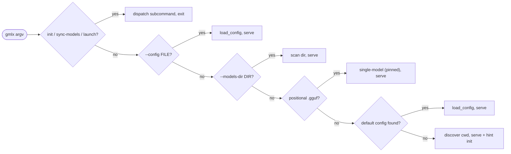

# gmlx server configuration

`gmlx serve` is the platform's server: a multi-model, continuously batched,
OpenAI/Anthropic-compatible API for GGUF models, driven by a composable YAML
config: named models, reusable profiles (sampling, load, prompt-cache, system-prompt,
and chat-template params), glob rules, friendly aliases, and opt-in directory
discovery.

The mental model in one paragraph: `models:` names each GGUF and says where it
lives; `profiles:` bundles reusable settings; `rules:` attach a profile to
model ids by glob; `aliases:` add friendly handles; `server:` configures the
process itself. A request names a model id, optionally with an `@profile`
suffix, and its effective settings are merged from the family's model-card
defaults, then the configured profile layers, then per-model settings, then
the request's own fields. Each layer only fills what the layers above leave
unset.

Sampling is model-aware from the first request: every model starts from its family's
model-card recommended defaults (Qwen3.6, Gemma, and gpt-oss all publish
different numbers), and the built-in intents (`@coding`, `@instruct`,
`@creative`, `@reasoning-low|-medium|-high|-max`) are addressable on any model with
zero configuration. See
[Sampling profiles and built-in intents](#profiles-sampling-profiles-and-built-in-intents).

Two privacy properties are load-bearing:

- `/v1/models` lists exactly your configured/discovered ids, never the
  Hugging Face cache.
- No Hugging Face access unless you opt in (`server.hf_cache: true`), and
  even then only the local cache is read, never the network.

Serving needs no optional extra, even for multimodal models: everything the
server needs installs with gmlx.

This document is the canonical reference for the config surface and the start
modes. Every YAML example here is parsed by a CPU test
(`tests/test_docs_config.py`), and the complete examples are run through the
real loader, so the reference can't drift from the code.

---

## Quick start

```sh
# 1. Serve a single GGUF (pinned, addressable by its derived id).
gmlx serve model-Q4_K_M.gguf

# 2. Scan a folder and write a starter config you can edit (-> ~/.config/gmlx/gmlx.yaml).
gmlx init --models-dir ~/models
gmlx serve                       # bare start finds ~/.config/gmlx/gmlx.yaml

# 2b. After hand-moving or deleting GGUFs, reconcile the config
#     (`gmlx pull` registers its own downloads; `rm` removes its entry).
gmlx sync-models                 # keeps edits/comments; adds new, drops gone

# 3. Serve a directory directly, no config file.
gmlx serve --models-dir ~/models
```

Then point a request at a model by its id (the ids `init` printed - auto-named
ids carry the quant tag, e.g. `qwen3.6-27b-q6`; `gmlx list` shows them):

```sh
curl localhost:8080/v1/chat/completions -d '{
  "model": "qwen3.6-27b",
  "messages": [{"role": "user", "content": "Explain entropy."}]
}'
```

Sampling defaults come from the model's family card automatically. Add
`@coding` / `@instruct` / `@creative` / `@reasoning-low|-medium|-high|-max` to any
id to switch operating point (`"model": "qwen3.6-27b@coding"`).
`gmlx profiles` prints the table.

---

## Start modes

`main()` resolves the first matching mode, top to bottom:

| Mode | Invocation | What it does |
|------|------------|--------------|
| init | `gmlx init (--models-dir DIR \| --from-hf-cache) [--out FILE] [-r] [--force]` | Discover GGUFs (streaming scan progress) from a directory and/or the local hf cache (`--from-hf-cache` writes portable `hf:` entries and sets `server.hf_cache`) and write a starter YAML to `--out` (default `~/.config/gmlx/gmlx.yaml`). A bare `gmlx init` on a terminal runs the guided wizard. The flag-driven path needs `--models-dir` (or `--from-hf-cache`), and `--no-interactive` skips the wizard. Refuses to overwrite without `--force`. An empty dir is fine; it writes a valid zero-model config. |
| sync-models | `gmlx sync-models [--config FILE] [--models-dir DIR] [--from-hf-cache] [--no-recursive] [--dry-run]` | Reconcile an existing config's `models:` with disk (and, with `--from-hf-cache` or `hf_cache: true`, the hf cache): keep configured models that still exist (comments/edits preserved), drop ones whose file is gone / no longer cached, add newly-discovered GGUFs. Default config unless `--config`. Scans recursively by default. |
| launch | `gmlx launch <harness> [options]` | Point an external coding harness / agent runtime (opencode / pi / omp / hermes / goose / claude-code), chat TUI (aichat / elia), or web app (open-webui) at a server (auto-starting one if down) and exec it. See [launch a coding harness](launch.md). |
| --config | `gmlx serve --config FILE` | Serve a YAML config (named models + profiles). Enables `POST /v1/reload`. |
| --models-dir | `gmlx serve --models-dir DIR [--hf-cache] [--recursive]` | Serve a header-only discovery scan of a directory (in-memory config). |
| positional | `gmlx serve model.gguf [--mmproj/--draft-gguf/--speculative ...]` | Serve a single model (pinned), id derived from the filename. |
| bare | `gmlx serve` | Load the first existing [default config](#default-config-locations); else discovery-scan the current directory and print a hint to run `init`. |


```mermaid
flowchart LR
  start(["gmlx argv"]) --> q0{"init / sync-models / launch?"}
  q0 -->|yes| sub["dispatch subcommand, exit"]
  q0 -->|no| q2{"--config FILE?"}
  q2 -->|yes| loadcfg["load_config, serve"]
  q2 -->|no| q3{"--models-dir DIR?"}
  q3 -->|yes| disc["scan dir, serve"]
  q3 -->|no| q4{"positional .gguf?"}
  q4 -->|yes| single["single-model (pinned), serve"]
  q4 -->|no| q5{"default config found?"}
  q5 -->|yes| loadcfg2["load_config, serve"]
  q5 -->|no| disc2["discover cwd, serve + hint init"]
```

### Default config locations

Bare start searches these in order (first existing wins). A project-local
`./gmlx.yaml` is searched first so a repo can override your user-level
config. `init` writes to `~/.config/gmlx/gmlx.yaml` by default (the
XDG-style location, alongside other local AI services). Override the write
target with `init --out FILE`.

1. `./gmlx.yaml` (project-local override)
2. `~/.config/gmlx/gmlx.yaml` (where `init` writes)
3. `~/.gmlx.yaml` (legacy dotfile)

### Single-model flags

When serving one positional GGUF: `--mmproj FILE` (float mmproj, makes it a
VLM), `--draft-gguf FILE` (assistant-shape drafter, implies `--speculative`),
`--speculative` (native-head MTP), `--adapter FILE` (live GGUF LoRA over the
base; text only; the bare base is also registered as `<id>-base` on the same
resident entry), `--chat-template STR|PATH` (replace the GGUF's template),
`--stream-experts` / `--stream-cpu` (over-RAM MoE execution placement, see `stream:`
below), the streamed-MoE levers `--moe-expert-mass P` / `--moe-experts K` /
`--moe-miss-shed P` / `--moe-layer-shed P` / `--moe-prestage MODE` (see the
matching per-model keys below), `--prefill-feeder` / `--decode-feeder`
(feeder opt-outs, see `prefill_feeder:` below),
`--hf-source REPO` (processor/config override, rarely needed),
`--host`, `--port`, `--budget-gb`, `--max-models`, `--pin ID_OR_PATH`
(repeatable), `--max-tokens`, `--no-auth` (the API key is config-only: see
`server.api_key` in the `server` key reference), `--foreground`/`-f` (stay
attached, since `serve` detaches by default) with `--log`/`--start-timeout`
and `--no-menubar` (skip the macOS menu-bar monitor; see
[cli.md](cli.md#background-mode--server-lifecycle)), `--stt [MODEL]`,
`--tts [MODEL]`, `--hf-cache`. `--mmproj` combines with `--speculative` when the
VLM has a native MTP head or a `--draft-gguf` drafter (text turns speculate, media
turns fall back); `--mmproj` and `--adapter` remain mutually exclusive.

---

## Config file reference

A config is a YAML mapping with these top-level keys, all optional:

```text
server:   bind, residency budget, path roots, HF policy, prompt cache, defaults
profiles: user profiles layered over built-in per-family intents (sampling + load + cache + system)
rules:    glob a model id -> a profile
models:   named entries (id == /v1/models id == request `model`)
aliases:  friendly names / profile presets (listed in /v1/models)
discover: opt-in header-only directory scan
talk:     voice chat defaults (see the talk section)
assistant: shared tool-loop assistant settings
theme:    default chat color theme (`gmlx chat`; --theme overrides)
themes:   user-defined chat color themes (see the chat themes section)
```

Unknown keys in the structural namespaces (top-level, `server`, `profiles`,
`models`, `rules`, `discover`) are a hard error: a typo like `pinned:` for
`pin:` fails the load instead of silently no-op'ing. To see the whole schema
with every key and its effective default, run `gmlx serve --print-config`
(optionally with `--config FILE` / `--models-dir DIR` / a positional GGUF). It
resolves the config for that start mode, prints it as YAML, and exits without
starting the server.

### `server`

```yaml
server:
  host: 127.0.0.1            # bind address; non-loopback requires api_key (or no_auth)
  port: 8080
  api_key: null              # require this key on every endpoint except /health
  no_auth: false             # explicit opt-out: non-loopback bind with no key
  model_dirs: [~/models]   # roots for relative model/mmproj/draft paths + default scan target
  budget_gb: 96              # resident weight-byte budget (null => 0.8x the GPU working set)
  max_models: null           # optional secondary cap on resident model count
  hf_cache: false            # true => named hf ids + hf: model paths resolve from the LOCAL cache (no download)
  menubar: true              # macOS: a background `serve` auto-raises the menu-bar monitor (false to disable)
  token_queue_timeout_s: null # seconds to wait for the NEXT token before aborting a request
                             #   (null => mlx-vlm's own default, 600; 0 => never)
  prefill_step_size: null    # prefill chunk size in tokens for every model on this server
                             #   (null => the default, 2048; lower caps peak memory on long prompts)
  dtype: null                # activation dtype for every model on this server: auto, bfloat16,
                             #   float16 (null => the default, auto; auto picks float16 on M1/M2)
  decode_prefill_ratio: null # admission pacing: auto (default) or a static GPU-time share
                             #   (null => the default, 1.0; 0 => strict alternation; see below)
  prefill_tick_ms: null      # wall-clock budget per prefill chunk while streams decode;
                             #   chunks are halved to fit (null => the default, 500; 0 => full chunks)
  cache_limit_gb: null       # MLX buffer-cache cap in GiB (null => auto: 4-12 GiB, sized from the
                             #   working-set slack; negative => never bound)
  family_defaults: true      # built-in per-family model-card sampling + @intents (false turns them off)
  stochastic_mtp: false      # p/q acceptance for sampled MTP requests: same output
                             #   distribution, higher acceptance, NOT token-identical
                             #   (see performance.md; applied at startup)
  gpu_keepwarm: false        # hold GPU clocks up while a streamed model is decoding
                             #   (heartbeat parks between requests, so idle costs nothing;
                             #   only acts on stream: experts models; applied at startup)
  cache:                     # the prompt cache (APC, automatic prefix cache) + SSD disk tier; see the cache key table
    enabled: true
    disk: {path: ~/.cache/gmlx/apc, max_gb: 200}
  stt: whisper-turbo         # speech-to-text -> POST /v1/audio/transcriptions (see below)
  tts: kokoro                # text-to-speech  -> POST /v1/audio/speech (see below)
  embeddings: qwen3-embed    # text embeddings -> POST /v1/embeddings (see below)
  assistants:                # served assistant ids: the built-in tool loop, server-side
    helper:                  #   (full contract + security model: assistant.md)
      model: qwen3.6-27b     # required: the underlying configured model id
      memory: false          # true = ONE shared store for every client of this id
      mcp: null              # null = inherit assistant.mcp; [...] = own tool scope; [] = tool-less
  assistant_allow_remote: false  # required true to serve assistants on a non-loopback bind
  defaults:
    profile: null            # default profile for EVERY model (lowest configured layer;
                             #   rules and per-model settings beat it. Rarely needed: each
                             #   model already starts from its family's model-card sampling)
    ttl_s: 900               # idle auto-unload seconds (null/0 = never); pinned exempt
    model: qwen3.6-27b        # fallback when a request omits/empties `model`
    preload: null            # warm models at startup: `all`, or a list of model ids
                             #   (validated against `models:`); null/[] = warm none
```

Paths in `model_dirs` expand `~`/`$VAR`. A relative `path`/`mmproj`/`draft_gguf`
on a model is searched against `model_dirs` in order (first existing wins). A
miss raises, listing the roots searched. One root lets every model entry use a
bare filename.

`token_queue_timeout_s` bounds how long the request loop waits for the next
token. On timeout the server cancels the in-flight generation (freeing the GPU
work) and returns an error to the client. A streaming request gets a final
`data: {"error": ...}` event. The failure is recorded as `last_error` in
`/v1/metrics` and logged as a `[req] ... FAILED ...` line. Unset, gmlx
defaults it to 1800 seconds (an exported `MLX_VLM_TOKEN_QUEUE_TIMEOUT` wins).
mlx-vlm's own 600-second default is shorter than a deep-context dense prefill.
The timeout triggers mainly on a very long prefill that hasn't emitted its
first token yet (a big prompt on a large or over-RAM model). Raise it for
those, or set `0` to wait indefinitely. The value drives mlx-vlm's
`MLX_VLM_TOKEN_QUEUE_TIMEOUT`. The config is authoritative for a server it
starts.

`prefill_step_size` sets the prefill chunk size, in tokens, for every model
this server runs (default 2048). Long prompts prefill chunk by chunk, and the
peak working memory of a request scales with chunk size x context depth -- lower
the chunk to fit deep-context requests on big models, at some prefill-throughput
cost (see [performance.md](performance.md#memory-and-the-kv-cache)). Server-wide
by design: the engine reads it per request, after the per-model load window has
closed, so it cannot be a per-model `load:` key. Also available as
`--prefill-step-size` on `serve` (the flag wins over the config) or an exported
`PREFILL_STEP_SIZE`. Applies to speculative (MTP) serving too.

`dtype` sets the width the model graph runs at for every model this server
loads: `auto` (the default), `bfloat16`, or `float16`, with `bf16` and `fp16`
accepted as spellings of the last two. It covers non-quantized parameters, the
dequantized embedding table, and every value flowing between quantized
matmuls. The KV cache follows it, since cache blocks are allocated from the
dtype of the keys and values written into them. Weights are untouched, so this
is not a requantization and the GGUF on disk is unchanged.

`auto` reads the GPU generation from the Metal architecture string. It gives
`float16` on Apple GPUs before Apple9, which are the M1 and the M2, and
`bfloat16` on all other devices. A device whose architecture cannot be read
also gets `bfloat16`, because an unknown device must keep the incumbent
numerics.

`decode_prefill_ratio` paces admission prefills against live decode. Stock
scheduling runs one decode step per prefill chunk, so while any request
prefills, every decoding stream advances ~1 token per chunk -- at deep context
that is a multi-second stall per admission. The default `auto` paces only
when an already-decoding stream admitted before the waiters would otherwise
fall below half its batched decode rate (the floor;
`GMLX_DECODE_PREFILL_FLOOR`), and runs stock scheduling for simultaneous
bursts, cheap chunks, and queued waiters held behind paced admissions
past a deadline (a prompt already being prefilled is bounded by pacing
itself, and time blocked by capacity rather than pacing does not age
toward the deadline). A numeric
value pins static pacing: a prefill chunk is admitted only after the decode
batch has received that multiple of the chunk's GPU time. Live streams then
keep ~half throughput during admissions at `1.0`, while a waiter's
time-to-first-token stretch compounds with queue depth (each waiter also
waits out the throttled prefill of everyone ahead of it) and delayed
admission narrows the decode batch. `0` restores stock scheduling. Prefill
runs at full speed whenever nothing is decoding, so a single-stream server
is unaffected. Also available as `--decode-prefill-ratio` on `serve`
(the flag wins over the config) or an exported `GMLX_DECODE_PREFILL_RATIO`
(read per scheduler tick, so it can be flipped on a live server). Applies to
speculative (MTP) serving too. Background and measured effects:
[performance.md](performance.md#serving-concurrent-requests).

`prefill_tick_ms` bounds how long any one prefill chunk can stall live decode
streams. Pacing (above) controls the average GPU share between decode and
prefill but never the length of a single chunk, so every live stream still
hitches by a full chunk (1-2 seconds at deep context, more when weights
stream from disk) whenever one lands. While decode rows are live, the chunk
is halved until its predicted wall time -- the last observed chunk cost
scaled to the tier -- fits this budget (default 500 ms, floored at
`GMLX_PREFILL_MIN_STEP` tokens). Smaller chunks lose some weight
amortization, so total prefill throughput under load drops a few percent per
halving tier (worst on MoE). Set `0` for batch-job serving where per-stream
latency does not matter. Inert whenever nothing is decoding, so
single-stream time-to-first-token is untouched. Also available as
`--prefill-tick-ms` on `serve` (the flag wins over the config) or an
exported `GMLX_PREFILL_TICK_MS` (read per chunk, so it can be changed on a
live server). Composes with `decode_prefill_ratio`: the ratio sets the duty
cycle, the tick sets the stall quantum.

`cache_limit_gb` caps MLX's buffer cache (the wired pool of freed GPU buffers
kept for reuse). Left `null`, the server always bounds it: 4-12 GiB sized
from the working-set slack the biggest configured model leaves. MLX's own
default is the memory limit, and an uncapped cache can hold tens of GB of
wired buffers the kernel counts against its free pages. See
[performance.md](performance.md#the-mlx-buffer-cache-at-deep-context) for the
policy, the `GMLX_CACHE_LIMIT_GB` env override (env wins over this key), and
the explicit-unlimited escape.

A text request whose prompt alone cannot fit in memory gets an immediate
HTTP 400 with the estimated need and the available budget in the body,
instead of dying mid-stream. The estimate prices prompt KV at the model's
per-token cost (GQA heads, MLA latents, sliding windows, and quantized KV
all lower it) plus the prefill score transient, against the working set
with the batch drained. `max_tokens` counts only when the request pins it
explicitly; default-max requests are never rejected on generation length.
Media requests are not estimated in v1. `GMLX_PREFLIGHT_MEM=0` disables.

Decode concurrency (how many requests generate tokens together in one batch
step) defaults to 8; past that width aggregate throughput gains shrink while
every stream slows. `GMLX_DECODE_BATCH` sets it (`0` restores the upstream
default of 32).

Requests beyond the waiting-queue cap get an immediate HTTP 503 with a
`Retry-After` header instead of queueing toward the token-queue timeout. The
JSON body names the cap and the current depth; the header value is the
estimated drain time, clamped to 2-60 seconds. Harness SDKs back off on 503
and retry, which beats holding a silent socket for half an hour.
`GMLX_QUEUE_DEPTH_CAP` sets the cap (default 2 x the decode concurrency;
`0` disables the check).

While a streaming request is silent (most notably during that long prefill),
the server emits an SSE comment line (`: keepalive`) every 15 seconds so
clients with a between-bytes read timeout don't drop the connection before
the first token. Comments are part of the SSE spec and invisible to event
parsers. `GMLX_SSE_KEEPALIVE_S` changes the interval (seconds, `0`
disables).

With an `api_key` set, every endpoint except `/health` requires it. Clients
send `Authorization: Bearer <key>` (OpenAI-style) or `x-api-key: <key>`
(Anthropic-style). `/health` stays open deliberately, and because it is the
one unauthenticated route it returns liveness only (`{"status": "healthy"}`,
no paths). That keeps liveness probes and `launch`'s reachability check
working against an authed server. `gmlx ps` reads the authed `/v1/metrics`
and takes `--api-key`. `OPTIONS` requests are also exempt: browsers send CORS
preflights credential-less by spec, so a browser client holding a key still
works, and the actual request authenticates as usual.

`server.api_key` is the sole server-side key source. There is no
`serve --api-key` flag and no `GMLX_API_KEY` server fallback. This is a
deliberate simplification: one key in one file, which the lifecycle tools and
the menu bar can also read. The runfile records only whether a key is set,
never the key.

Bind policy: a loopback `host` needs no key; a non-loopback `host` refuses to
start without `api_key` unless `no_auth: true` (or `--no-auth`) opts out
explicitly, for setups that authenticate in front (mTLS, a reverse proxy).
The client tools (`ps`, `status`, `launch`, `menubar`) still take `--api-key`
to present a key to the server.

Two more pieces of hardening, aimed at browser-borne attacks on a local
server:

- DNS-rebinding Host guard (loopback binds only): a request whose `Host`
  header isn't a loopback name gets 403. A malicious page can re-point its
  own hostname at `127.0.0.1` and reach a loopback-bound server same-origin,
  bypassing CORS entirely, but the browser still sends the attacker's `Host`,
  so checking it defeats the attack. A non-loopback bind doesn't get the
  guard; it is covered by the api-key policy above.
- Credential-less CORS: stock mlx-vlm reflects any request `Origin` with
  `Access-Control-Allow-Credentials: true`; gmlx serves a literal `*`
  without credentials instead. Auth here is header-based (no cookies), so
  legitimate clients are unaffected.

`assistants:` serves assistant ids: pseudo-models that answer through the
built-in MCP tool loop, run server-side, so a thin client gets tools with no
loop of its own. Because their tools execute on the server host, they carry
their own bind gate on top of the key policy above: a non-loopback bind with
assistants configured refuses to start unless `assistant_allow_remote: true`,
and a remote-exposed assistant must declare an explicit per-id `mcp:` scope
rather than inheriting the shared tool list. The full contract -- routing,
streaming and usage semantics, memory, and the security model -- is in
[assistant.md](assistant.md#served-assistants).

### `profiles`: sampling profiles and built-in intents

Two things live here: built-in family defaults and intents (shipped in code,
zero config) and user profiles (reusable, composable bundles of sampling +
load + cache + system + chat_template + chat_template_kwargs + thinking +
reasoning_effort params).

#### Built-in family defaults (model-card sampling)

Model vendors publish recommended sampling per family, and they disagree: the
Gemma card says low temperature degrades output, Qwen3.6 publishes three
distinct operating points, and gpt-oss wants `top_k` disabled entirely.
gmlx ships those recommendations as data: each model's family is detected
from its GGUF header (`general.architecture`) at registration/scan, its base
group becomes the lowest sampling layer, and the intents become addressable
profiles. `gmlx profiles` prints this table live (add a model id to see one
model fully resolved). Values are cited to the primary model cards in
`gmlx/gen/profiles.py`:

| family | GGUF arches | base (general use) | family intents |
|--------|-------------|--------------------|----------------|
| `qwen3.6` | `qwen35`, `qwen35moe`, `qwen3next`, `qwen4exp` | temperature=1.0 top_p=0.95 top_k=20 min_p=0.0 | `@coding`: temperature=0.6 top_p=0.95 top_k=20 min_p=0.0; `@instruct`: temperature=0.7 top_p=0.8 top_k=20 min_p=0.0 presence_penalty=1.5 enable_thinking=False |
| `qwen3` | `qwen3`, `qwen3moe`, `qwen3vlmoe` | temperature=0.6 top_p=0.95 top_k=20 min_p=0.0 | `@instruct`: temperature=0.7 top_p=0.8 top_k=20 min_p=0.0 enable_thinking=False |
| `qwen2.5` | `qwen2`, `qwen2moe` | temperature=0.7 top_p=0.8 top_k=20 repetition_penalty=1.05 | - |
| `gemma` | `gemma`, `gemma2`, `gemma3`, `gemma3n`, `gemma4`, `diffusion-gemma` | temperature=1.0 top_p=0.95 top_k=64 | - |
| `gpt-oss` | `gpt-oss` | temperature=1.0 top_p=1.0 | `@reasoning-high`: temperature=1.0 top_p=1.0 reasoning_effort=high; `@reasoning-low`: temperature=1.0 top_p=1.0 reasoning_effort=low; `@reasoning-medium`: temperature=1.0 top_p=1.0 reasoning_effort=medium |
| `glm` | `glm4`, `glm4moe`, `glm-dsa`, `glm5next` | temperature=1.0 top_p=0.95 | - |
| `deepseek` | `deepseek2`, `deepseek4` | temperature=0.6 top_p=0.95 | - |
| `minimax` | `minimax-m2`, `minimax-m3` | temperature=1.0 top_p=0.95 top_k=40 | - |
| `nemotron` | `nemotron_h_moe` | temperature=1.0 top_p=0.95 | - |
| `hunyuan` | `hunyuan-moe` | temperature=0.7 top_p=0.8 top_k=20 repetition_penalty=1.05 | - |
| `hy3` | `hy_v3` | temperature=0.9 thinking_start_token=<think:opensource> thinking_end_token=</think:opensource> | `@reasoning-high`: temperature=0.9 thinking_start_token=<think:opensource> thinking_end_token=</think:opensource> reasoning_effort=high; `@reasoning-low`: temperature=0.9 thinking_start_token=<think:opensource> thinking_end_token=</think:opensource> reasoning_effort=low |
| `hy4` | `hyv4` | temperature=0.9 top_p=1.0 thinking_start_token=<think:6124c78e> thinking_end_token=</think:6124c78e> | `@reasoning-high`: temperature=0.9 top_p=1.0 thinking_start_token=<think:6124c78e> thinking_end_token=</think:6124c78e> reasoning_effort=high; `@reasoning-low`: temperature=0.9 top_p=1.0 thinking_start_token=<think:6124c78e> thinking_end_token=</think:6124c78e> reasoning_effort=low |
| `kimi` | `kimi-k3` | temperature=1.0 top_p=0.95 thinking_start_token=<|open|>think<|sep|> thinking_end_token=<|close|>think<|sep|> | `@reasoning-high`: temperature=1.0 top_p=0.95 thinking_start_token=<|open|>think<|sep|> thinking_end_token=<|close|>think<|sep|> thinking_effort=high; `@reasoning-low`: temperature=1.0 top_p=0.95 thinking_start_token=<|open|>think<|sep|> thinking_end_token=<|close|>think<|sep|> thinking_effort=low; `@reasoning-max`: temperature=1.0 top_p=0.95 thinking_start_token=<|open|>think<|sep|> thinking_end_token=<|close|>think<|sep|> thinking_effort=max |
| `kimi-k2` | `deepseek2 named (?i)\bkimi` | temperature=1.0 top_p=0.95 | - |
| `muse` | `muse-glimmer` | temperature=1.0 top_p=0.95 top_k=64 thinking_start_token=<|start|>assistant to=self<|message|> thinking_end_token=<|eom|> | `@reasoning-high`: temperature=1.0 top_p=0.95 top_k=64 thinking_start_token=<|start|>assistant to=self<|message|> thinking_end_token=<|eom|> reasoning_strength=high; `@reasoning-low`: temperature=1.0 top_p=0.95 top_k=64 thinking_start_token=<|start|>assistant to=self<|message|> thinking_end_token=<|eom|> reasoning_strength=low; `@reasoning-medium`: temperature=1.0 top_p=0.95 top_k=64 thinking_start_token=<|start|>assistant to=self<|message|> thinking_end_token=<|eom|> reasoning_strength=medium; `@reasoning-xhigh`: temperature=1.0 top_p=0.95 top_k=64 thinking_start_token=<|start|>assistant to=self<|message|> thinking_end_token=<|eom|> reasoning_strength=xhigh |
| `llama` | `llama`, `smollm3` | temperature=0.6 top_p=0.9 | - |
| `mistral` | `mistral3` | temperature=0.15 | - |
| `default` | (anything else) | temperature=0.7 top_p=0.95 | `@coding`: temperature=0.3 top_p=0.95; `@creative`: temperature=1.0 top_p=0.95 min_p=0.05; `@instruct`: temperature=0.7 top_p=0.95 |

(This table is asserted in sync with the code by `tests/test_docs_config.py`.)

Every intent is addressable on every model, whichever family defined it: as
the request `model` (`qwen3.6-27b@coding`), as a request `profile` field, or
as `gmlx run/chat --profile coding`, even on a bare path
(`gmlx run path/to/model.gguf@coding`).
An intent the family has no card value for resolves to that family's own base
(not to another family's number): `@coding` on a Gemma model deliberately
stays at temperature 1.0, per the card's low-temperature warning. Intents
ride the same request machinery as user profiles, so an explicit request
field (or CLI flag) always wins.

Notes on individual families:

- gpt-oss: the `@reasoning-*` intents set `reasoning_effort` as a
  `chat_template_kwargs` variable; the GGUF-embedded harmony template renders
  it (the base template default is `medium`).
- kimi: the `@reasoning-*` intents set `thinking_effort` (the Kimi-K3
  template's variable name; it takes `low`/`high`/`max` and defaults to
  `max`, with no `medium` point). The XTML thinking markers
  (`<|open|>think<|sep|>` / `<|close|>think<|sep|>`) are set as the family's
  thinking tokens so open-think detection, thinking budgets, and the stream
  splitter track the model's real section tags.
- muse: the `@reasoning-*` intents set `reasoning_strength`, the Muse Glimmer
  template's variable name. It takes `low`/`medium`/`high`/`xhigh` and defaults
  to `high`. Reasoning is a message channel rather than a tag pair, so the
  thinking markers are the channel's own delimiters
  (`<|start|>assistant to=self<|message|>` / `<|eom|>`).
- qwen3.6 / qwen3: `@instruct` also sets `enable_thinking: false` (the card's
  non-thinking operating point).
- `default`: the fallback for unknown architectures, the historic scaffold
  defaults plus generic `@coding` / `@creative` / `@instruct` deltas.

Sampler semantics (matching unpatched mlx_lm / mlx-vlm): a `top_p` or `min_p`
of `0` means *disabled* (no filter), not "keep only the argmax" - so `top_p: 0`
is a no-op, exactly as on the stock server. When only `top_p` is set (no
`top_k`), the nucleus is bounded to the top 1024 candidates so the sort stays
batched. On a very flat distribution the tail past rank 1024 is dropped.

Detection reads only the GGUF header (cached across runs in
`~/.cache/gmlx/header-meta.json`, keyed by mtime+size). An explicit
`family:` on a model entry overrides detection, the escape hatch for a
not-yet-downloaded file or a family the table maps wrong. The kill switch is
`server: {family_defaults: false}`: no family base layer, no built-in profile
names.

#### Overriding the built-ins

Three levels, from global to surgical:

1. Shadow by name: a user profile named after an intent (e.g. `coding:`)
   replaces that built-in everywhere.
2. Compose: `extends: coding` inherits the intent (resolved per model family)
   and overrides just what you set.
3. Per-model reshape: a model's `profiles:` block changes what a named
   profile/intent means for that one model (see [`models`](#models)).

```yaml
profiles:
  coding:                                      # level 1: replaces @coding everywhere
    sampling: {temperature: 0.4, min_p: 0.05}
  my-coding:                                   # level 2: compose over the built-in
    extends: coding
    load: {kv_bits: 8}
```

#### User profiles

Reusable, composable bundles. A profile may `extends` another, or a built-in
intent (parent applied first, child overrides). Cycles and unknown parents
fail fast at load.

```yaml
profiles:
  brief:
    sampling: {max_tokens: 512}
  qwen-coder:
    extends: brief                             # inherit, then override
    system: "You are a terse senior engineer."  # injected only if the request has no system message
    sampling: {temperature: 0.2, repetition_penalty: 1.05}
    load: {kv_bits: 8, kv_group_size: 64}      # applied at model build via the residency env window
    chat_template: ./templates/qwen-tools.jinja  # inline Jinja or a .jinja/.txt path
```

`chat_template` replaces the GGUF's own chat template at load and is baked
into the tokenizer, so unlike `sampling`/`system` it is load-affecting: two
ids on the same GGUF under different templates are distinct resident entries.
The value is an inline Jinja string or a path to a `.jinja`/`.txt` file. It
applies to text and native-head/assistant MTP models. A VLM keeps its
mmproj-synthesized processor template.

`chat_template_kwargs` passes extra variables to the template's
`apply_chat_template` call. Use it for template flags the model exposes, most
notably `preserve_thinking` (Qwen3.6, recent Gemma-4), which keeps prior-turn
`<think>` blocks in the rendered prompt instead of stripping them. It's off
by default in those templates but a must-enable for agent / tool-use loops,
which depend on the model seeing its own prior reasoning. Unlike
`chat_template`, it is applied per request (not baked into the tokenizer), so
it is not load-affecting. A client may also send `chat_template_kwargs` on
the request body (OpenAI-extension style). Request keys win over the
profile's.

```yaml
profiles:
  agent:
    chat_template_kwargs: {preserve_thinking: true}   # keep prior-turn <think>
```

For `preserve_thinking` to matter, the reasoning has to reach the template:
the server keeps message keys that mlx-vlm's per-model message rebuild does
not itself produce, so an assistant message's `reasoning_content` echoed
back by the client renders on plain turns as well as tool-call turns. Set
`GMLX_FAITHFUL_HISTORY=0` to restore the stock rebuild, which keeps
reasoning only on tool-call messages for vision-capable model families.

The KV / disk cache stays correct regardless: reuse is keyed on the exact
token prefix, so changing this flag only changes the rendered tokens (and
thus the cache hit rate), never the validity of a hit.

`thinking` and `reasoning_effort` are dedicated profile keys (also usable in
a model's `overrides` / profile tweaks) for the two reasoning controls models
spell differently. There is no cross-model standard for the template
variable: MiniMax-M3 reads a three-state `thinking_mode`, Qwen3.x and GLM
read `enable_thinking`, Kimi K2.x reads a bare `thinking` variable, Hy3
grades a `reasoning_effort` scale that includes a `no_think` level, and
gpt-oss grades `reasoning_effort` but cannot disable reasoning. Unlike a raw `chat_template_kwargs` entry, these keys are mapped
onto the serving model's own spelling at request time (by inspecting its
chat template), so one profile applies across models. `thinking` takes
`on`/`off`/`adaptive` (`adaptive` is MiniMax-only); `reasoning_effort` takes
a level name the model's template validates (`low`/`medium`/`high`,
`no_think`, `max`, ...). A request's explicit `chat_template_kwargs` always
pass through verbatim and win over the mapped controls. The same controls
exist on `run`/`chat` as `--thinking` and `--reasoning-effort`.

```yaml
profiles:
  quick:
    thinking: off            # -> enable_thinking / thinking_mode / no_think, per model
  deep:
    reasoning_effort: high
```

### `rules`

Glob a model id to a profile. First match wins (`fnmatch`, not regex). Sits
below a model's own `profile`, above the server default.

```yaml
rules:
  - {match: "*coder*",   profile: qwen-coder}
  - {match: "qwen3.6-*", profile: qwen-creative}
```

### `models`

Each entry's key is the id used everywhere (`/v1/models`, the request `model`
field). The four common shapes:

```yaml
models:
  qwen3.6-27b:                       # native-head MTP (drafter inside the target GGUF)
    path: Qwen3.6-27B-MTP-GGUF/Qwen3.6-27B-Q4_K_S.gguf   # relative to model_dirs
    profile: qwen-creative
    speculative: true
    overrides: {sampling: {max_tokens: 2048}}            # wins over the profile
    pin: true                                            # never evicted
  gemma-31b-mtp:                     # assistant-shape MTP (separate drafter GGUF)
    path: google_gemma-4-31B-it-Q6_K_L.gguf
    draft_gguf: gemma-4-31B-it-assistant.Q8_0.gguf       # implies speculative
    native_mtp: false                # true: the GGUF's own MTP head drafts even
                                     #   with draft_gguf set (a companion otherwise wins);
                                     #   a sibling id over the same GGUF may choose differently
    speculative_width_cap: null      # speculate only up to this many live streams
                                     #   (null => the drafter family default;
                                     #    0 => uncapped; see below)
  gemma-e4b-vlm:                     # VLM (LLM GGUF + float mmproj GGUF)
    path: gemma-4-E4B-it-Q6_K.gguf
    mmproj: mmproj-gemma-4-E4B-it-bf16.gguf
  qwen3.6-27b-pure:                  # plain text
    path: Qwen3.6-27B-Q4_K-pure/Qwen3.6-27B-Q4_K.gguf
    family: qwen3.6                  # override family detection (rarely needed)
    profiles:                        # reshape what @coding means for THIS model
      coding: {sampling: {min_p: 0.05}}
```

Per-model keys: `path` (required), `profile`, `family`, `profiles`, `mmproj`,
`draft_gguf`, `native_mtp`, `adapter` (ids on one `path` that differ only in
`adapter` share one resident entry; see [lora.md](lora.md#serving-one-base-with-many-adapters)), `stream`, `moe_experts`, `moe_expert_mass`,
`moe_miss_shed`, `moe_layer_shed`, `moe_prestage`, `prefill_feeder`,
`decode_feeder`, `speculative`, `speculative_width_cap`, `overrides`
(`{sampling, load, cache, system, chat_template, chat_template_kwargs,
thinking, reasoning_effort}`), `pin`, `ttl_s`.

#### `speculative_width_cap`

Speculation and batching compete for the same bandwidth: verifying a draft
widens each request's weight reads, which is nearly free when one stream is
decoding and costly once several are. Where that trade turns depends on the
drafter and on whether the target routes experts, so each model carries a
measured default and this key overrides it.

`null` (the default) takes that value: uncapped for a native-head drafter on a
dense qwen target, `2` for the separate-model gemma assistant drafter on a
dense target, `1` for any routed-expert target, and `1` for the hy3 and
deepseek4 drafters (single sequence only). MoE targets are recognized by
inspecting the loaded model for stacked expert layers, so the cap reaches a
new MoE architecture without a per-model entry. `0` turns the cap off; `N`
speculates only while at most N requests decode together. A drafter that can
only handle one sequence clamps any larger value, since exceeding it raises
rather than running slowly.

A batch that grows past the cap converts to plain decode with the drafter
left loaded, and once it drains back to the cap it re-arms and speculates
again (a capture round rebuilds the drafter state; mechanics in
[speculative-batching.md](internals/speculative-batching.md)). `GMLX_MTP_WIDTH_CAP`
overrides every model at once (set it to `0` to measure a model uncapped) and
`--speculative-width-cap` does the same from the CLI. `GMLX_MTP_PREEMPT=0`
and `GMLX_MTP_RESUME=0` disable the batching transitions themselves (a lone
speculating stream then makes arriving requests wait, and a gated batch
stays plain until it finishes). The measured numbers behind the defaults are
in [performance.md](performance.md#mtp-speculative-decoding).

An entry whose file is gone from disk does not stop the server: it is skipped
with a log warning at startup (and on config reload), disappears from
`/v1/models`, and a request for it gets a 404 naming the problem. Restore the
file (it comes back on the next reload or request), or run `gmlx sync-models`
to drop dead entries and register new files in one pass. The same rule covers
`server.embeddings` / `server.rerank`: a missing service GGUF disables that
service with a warning instead of failing startup. A *malformed* entry (a
typo'd key, a bad value) still fails fast - disk state degrades, config shape
errors don't.

`family` overrides GGUF-header family detection (see the
[family table](#profiles-sampling-profiles-and-built-in-intents)); an unknown
value warns (forward-compatible) and falls back to `default`. `profiles` is a
per-model tweak map `{profile-or-intent-name: {sampling, load, ...}}`. When
the named profile is the one selected for a request, the tweak merges on top
(above the profile, below `overrides`). Naming an unknown profile there is an
error.

`stream: experts` streams a MoE model's routed-expert stacks from disk while
the every-token layers (attention, norms, routers, shared experts) and the KV
cache stay on GPU. With the decode feeder (default, below) it matches
`stream: cpu` on short generations and pulls ahead once the arena warms. A
quantized KV cache extends the advantage to long context. `stream: cpu`
instead runs the whole model on the CPU device: weights stream from the page
cache, so a MoE bigger than the wired-memory budget stays serveable.
Load-affecting (part of the residency identity). `stream: experts` also
applies to a VLM entry. gmlx puts the placement on the text tower, and the
vision tower stays on the GPU. The server refuses `stream: cpu` on a VLM
entry, and it refuses both values on a speculative/MTP entry. A `stream: cpu`
entry switches the whole process to the CPU device, so it suits a
single-model server rather than mixing with GPU-resident models. Send only
one request at a time to a streamed entry. Concurrent requests turn off the
streaming tier's decode accelerations, which need a one-token step (see
[streaming.md](streaming.md)). (The old key `cpu_moe: full | hybrid` is a
deprecated alias for `stream: cpu | experts` and warns at config load.)

`moe_expert_mass: P` (a share in `(0, 1]`) installs the adaptive lossy
fan-out filter over a `stream` entry's routers: each token keeps only the
smallest set of its routed experts covering share P of the router's gate
mass, so confident tokens read fewer expert bytes during decode. Same
semantics as `run --moe-expert-mass`; size P first with a lossless
`gmlx run --moe-expert-probe` pass on the same GGUF (see
[streaming.md](streaming.md)). Requires
`stream: experts | cpu` (announced as ignored otherwise), out-of-range
values fail config validation, and the key is load-affecting: two ids that
differ only in `moe_expert_mass` are distinct resident entries.

The other lossy MoE levers follow the same rules (require `stream`,
validated at config load, load-affecting): `moe_experts: K` caps the router
at a fixed K experts per token (composes with `moe_expert_mass`).
`moe_miss_shed: P` (a share in `(0, 1]`) drops routed experts that would
demand-miss the decode arena, lowest scores first, keeping at least share P
of each token's gate mass - it targets the disk stalls directly and never
drops an arena-resident expert. `moe_layer_shed: P` (a probability in
`(0, 1)`) skips a streamed MoE layer's routed experts entirely with
probability P per token; the layer's shared expert still runs. All three
change outputs relative to the trained router - evaluate quality on your
own tasks before serving with them.

`moe_prestage: keepers` retargets the lookahead prestage on a
`stream: experts` model: predictions are filtered through the miss-shed
policy, so an expert that would be shed if it demand-missed is never
read, and predicted keepers stage demand-grade, overlapping their
would-be demand stalls with compute. It adds no quality knob of its
own, applying the policy `moe_miss_shed` defines; it needs both
`stream: experts` and `moe_miss_shed` (each announced as ignored when
missing). Load-affecting like the levers above; the default (`ranked`)
keeps guess-grade speculative prestage (see
[streaming.md](streaming.md)).

`prefill_feeder: false` / `decode_feeder: false` opt a streaming model out of
the feeder paths that are otherwise on by default (`prefill_feeder`
everywhere, `decode_feeder` on `stream: experts` entries only - it needs the
every-token layers on GPU): staged expert prefill straight from the GGUF, and decode from a
wired, popularity-managed GPU expert arena. The arena yields under system
memory pressure and to the memory governor. It shrinks and keeps its most
popular experts. It regrows once pressure clears. A `stream: experts`
entry therefore coexists with other models loading on the same server.
`GMLX_DECODE_PRESSURE=0` pins it against pressure. The governor still
shrinks it before it sheds a request. Both keys are
load-affecting. See
[streaming.md](streaming.md) for what they
do and when to turn them off.

### `aliases`

A `name -> id` or `name -> id@profile` map. An alias is a friendly handle or
a profile preset, and is listed in `/v1/models` as its own entry (marked
`alias_of`); this is the only way a menu-driven client can pick a profile
preset without typing `@profile`.

```yaml
aliases:
  fast:  gemma-e4b-vlm               # a shorter handle for the same model
  coder: qwen3.6-27b@qwen-coder      # a preset: the 27B with the coder profile baked in
```

An alias name must not contain `@` and must not collide with a model id, and
its target id (and profile, if any) must exist. Validated at load.

### `discover`

Opt-in header-only directory scan (architecture + `nextn_predict_layers`
only, zero tensor I/O). Native-head MTP models auto-enable speculative.
Sibling `mmproj*.gguf` pairs into the model it best matches. A sibling
assistant drafter (gemma4 assistant, DSpark, DFlash) pairs in as that model's
`draft_gguf`, which turns speculative on; the arch, the hidden size, and the
filename must all agree. A drafter whose header names its base model (a
DFlash 2 drafter does) pairs with that model wherever the scan found it, and a
DFlash 2 drafter replaces a DFlash v1 sibling already paired on the same
target; a drafter that names a different base model never pairs. A streamed
model gets no drafter, and `speculative: false` stops the pairing.

```yaml
discover:
  - dir: null                  # null => scan server.model_dirs
    recursive: true
    pair_mmproj: true          # sibling mmproj*.gguf => VLM
    speculative: auto          # auto/true => MTP on for native-head models; false => off
```

Discovered ids are derived deterministically from the filename: strip the
split-shard suffix, the trailing quant tag (`Q4_K_S`, `Q6_K_L`, `BF16`, ...),
and kind markers (`mmproj`/`assistant`/`draft`/`mtp`), then slugify. On a
collision the quant tag is appended (`...-q4_k_s` vs `...-q6_k`) rather than
dropping an entry. The id table prints on start.

### Complete example

Every key above, in one config that validates cleanly:

```yaml
# doctest: build
server:
  host: 127.0.0.1
  port: 8080
  api_key: null
  no_auth: false
  model_dirs: [~/models]
  budget_gb: 96
  max_models: null
  hf_cache: false
  cache:
    enabled: true
    block_size: null
    num_blocks: null
    hash: fast
    disk:
      path: ~/.cache/gmlx/apc
      max_gb: 200
      workers: 2
      read_mode: direct
  family_defaults: true
  assistants:
    helper: {model: qwen3.6-27b, memory: false, mcp: null}
  assistant_allow_remote: false
  defaults:
    profile: null
    ttl_s: 900
    model: qwen3.6-27b
    preload: null
profiles:
  brief:
    sampling: {max_tokens: 1024}
  qwen-coder:
    extends: coding                # compose over the built-in intent
    system: "You are a terse senior engineer."
    sampling: {temperature: 0.2, top_p: 0.9, repetition_penalty: 1.05}
    load: {kv_bits: 8, kv_group_size: 64}
    chat_template: "{{ m.role }}: {{ m.content }}\n"
  qwen-creative:
    extends: creative
    sampling: {top_p: 0.98}
  reasoning:
    # cap thinking for this group; unlimited elsewhere
    sampling: {enable_thinking: true, thinking_budget: 1024}
rules:
  - {match: "*coder*", profile: qwen-coder}
models:
  qwen3.6-27b:
    path: Qwen3.6-27B-MTP-GGUF/Qwen3.6-27B-Q4_K_S.gguf
    profile: qwen-creative
    speculative: true
    overrides: {sampling: {max_tokens: 2048}}
    pin: true
  gemma-31b-mtp:
    path: google_gemma-4-31B-it-Q6_K_L.gguf
    draft_gguf: gemma-4-31B-it-assistant.Q8_0.gguf
    speculative: true
  gemma-e4b-vlm:
    path: gemma-4-E4B-it-Q6_K.gguf
    mmproj: mmproj-gemma-4-E4B-it-bf16.gguf
  qwen3.6-35b-a3:
    path: Qwen3.6-35B-A3B-GGUF/Qwen3.6-35B-A3B-Q4_K_M.gguf
    family: qwen3.6                # override header detection (rarely needed)
    profile: reasoning
    profiles:
      coding: {sampling: {min_p: 0.05}}              # reshape @coding for this model
    overrides: {sampling: {thinking_budget: 2048}}   # per-model cap wins over profile
aliases:
  fast: gemma-e4b-vlm
  coder: qwen3.6-27b@qwen-coder
assistant:
  max_tool_rounds: 8
  tool_timeout_s: 60
  mcp:
    - {name: clock, command: [uvx, mcp-server-time]}
  memory: {enabled: true}
discover:
  - {dir: null, recursive: true, pair_mmproj: true, speculative: auto}
```

The smallest useful config is just a model with a path:

```yaml
# doctest: build
models:
  my-model:
    path: ./my-model-Q4_K_M.gguf
```

---

## Precedence

A request's effective params are merged from these layers, lowest first:


```mermaid
flowchart LR
  f["family base (built-in)"] --> d["server.defaults.profile"]
  d --> r["rule.profile"]
  r --> mp["model.profile / @profile inline"]
  mp --> tw["model.profiles[selected] tweak"]
  tw --> ov["model.overrides"]
  ov --> rq["per-request fields"]
  rq --> out(["ResolvedModel"])
```

- The family base (the model-card defaults for the model's detected family)
  is merged first and can never shadow anything; every configured layer wins
  over it. `server: {family_defaults: false}` removes it (and the built-in
  intent names).
- An inline `@profile` in the request `model` string (or the `profile`
  request field) replaces the model's configured profile in the chain, not
  stacking on top. The name may be a user profile or a built-in intent
  (`@coding`, `@instruct`, `@creative`, `@reasoning-low|-medium|-high|-max`),
  resolved per the model's family.
- The `model.profiles[selected]` tweak applies when its name is the selected
  profile for the request (the request/inline profile, else the model's,
  else the rule's, else the server default). It reshapes that named profile
  for this one model, above the profile itself and below `overrides`.
- A per-request sampling field overrides the profile only when the client
  actually set it (mlx-vlm's pydantic `model_fields_set`); an unset field
  never clobbers a profile value. This is why a profile's `temperature` wins
  for a request that omits `temperature`, and loses to one that sends it.
- `server.cache` is the base for the cache merge (below all profiles).
- A profile's `system` is injected only when the request carries no system
  message; a user system message always wins.
- A profile's `chat_template` is resolved the same way through the chain,
  but is applied at model load (baked into the tokenizer), so it is
  load-affecting: a distinct template forks a resident entry, and a request
  can't override it per-call.

---

## Param key reference

### Sampling keys (`sampling:`)

The request fields mlx-vlm already honours, carried verbatim into generation:

`temperature`, `top_p`, `top_k`, `min_p`, `max_tokens`, `seed`,
`repetition_penalty`, `presence_penalty`, `frequency_penalty`,
`repetition_context_size`, `enable_thinking`, `thinking_budget`,
`thinking_start_token`, `thinking_end_token`.

`seed` is honored per request, in-batch: each seeded request draws its
tokens from its own key stream while unseeded rows in the same batch keep
the shared stream, byte for byte. Seed guarantees a deterministic sampling
stream for that request. It does not guarantee bitwise-identical output
across runs with different batch composition, because batched matmul
reduction order shifts logits at float tolerance; the same composition
(for example a solo replay) reproduces exactly. With speculative decoding,
drafts are greedy and a seeded single-stream request's target draws come
from the same per-request key stream, so a replay matches only across runs
with the same speculation setting; seeded rows inside a batched
speculative decode fall back to the shared stream.

`thinking_start_token` / `thinking_end_token` override the `<think>` /
`</think>` defaults everywhere the server needs the model's real reasoning
markers (open-think detection, `thinking_budget`, the streamed
reasoning/answer splitter). Set on a family card when a model spells them
differently (the `hy3` card pins `<think:opensource>` / `</think:opensource>`).

All three thinking keys apply to `run` and `chat` as well, through the config
overlay ([cli.md](cli.md#resolving-a-model-from-a-config)); they map onto
`--thinking-budget`, `--thinking-start-token`, and `--thinking-end-token`, and
an explicit flag wins. The REPL's reasoning rendering detects markers on its
own and is unaffected by the two token keys.

`thinking_budget` is off by default (unset means unlimited thinking). Set it
on a profile or per model to cap reasoning tokens: once ~N thinking tokens
are produced the engine forces `</think>` so the model answers. A per-request
`thinking_budget` wins over the profile/model value. The budget arms whenever
it is set, regardless of `enable_thinking`: it acts once the model actually
opens a `<think>` block, and a response that never thinks is never
force-closed. Works whether the template pre-fills `<think>` (e.g. GLM-5.2)
or the model generates it (e.g. Qwen3).

On MTP-drafted models the budget is enforced by the speculative round loop
itself (the close lands whole at a round boundary, so the cap can overshoot
by up to one draft block). What applies when:

| Serve situation | thinking_budget outcome |
|---|---|
| MTP model, single request decoding alone | applied |
| MTP model, requests batched together (coalesced arrivals, or a second request joining mid-decode) | dropped for those requests, with a server-log note; under concurrent traffic this is the common case |
| MTP model, request preempted mid-decode | budget lost from that point |
| MTP model, request with images/audio | applied when decoding alone (same as text); if the model's thinking markers cannot be resolved the budget is ignored with a log note |
| Non-MTP speculative models (draft-model pairs) | rejected by the engine; such a request errors |

Three more keys are honoured by gmlx's own server seams (mlx-vlm has no
native support; a per-request field still wins over the profile):

- `stop`: string or list of stop sequences, applied to the OpenAI
  chat-completions endpoints (stream and non-stream). Streams trim
  mid-token-safe and end with `finish_reason: "stop"`. Clients can also send
  the standard OpenAI `stop` parameter directly. The Anthropic endpoint
  keeps its native `stop_sequences`.
- `xtc_probability`, `xtc_threshold`: XTC sampling, injected as a
  per-request logits processor (newline + EOS excluded, same convention as
  `gmlx run`). Not compatible with speculative-decoding models; the engine
  rejects per-request logits processors there, so such a request errors.

### Load keys (`load:`)

Applied at model-build time through a transient env window in the residency
pool, so each model loads with its own params without leaking to co-resident
models. Each maps 1:1 to an mlx-vlm environment variable, listed in
[env-vars.md](env-vars.md#load-and-cache-keys):

| key |
|-----|
| `kv_bits` |
| `kv_group_size` |
| `kv_quant_scheme` |
| `max_kv_size` |
| `quantized_kv_start` |

> `prefill_step_size` is a server-level key, not a `load:` key: the engine
> reads it per request, after the per-model load window has closed, so a
> per-model mapping cannot work. Set `server.prefill_step_size` (see the
> server key table above).
>
> `dtype` is likewise server-level. It could be applied per model, but the
> reason to leave bfloat16 is that this GPU has no native bfloat16 arithmetic,
> which is true of every model on the box. Set `server.dtype`.

With `kv_bits` set, engagement is resolved per model at load on the real
cache stack and logged as one `[kv]` line. The policy is layer by layer:
growing attention KV quantizes except the last layer of a deep stack,
sliding windows and recurrent state stay fp16, pooled caches pack at
rest. `/v1/models` reports the result per resident model as `kv_quant`
(`bits`, `group_size`, `layers_quantized`, `layers_fp16`, `verdict`,
`verdict_batched`); `/health` carries the same field per resident entry.
Verdicts: `full` (policy fully applied), `partial` (hybrid stack, the
fp16 layers are counted), `dropped` (the model runs fp16 KV, reason
logged), `error` (the model fails to load, e.g. `kv_bits` outside
2/3/4/6/8 or split key/value bits). Speculative (MTP) models quantize at
batch size 1 and run fp16 KV while requests are batched; `verdict_batched`
reports that mode, and admission prices memory from it. `kv_quant_scheme`
accepts only `uniform` (validated at parse).

### Cache keys (`cache:`)

mlx-vlm's APC prompt cache and its optional SSD disk tier. Server-level,
overridable per profile/model. A present `disk.path` enables the SSD tier;
the on-disk namespace defaults to the model path, so one `disk.path`
partitions per model automatically. `disk` also takes a boolean shorthand:
`disk: true` enables the tier at `~/.cache/gmlx/apc`, and `disk: false`
disables it (useful per-model to opt out of a server-level disk tier).
The same pools serve speculative (MTP)
requests too; see
[Speculative decoding & the prompt cache](#speculative-decoding--the-prompt-cache).

| key |
|-----|
| `enabled` |
| `block_size` |
| `num_blocks` |
| `exact_entries` |
| `hash` |

| `disk.` key |
|-------------|
| `path` |
| `max_gb` |
| `workers` |
| `read_mode` |
| `namespace` |

The environment variable behind each key is listed in
[env-vars.md](env-vars.md#load-and-cache-keys).

> Worst-case APC disk use is about `disk.max_gb x N_models` (the cap is per
> namespace, and we namespace per model).

> `exact_entries` sizes the in-memory exact-prefix pool used by
> hybrid/recurrent archs (pure-attention archs use the block cache instead).
> gmlx defaults it to 4 when APC is on; mlx-vlm's own default is 2, which
> is low for a multi-conversation session where a third distinct prefix
> evicts the first. Each entry is a full prompt-cache clone, so raising it
> trades memory for reuse.

> Sizing `num_blocks`: the shared pool holds `num_blocks x block_size`
> tokens for all cached prefixes together -- the default 2048 x 16 = 32k
> tokens, which one long-context request can fill by itself. A full pool
> is not fatal: the cache evicts its oldest saved prefixes to keep
> caching new ones (`ckpt_pool_evictions` counts this), but reuse depth
> shrinks to what fits. Rule of thumb: `(expected prompt tokens x
> concurrent conversations) / block_size`; sliding-window models
> (gemma-family) also consume about `window / block_size` blocks per
> saved checkpoint, so budget extra there. 8192 blocks (128k tokens)
> costs pool metadata only until stores actually land.

`gmlx init` always writes this block on (`cache: {enabled: true, disk:
false}`); `--disk-cache` swaps the `disk` value for the SSD tier
(`disk: {path: ~/.cache/gmlx/apc, max_gb: 50}`). A config without a
`cache:` block leaves APC off.

An unknown key inside `sampling:` / `load:` / `cache:` (a typo like
`temprature:`) is warned about loudly at load rather than silently dropped.
Structural breakage (`pinned:` instead of `pin:`, a missing `path`, an
unknown profile reference, an `extends` cycle, a bad alias target) raises.

---

## Speculative decoding & the prompt cache

`stochastic_mtp: true` (or `serve --stochastic-mtp`) switches sampled MTP
requests from exact-match to p/q rejection-sampling acceptance, server-wide:
output keeps the exact sampling distribution but is not token-identical to a
non-speculative run, and acceptance (so decode speed) rises at temp > 0.
Greedy requests are unaffected; default MTP stays token-identical. Measured
gains and the tradeoff:
[performance.md](performance.md#stochastic-acceptance-opt-in). Applied at
server startup; a config reload does not re-apply it.

MTP and the prompt cache compose. A speculative request uses the same pools
the plain path uses, plus speculative-only layers on top. All of it is on by
default; an in-memory prefix layer always runs, and the shared pools join in
whenever `cache.enabled` is set, sized and evicted by the `cache:` keys
above. The switches at the end exist for A/B and triage, not tuning.

What a warm hit restores:

- Prefix layer: an in-memory LRU of post-prefill target KV + hidden state.
  A request sharing a token prefix with an earlier one (system prompt,
  conversation history) skips re-prefill of the shared part, even with
  `cache:` off.
- Shared pools: with `cache.enabled`, the standard lookup ladder (exact ->
  block -> disk) fills the prompt cache before prefill, exactly as on the
  non-speculative path, including warm restarts from the SSD tier.
- Retirement store: at request finish the whole sequence (prompt plus
  generated tokens) is stored back, not just the prompt. Turn N+1 of a
  conversation warm-starts past all of turn N instead of re-prefilling the
  previous reply. Single requests store every tier; batched rows store
  through the block pool only.
- Drafter-KV sidecar: a native MTP head (Qwen3.5/3.6 `nextn`) keeps its
  own KV, and a warm target with a cold drafter decodes at degraded
  acceptance until the head catches up. A small sidecar entry saves the
  drafter's KV next to the target's, so a warm hit restores both. It
  rides its own small LRU and never competes for the exact-entry slots.
- Checkpoint tier: hybrid archs (recurrent or sliding-window layers)
  cannot use the block cache alone, and cloning the whole prompt cache
  per entry grows quadratically over a conversation. The checkpoint tier
  saves these models piecewise instead - near-linear memory, same warm
  TTFT. Along a long prefill it drops a restore point every
  `GMLX_APC_CKPT_INTERVAL` tokens (default 4096), plus three targeted
  ones: a replay checkpoint one token before the prompt end (recurrent
  state cannot rewind, so an identical resend needs a restore point
  strictly below it), a turn checkpoint at the longest prefix the
  next turn's re-rendered history can actually replay (predicted from
  the chat template, so thinking-strip divergence lands past it), and
  an anchor checkpoint at the end of the system prompt. The anchor is
  the fan-out one: requests that share a system prompt and tool schemas
  but carry different user turns (parallel agents, subagent bursts) all
  restore from it instead of re-prefilling the shared prefix, and it is
  exempt from the pruning that otherwise keeps only the newest restore
  points as a conversation deepens. Exact-tier models (deepseek-v4-class
  pooling stacks) get the same anchor as a whole-prefix clone in its own
  small LRU (`GMLX_APC_ANCHOR_ENTRIES`), where sibling churn through the
  count-capped exact slots cannot evict it. What
  reuse each family gets from these:
  [performance.md](performance.md#the-prompt-cache). On ckpt-tier
  models prompt prefill runs one request at a time (batched prefill
  measured no win on these shapes).
- Decode-time checkpoints: the same models also drop restore points
  while generating, every `GMLX_APC_DECODE_CKPT` generated tokens
  (default 512). When the next turn's re-rendered history diverges from
  what was generated (thinking strip, tool-call re-serialization), the
  finish-time save falls back to the newest point below the divergence
  instead of dropping the reply entirely. Replies shorter than one
  interval save through the prompt-end point alone.

Eviction rides the pools the entries live in: the block LRU (`num_blocks`),
the exact-prefix LRU (`exact_entries`), the disk cap (`disk.max_gb`). Hit
and store counts surface on the authed `GET /v1/metrics`.

> Thinking templates that strip prior-turn `<think>` blocks from the
> re-rendered history (the Qwen3 family) diverge right after the
> assistant header, so a full-length retirement entry can never match.
> Retirement keys on the predicted next-turn render instead, and on
> hybrid models the decode-time snapshots retain whatever prefix of the
> reply the next turn can actually replay. What is structurally
> unretainable -- content past the divergence point -- costs
> re-prefilling, which is what every server pays there. A template
> property, not a gmlx one.

---

## Residency & auto-unload

Several models stay resident at once: pinned models plus an LRU pool bounded
by the weight-byte budget (`server.budget_gb`, default 0.8x the GPU
recommended working set). Each entry's footprint is its on-disk GGUF size
(zero-copy resident weight bytes). A `stream: experts` entry is priced at its
every-token weights plus its decode arena and its prefill ring. The routed
experts stay on disk. The arena fills what the ceiling leaves after the
ring, the KV room and the host floor, so a streamed model alone can use the
whole budget. The load gate keeps the ring and KV room a resident streamed
model has not filled, so a second model must fit beside them. To keep a
second model resident beside it, cap the arena with `GMLX_DECODE_ARENA_GB`
so both fit `budget_gb`. The streamed load
lowers the MLX wired limit for the rest of the process, so a resident dense
model runs unwired from then on. A raised limit wires every live buffer,
the streamed model's file views included.

- Idle TTL: `server.defaults.ttl_s` (overridable per model) idle-unloads a
  non-pinned model after it goes unused that long. The reaper only tears
  down an entry whose batch worker is drained (no in-flight requests), so it
  never unloads a model mid-generation. `null`/`0` = never.
- LRU under pressure: when a new model is requested and the budget is full,
  the least-recently-used non-pinned entry is evicted to make room.
- `pin: true` (or `--pin`) exempts a model from both.
- Keep tier: a softer pin set at runtime via `POST /v1/keep` (what
  `launch --model` fires, and what a talk session holds while it runs). The
  model is exempt from the idle-TTL reaper but still LRU-evictable under
  memory pressure. The point is to hold a coding session's model resident
  through idle gaps without letting it block the budget: unlike a
  `pin: true` model, a kept model can still be reclaimed when something else
  needs the room. `{"keep": false}` releases the hold without evicting;
  `POST /unload` releases and evicts.

The same GGUF served under two ids with different load params (kv bits,
mmproj, drafter, speculative, chat template) is two distinct resident
entries. Sampling/system/ttl differences do not fork an entry; the chat
template does, because it is baked into the tokenizer at load.

## Reloading the config

In `--config` mode (and a bare start that found a default config) the YAML
can be re-read without a restart: `POST /v1/reload`, or send `SIGHUP` to the
server process (`kill -HUP <pid>`, exactly as the startup hint prints). Both
run the same reload: the file is re-parsed, the model registry rebuilt, and
warm resident entries whose load signature is unchanged stay loaded.

`gmlx init` and `gmlx sync-models` do this for you: after either rewrites
the config, it SIGHUPs any running `--config` server started from that same
file so a just-added model is served without a manual restart (pass
`--no-reload` to opt out). Only servers launched with `--config` carry the
recorded config path and install the reload handler, so a single-model
server is never signalled.

- Companion changes are picked up: adding or removing `mmproj:` or
  `draft_gguf:` / `speculative:` on a model takes effect on that model's
  next cold load after the reload; an already-resident entry keeps its old
  shape until it is evicted or unloaded.
- Starting empty is fine: a config with zero `models:` serves; add models to
  the YAML and reload to pick them up.

---

## Hugging Face policy

By default the server makes no Hugging Face access. A request `model` that
isn't a local GGUF and isn't a configured id is refused (403
`hf_access_disabled`) rather than triggering a download. With
`server.hf_cache: true`, `HF_HUB_OFFLINE` is set and a named hf repo id
resolves from the local cache only, still never the network. The HF cache is
never enumerated into `/v1/models`: cached hf models are addressable only
when you name them in `models:`.

A model `path:` may be a portable `hf:<org>/<repo>/<file.gguf>[@rev]` ref
instead of a local path; it resolves to the file in your local HF cache
(never the network), so a config built on one machine works on another that
shares the cache. `gmlx init --from-hf-cache` and
`gmlx sync-models --from-hf-cache` scan the cache and write these entries
for you (and set `server.hf_cache: true`). To fetch a model into the cache,
use the normal `huggingface-cli download` (or just `gmlx pull` it into a
`model_dirs` folder).

