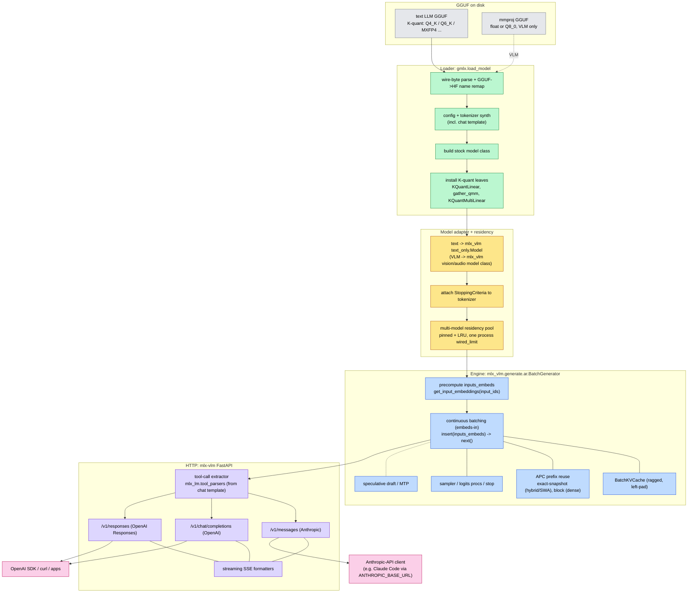

# Serving architecture

The gmlx server turns a loaded GGUF into a continuously-batched HTTP server
compatible with the OpenAI and Anthropic APIs. Behind a small multi-model
residency layer it composes three pieces: the gmlx loader, a serving engine
and FastAPI app derived from `mlx-vlm`, and tool parsers from `mlx-lm`.
The config surface, start modes, and endpoints are documented in
[server-config.md](server-config.md). This page covers the mechanics underneath.

The path from a GGUF file on disk to a client response:

## Components

1. GGUF on disk: a text LLM GGUF (K-quant: Q4_K / Q6_K / MXFP4 / ...). VLM models
   add a second `mmproj` GGUF (float or Q8_0) carrying the vision/audio tower.

2. Loader (`gmlx.load_model`): parses the GGUF wire bytes, remaps
   GGUF tensor names to HF names, synthesizes the config and tokenizer (including the
   chat template), builds the stock model class, and swaps the quantized leaves for
   K-quant modules (`KQuantLinear`, `gather_qmm`, `KQuantMultiLinear`). Output is a
   `(model, config, tokenizer)` triple: no safetensors round-trip.

3. Model adapter + residency: a text model is wrapped in
   `mlx_vlm.models.text_only.Model`, which exposes the `get_input_embeddings` /
   `language_model` interface the engine expects. A `StoppingCriteria` is attached to
   the tokenizer. VLM models are wrapped in their `mlx-vlm` vision/audio model class
   instead. Wrapped models are held in a multi-model residency pool (pinned + LRU)
   that owns a single process-wide `wired_limit`.

4. Engine (`mlx_vlm.generate.ar.BatchGenerator`): continuous (in-flight)
   batching over a ragged `BatchKVCache`. The engine is embeds-in: the request path
   precomputes `inputs_embeds` via `get_input_embeddings` and submits them through
   `insert(...)`, then drains tokens with `next()`. Prefix reuse is handled by the APC
   manager: exact-snapshot for hybrid / sliding-window caches, block-level for plain
   attention. Speculative decoding (draft model / MTP) is optional and runs
   gmlx's own verify round, which keeps APC available (upstream disables
   it under a draft model); see
   [server-config.md](server-config.md#speculative-decoding--the-prompt-cache).

5. HTTP layer (`mlx-vlm` FastAPI app): exposes OpenAI Chat Completions
   (`/v1/chat/completions`), OpenAI Responses (`/v1/responses`), and Anthropic
   Messages (`/v1/messages`), each with streaming SSE. Tool calls are extracted from
   the raw token stream by `mlx_lm.tool_parsers`, selected automatically from the
   model's chat template, and re-emitted in each protocol's content shape.
   Each request's sampling parameters resolve through the config precedence chain
   before generation, lowest layer first: the model family's model-card defaults
   (`gmlx.profiles`, keyed off the GGUF header arch and cached in
   `~/.cache/gmlx/header-meta.json`), then server defaults, matched rules,
   the model's profile or a request `@intent`, per-model overrides, and finally
   the request's own fields. `server.family_defaults: false` removes the family
   layer. See the [Precedence section of server-config.md](server-config.md#precedence).
   Served assistant ids (`server.assistants:`) sit in front of this layer: a
   chat-completions request to one runs the built-in MCP tool loop on a worker
   thread, each round re-entering the server as an ordinary loopback client, so
   profiles, speculative decoding, and batching apply per round
   ([assistant.md](assistant.md#served-assistants)).

6. Clients: any OpenAI- or Anthropic-compatible client. Pointing
   `ANTHROPIC_BASE_URL` at the `/v1/messages` endpoint lets Anthropic-API tools (for
   example Claude Code) drive a local GGUF model.
